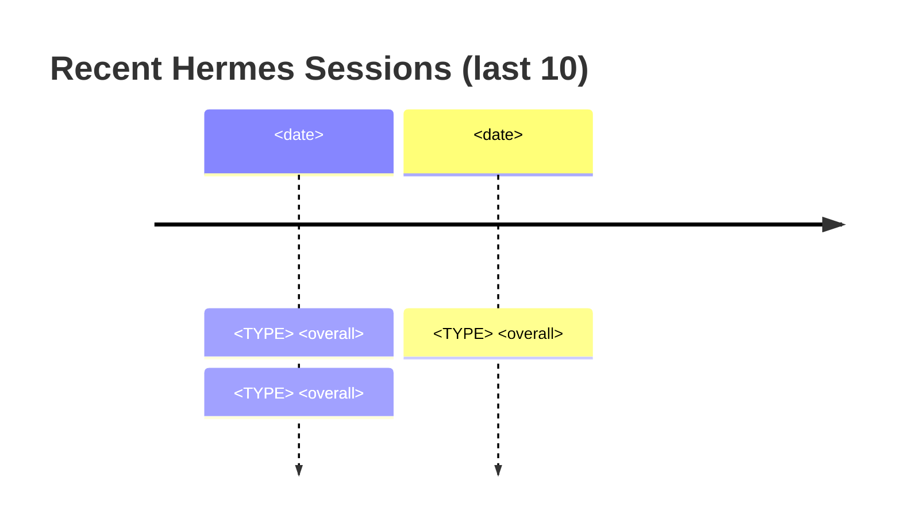

You are the Hermes Status reporter for automation_dashboard. Execute this short workflow inside the current interactive Claude Code session. Do not invoke `claude --print` or `claude -p` anywhere.

## Step 1 — Run the aggregator

```bash
composer hermes-status
```

This reads (without re-running anything heavy) the latest:
- `data/hermes_findings.json`
- `data/agents/audit-sentinel/findings.json`
- `data/agents/update-inspector/findings.json`
- `data/agents/system-check/findings.json`
- Most recent `docs/hermes/LIFECYCLE-*.md` frontmatter
- Open `data/agents/lifecycle/<TS>/` session dirs (recent 3, with phase completion count)
- Git position (branch, HEAD, uncommitted file count)
- PHPStan baseline file size + commit status

## Step 2 — Add lightweight commentary

After the script renders its markdown, append a short "## Read" section interpreting the snapshot:

- **All clear?** — if every collector is PASS and uncommitted=0, say so plainly
- **Aging data** — if any collector's last run is >24h old, recommend re-running it (`composer hermes-audit`, etc.)
- **No lifecycle ever** — if no `LIFECYCLE-*.md` exists yet, recommend running `/hermes-lifecycle` to seed the baseline
- **Stuck session** — if any open lifecycle session has < 8 phases done and is > 1h old, flag it for cleanup
- **Drift** — if uncommitted file count is non-zero, flag what kind of files are dirty (sample is in the status output)
- **Baseline not committed** — if PHPStan baseline gate shows ⚠️, surface the `git add` recommendation

Keep the commentary to 3-6 bullets. Don't lecture; just point at what the snapshot reveals.

## Step 3 — Render a recent-sessions visualization

Read the chronological list of session notes in `docs/hermes/` (any file matching `<TYPE>-<YYYY-MM-DD>_<HH-MM>.md` where TYPE ∈ {FLEET, DOCS, AUDIT, UPDATE, SYSTEM, LIFECYCLE}). Pick the most recent 10 across all types.

Render a Mermaid timeline showing them:



Group by date. Use the `overall` from each note's frontmatter.

If fewer than 2 session notes exist, skip the visualization with `_(Not enough history yet — visualizations appear once 2+ sessions have run.)_`

## Step 4 — Final report

End with ONE LINE: `status snapshot rendered — <overall verdict like "all green" / "X warnings / Y failures">`.

## What you do NOT do

- Do not run any of the heavy commands (`composer hermes-fast`, `hermes-audit`, etc.) — this is a snapshot of state-on-disk, not a re-scan
- Do not edit any file
- Do not write a session note — Status is a transient view, not a permanent record

## Notes on cost

All tool calls (Bash, Read) run inside the current interactive Claude Code session — subscription billing, no credit-pool burn.
