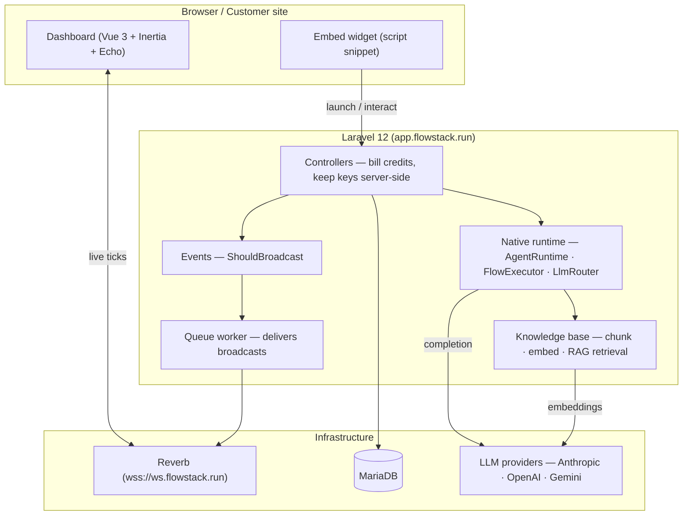
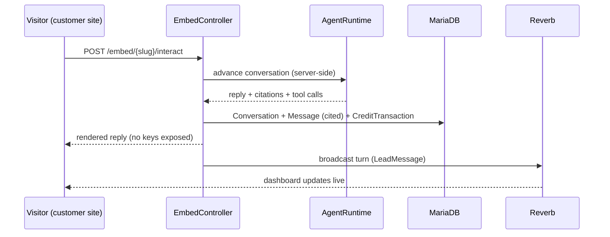

<div align="center">

# Flowstack — Automation Dashboard

**A real-time, multi-tenant platform for AI customer-facing agents.**

_White paper · v1 · 2026-06_

</div>

---

## Abstract

Flowstack lets a team stand up an AI agent that answers customers, captures
qualified leads, and escalates to a human when it isn't confident — then watch
all of it happen **live**. The agent runs on a server-side **native runtime**
(LLM + retrieval-augmented knowledge base) so provider API keys never touch the
browser, every message is metered against a team's credit balance, and every
conversation, lead, and citation is recorded for review.

The same agent embeds on any website with a one-line `<script>` snippet. A
visitor's chat on a customer's marketing site produces the identical data trail
as an in-app conversation — transcript, citations, lead, credit debit — and
streams onto the operator's dashboard in real time.

### The problem

Off-the-shelf chatbots are black boxes: you can't see what they said, you lose
leads they gathered but never recorded, and they hallucinate past the limits of
their knowledge. Operators get no audit trail and no control over spend.

### The approach

| Principle | How Flowstack realizes it |
| --------- | ------------------------- |
| **Grounded** | Per-agent knowledge base; answers cite their sources, and low-confidence turns auto-escalate instead of guessing. |
| **Accountable** | Every turn writes a `Conversation` + `Message` (with citations) + `CreditTransaction`; nothing is ephemeral. |
| **Lead-safe** | A deterministic backstop captures a lead from the transcript even when the model forgets to call the tool. |
| **Server-trusted** | Provider keys, billing, and retrieval all live server-side; the browser only ever sees rendered output. |
| **Observable** | Real-time broadcast (Reverb/WebSockets) pushes every change to all connected screens with no polling. |

---

## System architecture



### Embed conversation flow



---

## Stack

| Layer        | Choice                                                          |
| ------------ | -------------------------------------------------------------- |
| Backend      | Laravel 12, PHP 8.2+ (CI/prod run **8.4**)                     |
| Auth / UI    | Jetstream (Inertia 2 + Vue 3), teams enabled, Sanctum         |
| Frontend     | Vue 3, Inertia 2, Vite 7, Tailwind, Laravel Echo              |
| Real-time    | **Laravel Reverb** (self-hosted, first-party) over WebSockets |
| Database     | **MariaDB** (dev, test, and production)                        |
| AI runtime   | Native server-side runtime — Anthropic / OpenAI / Gemini + OpenAI embeddings for RAG |
| Embed widget | Themed `<script>` snippet → iframe chat, domain allowlist     |
| CI / quality | **Hermes** gate (`composer hermes`) + GitHub Actions          |

---

## Local setup

Requires **PHP 8.2+**, **Composer**, **pnpm**, and a local **MariaDB** server.

```bash
# 1. Dependencies
composer install
pnpm install

# 2. Environment
cp .env.example .env
php artisan key:generate

# 3. Database — MariaDB (defaults in .env.example: db `automation_dashboard`,
#    user `flowstack` / pass `flowstack` on 127.0.0.1:3306). Create it, then:
php artisan migrate

# 4. Frontend assets
pnpm run build          # or: pnpm run dev

# 5. Serve + background workers
php artisan serve                       # http://127.0.0.1:8000
php artisan queue:work                  # broadcasts are queued — required
php artisan reverb:start                # local WebSocket server (port 8080)
```

> `.env.example` ships with `DB_CONNECTION=mariadb` and
> `BROADCAST_CONNECTION=reverb`. Fill the `REVERB_*` app credentials (any
> locally-unique values work for dev) so the browser can connect; the dashboard
> shows an **OFFLINE** badge until Reverb is reachable.

### Embedding the agent on a website

Each active agent exposes a one-line snippet (copy it from **Install** in the
dashboard):

```html
<script src="https://app.flowstack.run/widget/<agent-slug>.js" defer></script>
```

A floating launcher appears bottom-right; clicking it opens the agent's chat in
an iframe. Appearance, proactive teaser, and the domain allowlist are controlled
per-agent in the dashboard — nothing about the widget's look lives in customer
code.

---

## Native runtime (server-side AgentRuntime)

Configured via `.env` (`ANTHROPIC_API_KEY` for the chat loop, `OPENAI_API_KEY`
for KB embeddings — both server-side only):

- **Conversational engine** — `app/Runtime` (`AgentRuntime`, `FlowExecutor`,
  `LlmRouter` + per-provider clients) launches and advances conversations and
  tracks per-visitor session state. The `capture_lead` tool upserts a `Lead`
  inside the engine; a deterministic **backstop** catches leads the model
  gathered but forgot to capture.
- **Knowledge base** — per-agent docs are chunked, embedded, and retrieved as
  auto-RAG context each turn. URL ingestion is **SSRF-hardened** (scheme
  allowlist + private/reserved-IP rejection, re-checked on every redirect hop).
- **Grounded answers** — responses cite their sources; low-confidence turns
  auto-escalate to a human instead of guessing.

See `docs/runtime-native.md` for the full breakdown.

---

## Quality gate (Hermes)

Hermes mirrors CI locally — pint, PHPStan, the full test suite, boot/route/
migration checks, doc-coverage, and a security audit.

```bash
composer hermes            # full gate (matches GitHub Actions)
composer hermes-fast       # skip the vite/pnpm frontend build
composer hermes-audit      # security Audit Sentinel only
php artisan test           # tests alone
```

A tracked **pre-push hook** (`scripts/git-hooks/`) runs the audit gate before
every push; install it with `bash scripts/git-hooks/install.sh`.

---

## Deployment (Laravel Forge)

This project deploys to **Laravel Forge**. One command pushes committed work and
triggers a Forge deployment:

```bash
bin/deploy.sh             # push current branch + trigger Forge deploy
composer deploy           # same thing

bin/deploy.sh --no-deploy        # push only
bin/deploy.sh --branch main      # push a specific branch
bin/deploy.sh --status           # poll Forge API for the deploy result
```

### One-time setup

1. **Server config** — paste `deploy/forge-deploy.sh` into your Forge site's
   **Deploy Script** box. Add daemons for the **queue worker** and **Reverb**
   (`php artisan reverb:start`) under Server → Daemons.
2. **Deploy hook** — copy `.forge-deploy.example` to `.forge-deploy` (gitignored)
   and paste the site's **Deploy Hook** URL, or export `FORGE_DEPLOY_HOOK`.
3. *(Optional)* for `--status`, export `FORGE_API_TOKEN`, `FORGE_SERVER_ID`,
   and `FORGE_SITE_ID`.

The WebSocket subdomain (`wss://ws.flowstack.run`) is an nginx reverse-proxy to
the local Reverb daemon — see `docs/operations/websocket-proxy.md` and
`docs/operations/reverb-prod.md`.

> **Other hosts:** the app is host-agnostic (Laravel Cloud, Railway, Render,
> Fly.io). Whichever you pick, run a persistent `queue:work` process, a Reverb
> daemon, and the scheduler.
