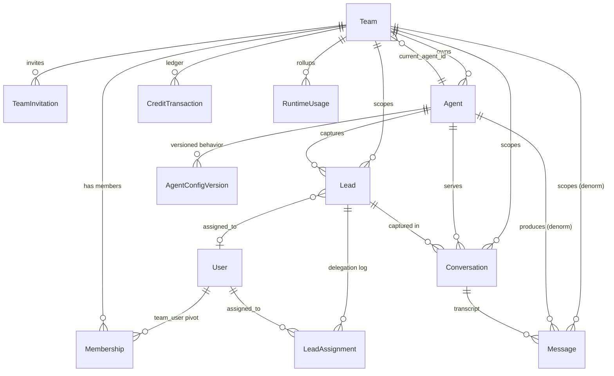
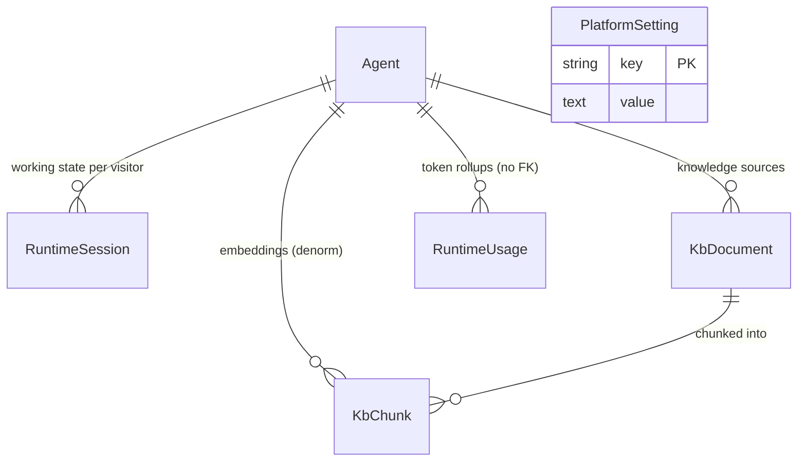

# Data model — consolidated ERD

> The persistence spine of the platform. Every box below is a real Eloquent
> model under [`app/Models/`](../../app/Models/) or [`app/Runtime/Models/`](../../app/Runtime/Models/),
> backed by a migration in [`database/migrations/`](../../database/migrations/).
> The code is the source of truth — this doc is the map, not the territory.

See [[project-overview]] for how these tables fit the product, [[authorization]]
for who may read/write them, and [[architecture/state-machines]] for the status
columns called out below.

## Core diagram

## Runtime / Knowledge-Base diagram

`PlatformSetting` stands alone — a global key/value store with no tenant column.

## Entities

| Entity | Purpose | Key columns | Main relationships |
|---|---|---|---|
| **Team** ([`Team.php`](../../app/Models/Team.php)) | Tenant root + billing owner. Holds the credit balances and Stripe subscription. | `current_agent_id`, `plan`, `credit_balance`, `topup_balance`, `credits_renewed_at`, `alert_thresholds_fired`, `stripe_*`, `profile` | hasMany Agent, CreditTransaction; belongsTo current Agent |
| **User** ([`User.php`](../../app/Models/User.php)) | Authenticated operator. Jetstream/Fortify (2FA, passkeys, API tokens). | `name`, `email`, `password` | belongsToMany Team via `team_user` |
| **Membership** ([`Membership.php`](../../app/Models/Membership.php)) | The `team_user` pivot — user↔team with a `role`. | `team_id`, `user_id`, `role` | pivot |
| **TeamInvitation** ([`TeamInvitation.php`](../../app/Models/TeamInvitation.php)) | Pending invite to join a team at a role. | `email`, `role` | belongsTo Team |
| **Agent** ([`Agent.php`](../../app/Models/Agent.php)) | One conversational bot. Native Flowstack runtime; no per-row credentials. Route key is `slug`. | `team_id`, `name`, `slug` (unique), `status`, `mode`, `runtime_mode`, `last_health_*` | belongsTo Team; hasMany Lead, Conversation, Message |
| **AgentConfigVersion** ([`AgentConfigVersion.php`](../../app/Models/AgentConfigVersion.php)) | Versioned operator-editable behavior (`config` JSON: instructions, greeting, model_tier). At most one draft + one published per agent. | `agent_id`, `version`, `status`, `config`, `published_at` | belongsTo Agent. Unique `(agent_id, version)` |
| **Lead** ([`Lead.php`](../../app/Models/Lead.php)) | A captured prospect in the kanban pipeline. | `team_id`, `agent_id`, `assigned_to`, `name`, `email`, `status`, `score`, `visitor_id`, `captured`, `notes` | belongsTo Team, Agent, assignee User; hasMany Conversation, LeadAssignment |
| **LeadAssignment** ([`LeadAssignment.php`](../../app/Models/LeadAssignment.php)) | Audit row each time a lead is (re)assigned. | `lead_id`, `team_id`, `agent_id`, `assigned_to`, `assigned_by`, `previous_assignee`, `strategy` | belongsTo Lead, assignee User |
| **Conversation** ([`Conversation.php`](../../app/Models/Conversation.php)) | One chat session's display thread. | `team_id`, `agent_id`, `lead_id`, `visitor_id`, `session_key`, `transcript_id`, `channel`, `status`, `message_count`, `started_at`/`ended_at`/`last_message_at`, `meta` | belongsTo Team, Agent, Lead; hasMany Message |
| **Message** ([`Message.php`](../../app/Models/Message.php)) | One turn in a conversation. Scout `Searchable` (Typesense + FULLTEXT fallback). | `conversation_id`, `team_id`, `agent_id`, `role`, `text`, `trace_type`, `payload`, `sequence`, `sent_at` | belongsTo Conversation, Team, Agent |
| **CreditTransaction** ([`CreditTransaction.php`](../../app/Models/CreditTransaction.php)) | Append-only credit ledger. Signed `amount`. | `team_id`, `agent_id` (nullable), `amount`, `reason`, `meta` | belongsTo Team, Agent |
| **RuntimeUsage** ([`RuntimeUsage.php`](../../app/Models/RuntimeUsage.php)) | Per-day token rollup `(team, agent, date, tier)`. Survives agent deletion (no FK on `agent_id`). | `team_id`, `agent_id` (nullable, no FK), `date`, `tier`, `turns`, `tokens_in`, `tokens_out` | belongsTo Team. Unique `(team_id, agent_id, date, tier)` |
| **RuntimeSession** ([`RuntimeSession.php`](../../app/Runtime/Models/RuntimeSession.php)) | Ephemeral per-`(agent, visitor)` working state between turns. Pruned after 30 idle days. | `agent_id`, `visitor_id`, `flow_state`, `variables`, `history`, `last_activity_at` | belongsTo Agent. Unique `(agent_id, visitor_id)` |
| **KbDocument** ([`KbDocument.php`](../../app/Runtime/Models/KbDocument.php)) | One uploaded knowledge source (url/file/text). Holds `raw_content` pre-chunking. | `agent_id`, `title`, `source`, `source_url`, `raw_content`, `metadata`, `chunk_count` | belongsTo Agent; hasMany KbChunk |
| **KbChunk** ([`KbChunk.php`](../../app/Runtime/Models/KbChunk.php)) | RAG retrieval unit: chunk text + embedding vector. | `document_id`, `agent_id` (denorm), `position`, `content`, `embedding` (JSON floats), `embedding_model`, `metadata` | belongsTo KbDocument, Agent |
| **PlatformSetting** ([`PlatformSetting.php`](../../app/Models/PlatformSetting.php)) | Global key/value store (marketing counters, kill switches). String PK, no timestamps, no tenant. | `key` (PK), `value` | none |

## The tenancy spine

`team_id` is the tenant key on nearly every domain table — `leads`,
`conversations`, `messages`, `lead_assignments`, `credit_transactions`,
`runtime_usage`, plus `agents`. Authorization (see [[authorization]]) checks
ownership against the active team before any read or write.

Inside a team, **`agent_id` is the second scoping axis.** The SaaS model is
"one current agent at a time": `Team::current_agent_id` picks which agent the
dashboard is looking at. The `scopeForAgent()` method on `Lead`, `Conversation`,
and `Message` enforces this — and deliberately **returns zero rows for a null
agent** (`whereRaw('1 = 0')`), because a team with no current agent is
mid-onboarding and should see nothing rather than everything.

### Denormalized invariants

Several `team_id`/`agent_id` columns are denormalized copies kept for
join-free, index-backed reads — but they must stay consistent with their parent:

- **`messages.team_id == conversations.team_id`** — denormalized so team-scoped
  search/listing skips the join. [`MessageFactory`](../../database/factories/MessageFactory.php)
  derives it from the parent conversation (`fn ($attrs) => Conversation::find($attrs['conversation_id'])->team_id`)
  precisely to preserve this invariant in tests.
- **`messages.agent_id`** mirrors the conversation's agent for the same reason.
- **`kb_chunks.agent_id`** is denormalized from `kb_documents.agent_id` so every
  RAG query filters on `agent_id` first without a join through the parent.

## Lifecycle / status columns

Status columns are never written directly — only via `transitionTo()` through the
home-grown state machines. See [[architecture/state-machines]].

- **Agent.status** — `draft → active → disabled` (+ back). Constants on
  [`Agent.php`](../../app/Models/Agent.php); machine `AgentStateMachine`.
- **Lead.status** — `LeadStatus` enum: `new`, `engaging`, `qualified`,
  `assigned`, `won`, `lost` ([`app/Enums/LeadStatus.php`](../../app/Enums/LeadStatus.php)).
- **Conversation.status** — `active | ended` (bare strings); `ConversationStateMachine`.
- **AgentConfigVersion.status** — `draft | published | archived` (no machine; the
  publish service enforces the "one draft, one published" invariant).
- **LeadAssignment.strategy** — `AssignmentStrategy` enum: `round_robin`,
  `least_loaded`, `manual`, `unassigned`.
- **RuntimeSession.flow_state** — engine state (`greeting`, `discovery`,
  `capture`, …); driven by the runtime, not a domain state machine.

## Credit ledger model

Two balance buckets live on `teams`:

- **`credit_balance`** — the monthly plan allowance. Hard-resets at renewal.
- **`topup_balance`** — purchased credits that roll over until spent.

`Team::totalCredits()` sums both; consumption drains the monthly bucket first so
paid credits are the last to go (policy 2026-06-12). Those balances are a
**cache**: `credit_transactions` is the append-only ground truth. Every movement
is one signed row (`amount`: positive grant, negative consume) with a `reason`:

- `grant_renewal` — monthly allowance granted.
- `grant_topup` — Stripe top-up purchase.
- `consume_message` — a visitor message debit (multiplied by the agent's live
  tier via `AgentConfigVersion::creditsPerMessage()`).
- `expire_monthly` — leftover monthly credits wiped at renewal, **recorded so the
  ledger always sums to the live balances** (asserted by `credits:reconcile`).

`RuntimeUsage` is the *cost* side (raw tokens for the margin view), separate from
the *credit* side above — tokens price the platform's bill, credits price the
customer's.

## Naming note: visitor_id / session_key / transcript_id

The runtime's identifier columns were renamed from their legacy Voiceflow names
(migration [`2026_06_13_000000_rename_voiceflow_columns_to_visitor.php`](../../database/migrations/2026_06_13_000000_rename_voiceflow_columns_to_visitor.php)):

- `voiceflow_user_id → visitor_id` (on `leads` and `conversations`)
- `voiceflow_session_key → session_key` (on `conversations`)
- `voiceflow_transcript_id → transcript_id` (on `conversations`)

These columns outlived the Voiceflow engine — they now hold the **native**
runtime's own visitor/session/transcript identifiers. "Voiceflow" survives only
in docs as historical reference. `visitor_id` is the join key between a
`RuntimeSession` (working state) and the `conversations`/`leads` it produced.
