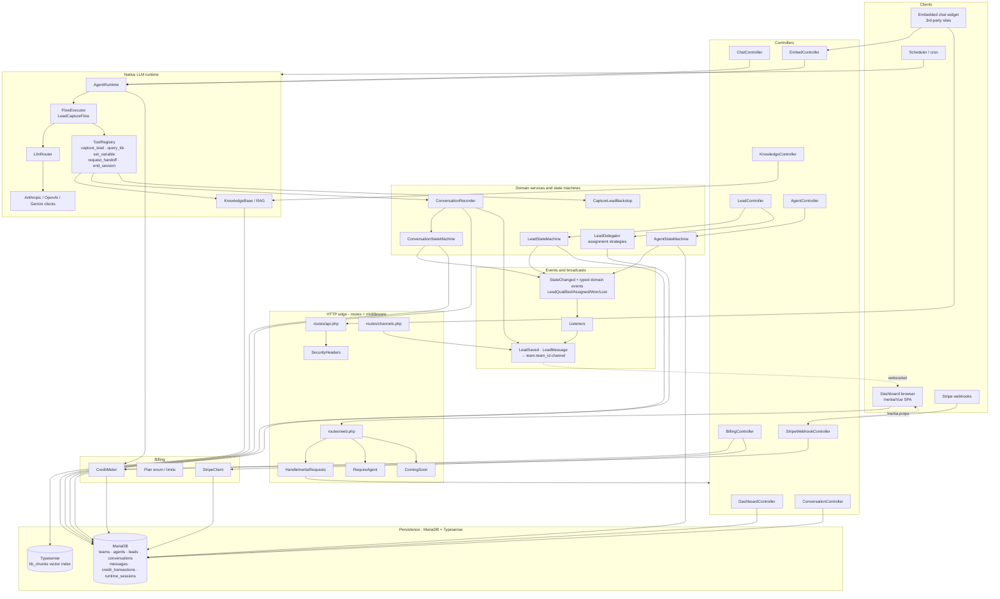
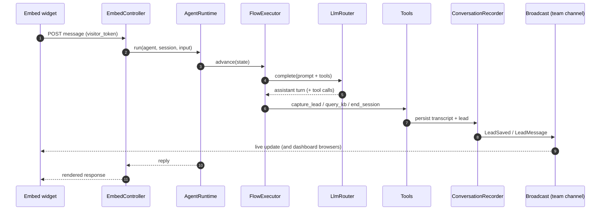
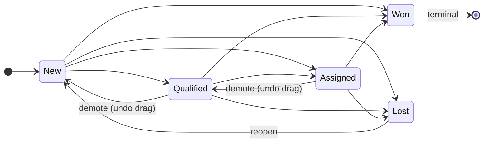

# Architecture — full application graph

A single end-to-end map of the whole application: from inbound HTTP and the
embed widget, through controllers, state machines, the native LLM runtime,
billing, and domain events, down to persistence and back out to the Inertia/Vue
frontend and real-time broadcasts.

> Companion to [[integration-map]] (surface-to-surface wiring),
> [[state-machines]] (transition rules), and [[data-model]] (table shapes).
> This doc is the *whole-system* lens — every layer in one graph.

> **Live version:** a local-only operator page renders this as an interactive
> 3D force-directed graph at `/architecture` (auto-discovered from the codebase,
> not hand-drawn — `app/Support/ArchitectureGraph`). Its integrity is gated by
> `php artisan arch:graph-check` (runs in `composer hermes-fast`), which fails if
> the node count drifts from the `app/` classes on disk or any node is orphaned.
> The Mermaid blocks below are the curated 2D companion view.

## 1. End-to-end system graph



## 2. Request lifecycles (the three hot paths)



## 3. State machine map



Agent: `draft → active` (gated on health) · `active ⇄ disabled` ·
re-enable from disabled always allowed (native agents carry no credentials).
Conversation: `active → ended` only (terminal).

---

_The interactive `/architecture` page is regenerated live from the codebase on
every load — no manual step. These curated Mermaid blocks are hand-maintained;
refresh them when a new top-level subsystem (controller group, runtime stage, or
broadcast channel) lands. Last revised 2026-06-21._
```
