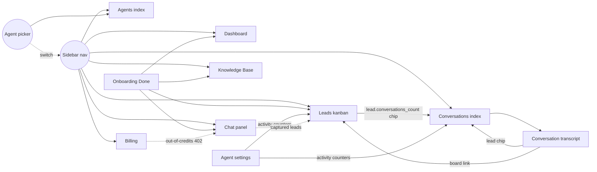

# Architecture — integration map

Where every product surface connects to every other, what's wired today,
and what's still loose. Written 2026-06-04 as the "make everything
interconnected" target, then maintained as we close gaps.

> Phase docs (`phase-N-*.md`) cover *what shipped*. This doc covers *how
> the pieces talk to each other* — orthogonal lens, easier to scan when
> deciding the next feature.

## Product surfaces (Inertia pages)

```
/dashboard            Pipeline at a glance
/chat                 Talk to your agent as if you were a lead
/leads                Kanban board (drag, assign, delete)
/conversations        Transcript history (paginated)
/conversations/{id}   Single transcript
/conversations/search Full-text + Scout/Typesense
/knowledge            Per-agent KB (list, add URL/file, query, inspect, delete)
/agents               Agent CRUD + create dialog + plan gate
/agents/{slug}        Per-agent settings (name + activity counters)
/billing              Plan, credits, top-up dialog, transaction history
/onboarding           One-step managed signup → /onboarding/done
/profile, /teams      Jetstream defaults
```

Plus operator-facing artisan commands: `vf:pool:add`, `vf:pool:list`,
`platform:set`.

## Cross-page links (what's wired)



Light dashed arrows are *implicit* (a side-effect of the underlying
data model — e.g. credit consumption in `/chat/interact` ripples into
the credit history table the billing page renders). Solid arrows are
explicit hyperlinks the operator clicks.

## Voiceflow API coverage

| API group | Endpoints we ship | Surface |
|---|---|---|
| Dialog Manager (Conversations) | `launch`, `interact`, session, getVariables | `/chat/*`, webhook |
| Knowledge Base | list (+ type filter), create-url, create-file, get-with-chunks, delete, query | `/knowledge` |
| Transcripts | backfill (one-shot import) | `php artisan vf:transcripts:backfill` |
| Webhooks (inbound) | per-agent lead-captured | `/api/voiceflow/lead-captured/{agent:slug}` |
| **Projects** | nothing yet | – |
| **Analytics** | nothing yet | – |
| **Usage** | nothing yet | – |
| **Evaluations** | nothing yet | – |
| **Session/org webhooks** | nothing yet | – |

The bottom five are the headroom — each is a wedge that adds a
distinct dimension of value without duplicating what's already there.

## Open interconnection gaps (ranked by leverage)

1. **Dashboard stat cards are not click-throughs.** "Won: 17" should
   filter the kanban to `status=won`; "Conversations: 234" should
   land on `/conversations` (no filter needed). One Vue change per
   card. Highest UX-per-line-of-code in the entire product.

2. **Agent picker doesn't preserve the page.** Switching agents
   reloads the current URL, but for filtered views (e.g. Leads with
   `?mine=1`) the filter is dropped because we POST current-agent
   then redirect to a fresh state. Should respect the original
   query string.

3. **Knowledge page doesn't surface "which doc answered this."**
   The KB query endpoint returns source chunks with `documentID`,
   but the chunk renderer shows them flat. A click on a source
   chunk should jump into the inspect panel for that document.

4. **Conversations search results don't link to the originating
   lead.** Each match shows the message body + timestamp, but if
   the message belongs to a captured lead the row should also
   surface the lead name + status.

5. **No notification fan-out beyond lead capture.** The bell currently
   only fires for `lead.saved`. Other events worth notifying:
     - Agent health check failed (operator should know within minutes)
     - Pool capacity below threshold (operator-only)
     - KB document failed to scrape (URL changed / 404)
     - Credit balance below 10% (push to upgrade or top up)

6. **Public stats endpoint doesn't share its compute with the
   internal Dashboard.** Both surfaces re-do the COUNT(*)s
   independently. A shared `PlatformMetrics` query object would
   eliminate the drift risk.

## Voiceflow features to wire (prioritised)

### Tier 1 — direct revenue / billing value

- **Usage API** (`POST /v2/query/usage`, name=`credit_usage`).
  Voiceflow reports per-project credit spend. Wire into `/billing`
  as "Voiceflow runtime cost (this period)" — distinct from our
  message-credit count. Helps the operator see margins.
  Doc: `docs/voiceflow/usage/query-usage.md`.

### Tier 2 — agent quality + observability

- **Analytics API → Dashboard.** Per-agent breakdowns of:
  `interactions`, `unique_users`, `top_intents`. Powers a richer
  Dashboard with "what users actually ask" — currently the only
  observability is raw message count.
  Doc: `docs/voiceflow/analytics/overview.md`.

- **Evaluations.** Rate transcripts via Voiceflow's LLM-judge
  endpoint. UI: a "Run quality check" button on the Conversations
  list runs evals across the last N transcripts. Becomes a value
  prop on the Operator plan ("you didn't just deploy an agent, you
  monitored it").
  Doc: `docs/voiceflow/evaluations/README.md`.

### Tier 3 — environment / lifecycle controls

- **Project Environments.** Voiceflow supports `main`, `development`,
  `staging` per project. Currently we pin to `main` per pool entry.
  Exposing the environment toggle on `/agents/{slug}` (and letting
  the chat panel run on `development` while leads still use `main`)
  would unlock A/B testing of flows.
  Docs: `docs/voiceflow/projects/{list,get,publish,delete}-environment.md`.

- **Org-events webhook** (Svix-signed). Subscribe to
  `organization.project.created/deleted/published`. Use it to keep
  the `voiceflow_project_pool` table in sync if an operator does
  manual cleanup in Voiceflow's UI.
  Doc: `docs/voiceflow/webhooks/org-events.md`.

### Tier 4 — channel expansion

- **Session lifecycle webhook** (`runtime.call.start/end`,
  `runtime.session.start/end`). Useful when we add a phone-call
  channel — currently the dashboard assumes web-chat only.
  Doc: `docs/voiceflow/webhooks/session-lifecycle.md`.

## Operating principle

Every page in the product is a *view onto the same agent's data*.
When a user switches agents in the picker, every list, every stat,
every counter should swap. We mostly enforce this via
`current_agent_id` + `forAgent()` scopes; the remaining gaps live
in surfaces that haven't been refactored against the agent picker
(public stats, marketing site, etc.) — those are intentionally
NOT scoped because they aggregate across all tenants.

Two questions to ask before adding a new surface:

1. **Is it agent-scoped?** If yes, route through `forAgent()` so the
   picker controls it. If no (operator-only / cross-tenant), make it
   explicit in the controller header comment.
2. **Does it link back to existing surfaces?** Every list should have
   cross-links to related views (Lead → Conversations, Conversation
   → Lead, etc.) so the operator never hits a dead-end page that
   forces them to re-navigate.
