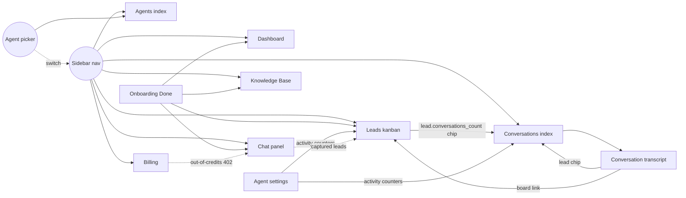

# Architecture — integration map

Where every product surface connects to every other, what's wired today,
and what's still loose. Written 2026-06-04 as the "make everything
interconnected" target, then maintained as we close gaps.

> [[docs/README|Phase docs (`phase-N-*.md`)]] cover *what shipped*. This doc covers *how
> the pieces talk to each other* — orthogonal lens, easier to scan when
> deciding the next feature.

## Product surfaces (Inertia pages)

```
/dashboard            Pipeline at a glance
/chat                 Talk to your agent as if you were a lead
/leads                Kanban board (drag, assign, delete)
/conversations        Transcript history (paginated)
/conversations/{id}   Single transcript
/conversations/search Full-text + Scout/Typesense
/knowledge            Per-agent KB (list, add URL/file, query, inspect, delete)
/agents               Agent CRUD + create dialog + plan gate
/agents/{slug}        Per-agent settings (name + activity counters)
/billing              Plan, credits, top-up dialog, transaction history
/onboarding           One-step managed signup → /onboarding/done
/profile, /teams      Jetstream defaults
```

Plus operator-facing artisan commands: `platform:set`,
`credits:reconcile`, `runtime:costs`.

## Cross-page links (what's wired)



Light dashed arrows are *implicit* (a side-effect of the underlying
data model — e.g. credit consumption in `/chat/interact` ripples into
the credit history table the billing page renders). Solid arrows are
explicit hyperlinks the operator clicks.

## Engine surface

Conversations run entirely on the native runtime
([docs/runtime-native.md](../runtime-native.md)). Controllers call
`AgentRuntime` directly — `launch` / `interact` (and stage-level streaming)
on `/chat/*` and `/embed/*`, per-agent Knowledge Base CRUD + query on
`/knowledge`, and conversation/transcript management on `/conversations`.
There are no outbound vendor API calls and no inbound engine webhooks:
lead capture, KB retrieval, and session lifecycle are all in-process. The
archived reference for the removed third-party engine lives under
[docs/voiceflow/](../voiceflow/README.md) for historical context only.

## Open interconnection gaps (ranked by leverage)

1. **Dashboard stat cards are not click-throughs.** "Won: 17" should
   filter the kanban to `status=won`; "Conversations: 234" should
   land on `/conversations` (no filter needed). One Vue change per
   card. Highest UX-per-line-of-code in the entire product.

2. **Agent picker doesn't preserve the page.** Switching agents
   reloads the current URL, but for filtered views (e.g. Leads with
   `?mine=1`) the filter is dropped because we POST current-agent
   then redirect to a fresh state. Should respect the original
   query string.

3. **Knowledge page doesn't surface "which doc answered this."**
   The KB query endpoint returns source chunks with `documentID`,
   but the chunk renderer shows them flat. A click on a source
   chunk should jump into the inspect panel for that document.

4. **Conversations search results don't link to the originating
   lead.** Each match shows the message body + timestamp, but if
   the message belongs to a captured lead the row should also
   surface the lead name + status.

5. **No notification fan-out beyond lead capture.** The bell currently
   only fires for `lead.saved`. Other events worth notifying:
     - Agent health check failed (operator should know within minutes)
     - Provider key missing / unfunded (tier greyed out, chat returns 503)
     - KB document failed to scrape (URL changed / 404)
     - Credit balance below 10% (push to upgrade or top up)

6. **Public stats endpoint doesn't share its compute with the
   internal Dashboard.** Both surfaces re-do the COUNT(*)s
   independently. A shared `PlatformMetrics` query object would
   eliminate the drift risk.

## Native engine follow-ups (prioritised)

These build directly on the native runtime
([docs/runtime-native.md](../runtime-native.md)); none depend on any
external vendor.

### Tier 1 — direct revenue / billing value

- **Per-team runtime cost surface.** `runtime:costs` already prices each
  team's `runtime_usage` at provider rates (ops-only today). Wire a
  read-only "runtime cost (this period)" line into `/billing` — distinct
  from the message-credit count — so the operator can eyeball margins.

### Tier 2 — agent quality + observability

- **Analytics → Dashboard.** Per-agent breakdowns (interactions,
  unique visitors, top topics) on the Dashboard, beyond today's raw
  message count. Source data is already in `messages` + `runtime_usage`.

- **Transcript evaluations.** Automated quality scoring of stored
  transcripts (e.g. LLM-as-judge); currently the KB Q&A box is the only
  retrieval check. Tracked as a deferred item in
  [docs/runtime-native.md](../runtime-native.md).

### Tier 3 — lifecycle controls

- **Per-agent flow selection.** Every agent runs `LeadCaptureFlow` today;
  a `flow` column + template registry is the planned shape (see
  [docs/runtime-native.md](../runtime-native.md) follow-ups).

### Tier 4 — channel expansion

- **Phone / SMS channel.** The dashboard assumes web-chat only. Adding a
  voice or SMS channel would feed the same `AgentRuntime` through a new
  controller, reusing in-engine lead capture and session state.

## Operating principle

Every page in the product is a *view onto the same agent's data*.
When a user switches agents in the picker, every list, every stat,
every counter should swap. We mostly enforce this via
`current_agent_id` + `forAgent()` scopes; the remaining gaps live
in surfaces that haven't been refactored against the agent picker
(public stats, marketing site, etc.) — those are intentionally
NOT scoped because they aggregate across all tenants.

Two questions to ask before adding a new surface:

1. **Is it agent-scoped?** If yes, route through `forAgent()` so the
   picker controls it. If no (operator-only / cross-tenant), make it
   explicit in the controller header comment.
2. **Does it link back to existing surfaces?** Every list should have
   cross-links to related views (Lead → Conversations, Conversation
   → Lead, etc.) so the operator never hits a dead-end page that
   forces them to re-navigate.
