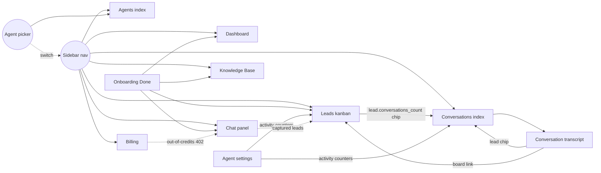

# Architecture — integration map

Where every product surface connects to every other, what's wired today,
and what's still loose. Written 2026-06-04 as the "make everything
interconnected" target, then maintained as we close gaps.

> [[docs/README|Phase docs (`phase-N-*.md`)]] cover *what shipped*. This doc covers *how
> the pieces talk to each other* — orthogonal lens, easier to scan when
> deciding the next feature.

## Product surfaces (Inertia pages)

```
/dashboard            Pipeline at a glance
/chat                 Talk to your agent as if you were a lead
/leads                Kanban board (drag, assign, delete)
/conversations        Transcript history (paginated)
/conversations/{id}   Single transcript
/conversations/search Full-text + Scout/Typesense
/knowledge            Per-agent KB (list, add URL/file, query, inspect, delete)
/agents               Agent CRUD + create dialog + plan gate
/agents/{slug}        Per-agent settings (name + activity counters)
/billing              Plan, credits, top-up dialog, transaction history
/onboarding           One-step managed signup → /onboarding/done
/profile, /teams      Jetstream defaults
```

Plus operator-facing artisan commands: `vf:pool:add`, `vf:pool:list`,
`platform:set`.

## Cross-page links (what's wired)



Light dashed arrows are *implicit* (a side-effect of the underlying
data model — e.g. credit consumption in `/chat/interact` ripples into
the credit history table the billing page renders). Solid arrows are
explicit hyperlinks the operator clicks.

## Voiceflow API coverage

> **Note (auto-synced 2026-06-08):** Phase 15 (`docs/phase-15-voiceflow-wrapper.md`)
> shipped typed subclients (`RuntimeClient`, `AnalyticsClient`,
> `RealtimeClient`, `StreamingClient`) plus Evaluations + Environments UI
> routes, a session-lifecycle inbound webhook, and an org-events inbound
> webhook. The table + Tier 2/3/4 entries below were updated to reflect
> the new shipped surface.

| API group | Endpoints we ship | Surface |
|---|---|---|
| [[docs/voiceflow/conversations/README|Dialog Manager (Conversations)]] | `launch`, `interact`, `interact/stream`, session, getVariables | `/chat/*`, webhook |
| [[docs/voiceflow/knowledge-base/README|Knowledge Base]] | list (+ type filter), create-url, create-file, create-text, get-with-chunks, delete, query, replace/patch (wrapper-only) | `/knowledge` |
| [[docs/voiceflow/transcripts/README|Transcripts]] | search (paginated stream), get, end, delete, backfill | `php artisan voiceflow:backfill`, `ConversationController::endUpstream`/`deleteUpstream` |
| [[docs/voiceflow/webhooks/README|Webhooks (inbound)]] | per-agent lead-captured, per-agent session-lifecycle, platform-level org-events | `/api/voiceflow/lead-captured/{agent:slug}`, `/api/voiceflow/webhooks/session/{agent:slug}`, `/api/voiceflow/webhooks/org` |
| **Project Environments** | list, get, clone, publish, delete, export, traffic split | `/agents/environments*` |
| **Evaluations** | list, get, create, run, queue, delete | `/agents/evaluations*` |
| **Usage** | `safeUsageCount()` helper on `VoiceflowService` | wrapper-only (no UI surface yet) |
| **Analytics** | wrapper methods on `AnalyticsClient` | wrapper-only (no UI surface yet) |
| **Projects** | nothing yet | – |

The remaining headroom is the Projects API (no public `POST /project` —
see Phase K in [[phase-13-multitenancy|phase-13-multitenancy.md]] for why)
plus dashboard surfaces for the Analytics + Usage wrappers that already
ship as untyped helpers.

## Open interconnection gaps (ranked by leverage)

1. **Dashboard stat cards are not click-throughs.** "Won: 17" should
   filter the kanban to `status=won`; "Conversations: 234" should
   land on `/conversations` (no filter needed). One Vue change per
   card. Highest UX-per-line-of-code in the entire product.

2. **Agent picker doesn't preserve the page.** Switching agents
   reloads the current URL, but for filtered views (e.g. Leads with
   `?mine=1`) the filter is dropped because we POST current-agent
   then redirect to a fresh state. Should respect the original
   query string.

3. **Knowledge page doesn't surface "which doc answered this."**
   The KB query endpoint returns source chunks with `documentID`,
   but the chunk renderer shows them flat. A click on a source
   chunk should jump into the inspect panel for that document.

4. **Conversations search results don't link to the originating
   lead.** Each match shows the message body + timestamp, but if
   the message belongs to a captured lead the row should also
   surface the lead name + status.

5. **No notification fan-out beyond lead capture.** The bell currently
   only fires for `lead.saved`. Other events worth notifying:
     - Agent health check failed (operator should know within minutes)
     - Pool capacity below threshold (operator-only)
     - KB document failed to scrape (URL changed / 404)
     - Credit balance below 10% (push to upgrade or top up)

6. **Public stats endpoint doesn't share its compute with the
   internal Dashboard.** Both surfaces re-do the COUNT(*)s
   independently. A shared `PlatformMetrics` query object would
   eliminate the drift risk.

## Voiceflow features to wire (prioritised)

### Tier 1 — direct revenue / billing value

- **Usage API** (`POST /v2/query/usage`, name=`credit_usage`).
  Voiceflow reports per-project credit spend. Wire into `/billing`
  as "Voiceflow runtime cost (this period)" — distinct from our
  message-credit count. Helps the operator see margins.
  Doc: `docs/voiceflow/usage/query-usage.md`.

### Tier 2 — agent quality + observability

- **[[docs/voiceflow/analytics/README|Analytics API]] → Dashboard.** Per-agent breakdowns of:
  `interactions`, `unique_users`, `top_intents`. Powers a richer
  Dashboard with "what users actually ask" — currently the only
  observability is raw message count. **Wrapper shipped in Phase 15
  (`AnalyticsClient`); no dashboard surface consumes it yet.**
  Doc: `docs/voiceflow/analytics/overview.md`.

- **Evaluations.** ✅ Shipped in Phase 15. `/agents/evaluations*`
  pages + `EvaluationsController` + `AnalyticsClient` evaluation
  methods (list / get / create / run / queue / delete).
  Doc: `docs/voiceflow/evaluations/README.md`.

### Tier 3 — environment / lifecycle controls

- **Project Environments.** ✅ Shipped in Phase 15. `/agents/environments*`
  pages + `EnvironmentsController` + `RealtimeClient` environment methods
  (list / get / clone / publish / delete / export / traffic split).
  Operator can clone `main → staging`, publish, and export.
  Docs: `docs/voiceflow/projects/{list,get,publish,delete}-environment.md`.

- **Org-events webhook** (Svix-signed). ✅ Shipped in Phase 15 as
  `POST /api/voiceflow/webhooks/org` (`OrgEventsController`).
  Auth is the platform-level `services.voiceflow.org_webhook_secret`
  via `hash_equals`; Svix HMAC verification is wired through
  `SvixVerifier` but the `svix/svix` composer dep is still pending —
  until then the shared secret is the trust boundary. Reactively
  retires `voiceflow_project_pool` rows on `organization.project.deleted`.
  Doc: `docs/voiceflow/webhooks/org-events.md`.

### Tier 4 — channel expansion

- **Session lifecycle webhook** (`runtime.call.start/end`,
  `runtime.session.start/end`). ✅ Shipped in Phase 15 as
  `POST /api/voiceflow/webhooks/session/{agent:slug}`
  (`SessionLifecycleController`). Per-agent `X-Webhook-Secret`,
  persists every event to `voiceflow_webhook_events` with idempotency
  on `(agent_id, event_id)`, reactively updates
  `Conversation.{started_at, ended_at, status, voiceflow_transcript_id}`.
  Useful for a future phone-call channel — currently the dashboard
  assumes web-chat only.
  Doc: `docs/voiceflow/webhooks/session-lifecycle.md`.

## Operating principle

Every page in the product is a *view onto the same agent's data*.
When a user switches agents in the picker, every list, every stat,
every counter should swap. We mostly enforce this via
`current_agent_id` + `forAgent()` scopes; the remaining gaps live
in surfaces that haven't been refactored against the agent picker
(public stats, marketing site, etc.) — those are intentionally
NOT scoped because they aggregate across all tenants.

Two questions to ask before adding a new surface:

1. **Is it agent-scoped?** If yes, route through `forAgent()` so the
   picker controls it. If no (operator-only / cross-tenant), make it
   explicit in the controller header comment.
2. **Does it link back to existing surfaces?** Every list should have
   cross-links to related views (Lead → Conversations, Conversation
   → Lead, etc.) so the operator never hits a dead-end page that
   forces them to re-navigate.
