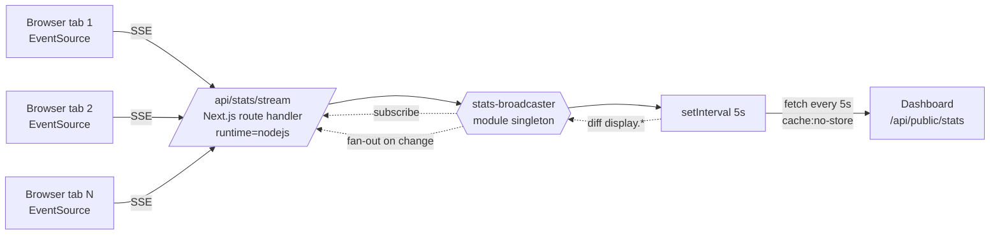
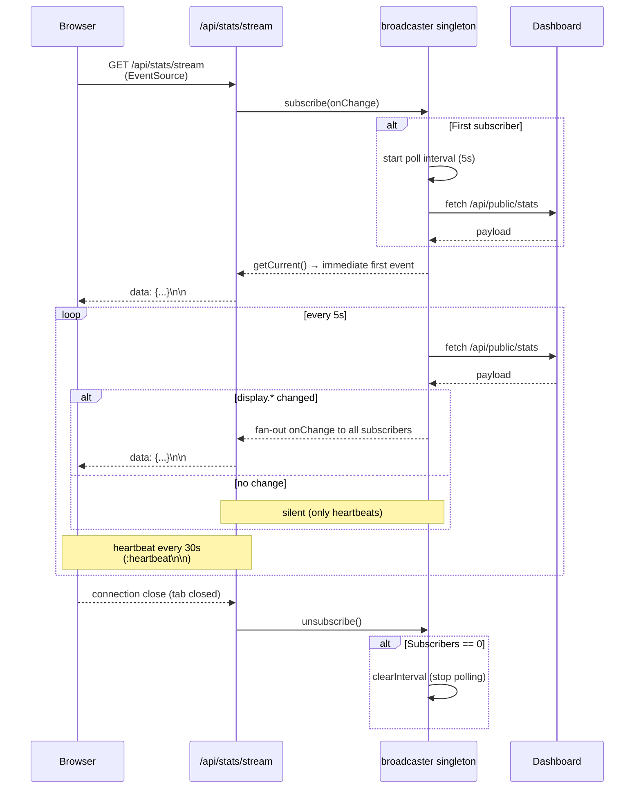
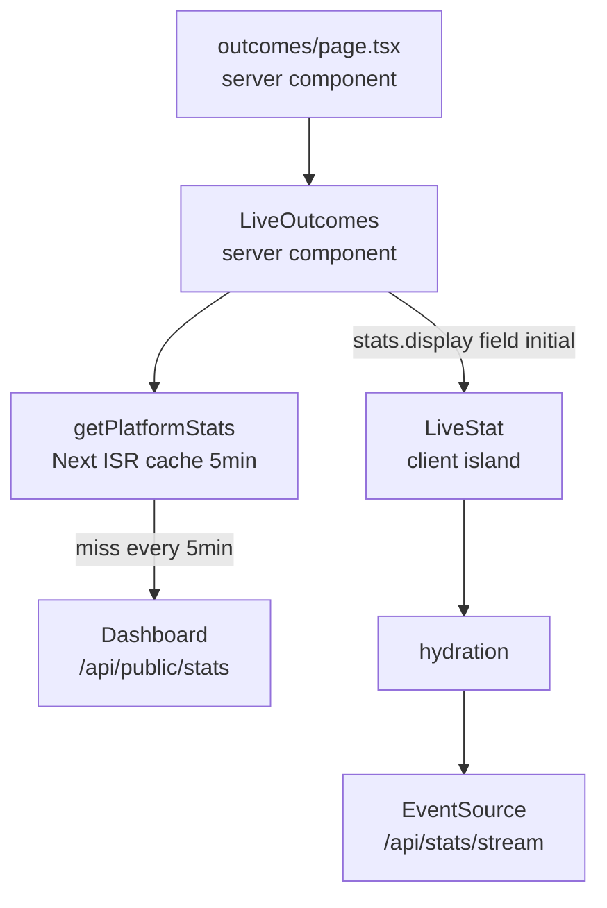

# Architecture — landing SSE pipeline (landing-site side)

How the Next.js marketing site at `/home/theone/automation-landing` consumes
[[public-surface|the dashboard's [`/api/public/stats`](../public-surface.md)]] and pushes
sub-second updates to visitors **without polling** and **without holding
PHP-FPM workers hostage**.

> Companion: [[public-stats-flow|[./public-stats-flow.md](./public-stats-flow.md)]] (dashboard side)

## Design constraints

1. **Instant updates.** Visitors see changes within ~5s of a tier flip.
2. **Cheap.** No Pusher / Reverb / third-party service.
3. **Dashboard stays a normal request-response Laravel app.** No Octane,
   no async runtime; SSE connections never reach PHP-FPM.
4. **Render-correct first paint.** No flash, SEO-friendly initial values.

## The trick — Node-side singleton broadcaster

Naïve SSE would have every visitor open a connection to the dashboard.
Disaster: PHP-FPM workers held open per visitor. Instead:

- SSE lives on the **Next.js landing site**, not on Laravel.
- A **module-level singleton** in the Next process polls the dashboard
  every 5s.
- Every visitor's `EventSource` subscribes to that singleton.
- The singleton only broadcasts when `display.*` actually changes.
- Singleton **stops the poll loop when subscribers drop to 0**.

Net: dashboard sees **one** request per 5s regardless of visitor count.
Visitors see updates the moment the singleton detects a change.

## High-level flow

## Connection lifecycle

## First paint vs streamed updates

First paint is **server-rendered** for SEO + zero-flash:

- Server: `getPlatformStats()` reads from dashboard via Next 16 ISR
  (`revalidate: 300`). First paint is correct bucketed labels.
- Hydration: `<LiveStat>` ("use client") opens an `EventSource` to
  `/api/stats/stream`. Initial value stays visible until the first
  streamed update arrives.

## File map

| File | Purpose |
|---|---|
| `src/lib/stats.ts` | Typed `PlatformStats` + `CountField` + `getPlatformStats()` (ISR for first paint) + `fetchPlatformStatsFresh()` (no-cache, used by broadcaster) + `formatStat()` |
| `src/app/api/stats/stream/route.ts` | SSE route handler — subscribes the request, sends initial event, fans out broadcaster events, heartbeats every 30s, cleans up on disconnect |
| `src/lib/stats-broadcaster.ts` | Module-level singleton — poll loop + subscriber set + diff-and-broadcast + idle-stop |
| `src/components/live-stat.tsx` | `"use client"` island — `EventSource` consumer, takes server-rendered `initial`, renders `fallback` when bucket is `null` |
| `src/components/sections/live-outcomes.tsx` | Server component — fetches initial stats, renders the strip with one `<LiveStat>` per cell |
| `src/components/sections/founder-slots.tsx` | Server-only (no SSE) — founder slots changes only via operator CLI; ISR refresh is correct |

## Deployment constraints

**Required:** a long-running Node process for the landing site so the
module-level singleton survives across requests.

- ✅ Self-hosted Node (VPS, Railway, Fly.io, Render, custom Docker)
- ✅ Any PaaS with non-recycling persistent processes

**Incompatible:**
- ❌ Vercel serverless functions — each invocation is a fresh isolate.
  Singleton becomes per-invocation; broadcast doesn't reach other tabs.
  Plus per-execution-second billing makes long-lived SSE expensive.
- ❌ Vercel Edge runtime — 30s execution cap kills the connection.
- ❌ AWS Lambda / Cloudflare Workers — same isolation + execution-time
  issues.

If the landing site moves to a serverless host, fall back to short-interval
polling (~5s) with edge cache. See the polling-design notes in
[[phase-14-public-stats|[../phase-14-public-stats.md](../phase-14-public-stats.md#alternative-polling)]].

## Environment variables

| Var | Purpose |
|---|---|
| `DASHBOARD_API_URL` | Server-only. Used by `lib/stats.ts` + broadcaster to reach the dashboard. No `NEXT_PUBLIC_` prefix — must not ship to the browser. |
| `NEXT_PUBLIC_DASHBOARD_URL` | Client-facing. Visitor-bound dashboard origin for "Start free trial" / login buttons. Usually same value as `DASHBOARD_API_URL`. |

See `.env.example` in the landing repo.
