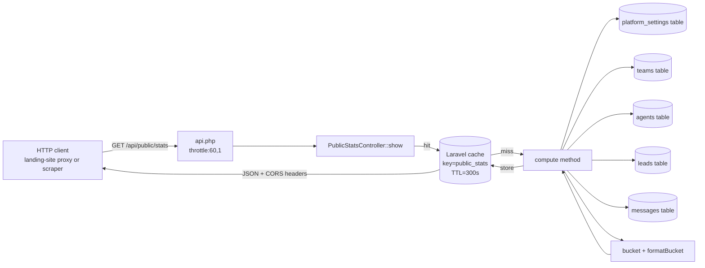
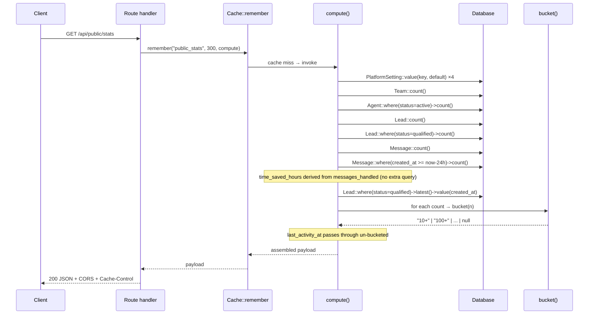
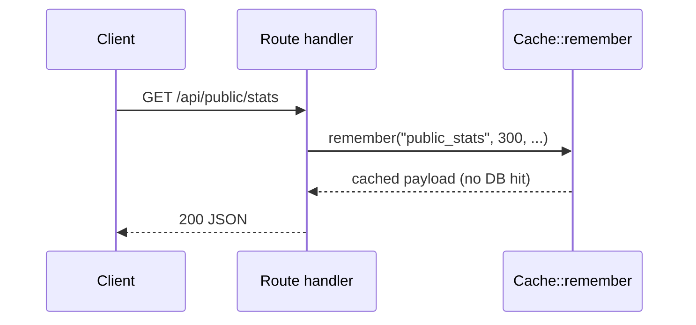
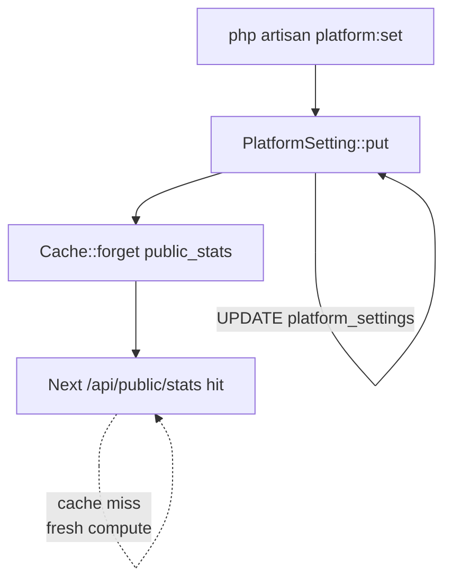

# Architecture — public stats data flow (dashboard side)

How `/api/public/stats` answers a request. Reference for changes to the
controller, cache strategy, or `platform_settings` schema.

> Contract: [[public-surface|../public-surface.md]]
> Landing-side companion: [[landing-sse-pipeline|./landing-sse-pipeline.md]]

## High-level

## Request sequence (cache miss)

## Request sequence (cache hit — the common case)

After the first miss, every subsequent request for the next 5 minutes
returns from cache — zero DB queries. Throughput is bounded by HTTP
plumbing, not by the database.

## Cache invalidation

Operator edits land immediately because `PlatformSetting::put()` forgets
the cache key in the same call. The next request recomputes. Aggregate
counts that change "organically" (a new team, a qualified lead) do **not**
bust the cache — they're absorbed by the 5-minute TTL. Landing-site
visitors see those changes on the next 5-min boundary.

## Why these counts and not others

The exposed counts (`teams_count`, `agents_active`, `leads_total`,
`leads_qualified`, `messages_handled`, `messages_last_24h`,
`time_saved_hours`) plus the un-bucketed `last_activity_at` recency
field were chosen because:

- They tell a coherent funnel story (signups → agents → leads → qualified → engagement) plus recency / "is it being used right now" signals
- Each is a single indexed `COUNT(*)` or a `latest()->value()` — cheap to compute on every cache miss
- `time_saved_hours` is purely derived from `messages_handled` (no extra query)
- None contain per-tenant detail
- Bucketing masks small early-stage values automatically; `last_activity_at` is rendered as relative time on the landing client so a single recent timestamp is not identifying

Candidates intentionally NOT exposed:
- `users.count()` — duplicates `teams_count` for our model (each user gets a personal team on signup)
- `conversations.count()` — engagement signal is better served by `messages_handled`
- `voiceflow_project_pool` availability — operational signal, not public

To add another: see [../public-surface.md#adding-a-new-computed-field](../public-surface.md#adding-a-new-computed-field).
