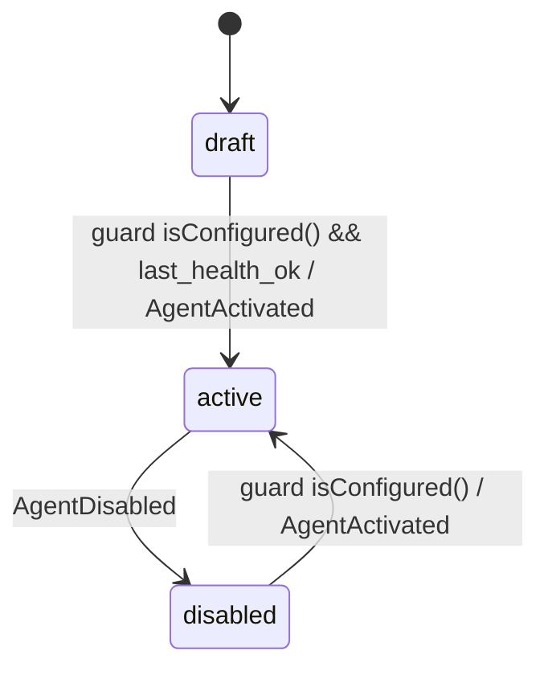
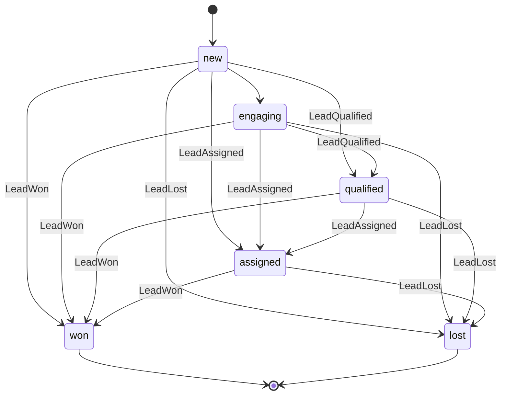
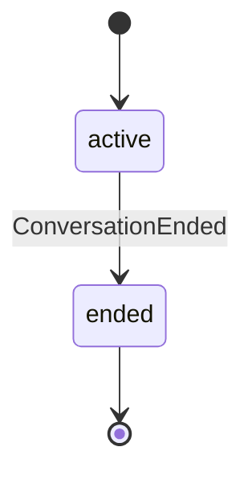

# State machines — domain lifecycle pattern

> Every status-bearing domain entity (Agent, Lead, Conversation) moves between
> states through one small, home-grown state machine. No status column is ever
> written directly — `transitionTo()` is the only door.

## Why a tiny home-grown machine

The whole thing is ~250 lines across [`app/Lifecycle/`](../../app/Lifecycle/).
We skipped a library (`spatie/laravel-model-states`, `winzou/state-machine`)
because the requirements are narrow and the cost of a dependency is mostly in
the parts we'd never use:

- We need exactly three things: **declare allowed transitions**, **gate them
  with a guard**, and **fire events when they land**. That's a value object plus
  a base class.
- Transitions must be **atomic with the side effects** — the status write and
  the events that depend on it have to commit together or not at all. Owning the
  `DB::transaction` wrapper ourselves is simpler than bending a library's
  hook order to guarantee that.
- States are already plain backed enums / string constants the rest of the app
  uses; we didn't want a parallel "state class" hierarchy shadowing them.

The pieces:

| File | Role |
|---|---|
| [`StateMachine.php`](../../app/Lifecycle/StateMachine.php) | Base class. Holds the transition list, validates + applies + persists + fires events. |
| [`Transition.php`](../../app/Lifecycle/Transition.php) | Value object: one allowed `from → to` move, with an optional guard closure and optional event class. |
| [`HasLifecycle.php`](../../app/Lifecycle/HasLifecycle.php) | Trait on the model. Exposes `transitionTo()` / `canTransitionTo()` that delegate to the model's `stateMachine()`. |
| [`InvalidTransition.php`](../../app/Lifecycle/InvalidTransition.php) | Typed exception for refusals (undeclared move, or guard failed). |

`Transition::matches()` normalises both sides to their backing string, so a
machine can mix enum states (Lead) and bare string states (Conversation)
without caring which it got.

## How a transition executes

The flow is the same for every model — `$lead->transitionTo(LeadStatus::Qualified)`:

```mermaid
stateDiagram-v2
    [*] --> findTransition: transitionTo(to, context)
    findTransition --> Refuse: not declared
    findTransition --> Guard: declared
    Guard --> Refuse: guard returns false
    Guard --> Apply: guard passes (or none)
    state "DB::transaction" as Apply {
        [*] --> Persist: model.status = to; save()
        Persist --> FireGeneric: event(StateChanged)
        FireGeneric --> FireTyped: event(transition.event) if set
        FireTyped --> [*]
    }
    Refuse --> [*]: throw InvalidTransition
    Apply --> [*]: return model
```

Concretely, in [`StateMachine::transitionTo()`](../../app/Lifecycle/StateMachine.php):

1. Read the current state off the model's `stateAttribute()` (default `status`).
2. `findTransition(from, to)` walks the declared list; `null` → throw.
3. `Transition::isAllowedFor($model)` runs the guard closure; `false` → throw.
4. Inside one `DB::transaction`: write the new status and `save()`, then
   `event(new StateChanged(...))`, then the transition's typed event if it
   declares one (`event: LeadQualified::class`).

The transaction is the load-bearing part: if a listener throws, the status
write rolls back too, so the model is never left "moved on disk but the
follow-on work didn't happen." On success the in-memory model already carries
the new status (callers can chain off the returned model).

`canTransitionTo()` runs steps 1–3 read-only (no persist, no events) — the
kanban and status-dropdown UIs use it to decide whether a target is reachable
before offering it.

### Guards and effects

- **Guard** = a `Closure(Model): bool` on the `Transition`. It's the single
  place a precondition lives (see Agent `draft → active` below). Optional —
  trivial moves stay one line.
- **Effect** = the fired events. The machine itself has no other side effects;
  anything that should happen *because* of a transition is a listener on the
  typed event. See [[domain-events]] for the listener wiring.

## The events

Two layers fire on every successful transition:

- [`StateChanged`](../../app/Events/Domain/StateChanged.php) — the generic
  "something moved" event (`model`, `from`, `to`, `context`). For cross-cutting
  concerns like audit logging that don't care *which* machine moved.
- A **typed domain event** per transition (`AgentActivated`, `LeadQualified`,
  `LeadAssigned`, `LeadWon`, `LeadLost`, `LeadStatusChanged`, `AgentDisabled`,
  `ConversationEnded`) in [`app/Events/Domain/`](../../app/Events/Domain/). These
  drive behaviour-specific listeners.

The free-form `$context` array passed to `transitionTo()` rides along on both
events (e.g. who triggered the move) for listeners that want it.

## The three machines

### Agent — [`AgentStateMachine`](../../app/Lifecycle/AgentStateMachine.php)

States are string constants on `Agent` (`STATUS_DRAFT`, `STATUS_ACTIVE`,
`STATUS_DISABLED`).

- `draft → active` is the one gated move: the agent must have credentials
  (`isConfigured()`) and its last health check must have passed
  (`last_health_ok`). That rule lives nowhere else.
- `active ⇄ disabled` is the reversible pause/resume. There is **no path back to
  draft** — disabling keeps the keys; you never re-enter setup. Note managed
  signups (see [[phase-13-multitenancy]]) land directly in `active`, so `draft`
  is effectively a BYOK/ops state.

### Lead — [`LeadStateMachine`](../../app/Lifecycle/LeadStateMachine.php)

States are the `LeadStatus` backed enum (`new`, `engaging`, `qualified`,
`assigned`, `won`, `lost`).

- **`won` / `lost` are terminal** — no reopening; convert a contact again by
  creating a fresh Lead row.
- Only forward moves are declared. An explicit demotion (`qualified → engaging`)
  is treated as a bug, not a feature, so it's simply absent and refused.
- **Cross-step jumps are allowed** (`new → assigned`) on purpose: the kanban UI
  lets reps drag a card across columns. Every transition reuses the same typed
  event so the chain fires identically whether the move came from the UI, the
  delegator, or the engine. Callers:
  [`LeadController::updateStatus()`](../../app/Http/Controllers/LeadController.php)
  (drag-and-drop) and [`LeadDelegator`](../../app/Services/LeadDelegator.php)
  (auto-assign, which checks `canTransitionTo()` first so it no-ops from a
  terminal state).

### Conversation — [`ConversationStateMachine`](../../app/Lifecycle/ConversationStateMachine.php)

States are bare strings (`active`, `ended`).

A conversation that ends and later resumes gets a **new row** — keeping the
audit trail and analytics unambiguous. Driven by
[`ConversationRecorder`](../../app/Services/ConversationRecorder.php), which
guards with `canTransitionTo('ended')` so a double-end is a harmless no-op.

## InvalidTransition handling

[`InvalidTransition`](../../app/Lifecycle/InvalidTransition.php) is thrown for
an undeclared move, a missing current state, or a failed guard. It extends
`InvalidArgumentException` (so existing catch sites / tests keep working) and
carries `model`, `from`, `to`, `reason` for a precise message.

The global handler in [`bootstrap/app.php`](../../bootstrap/app.php) maps it so
it never surfaces as a 500:

- JSON requests → **422** with `{ error, from, to, reason }`.
- Web requests → redirect back with a `status` validation error.

That's why the kanban and status dropdowns can render an illegal drag
(e.g. `won → engaging`) as an inline validation message.

## OnboardingState — a related-but-different state

[`OnboardingState`](../../app/Lifecycle/OnboardingState.php) lives in the same
folder but is **not** a `StateMachine`. It's a derived enum — the single source
of truth for "where is this user in setup" — computed fresh from DB state by
`OnboardingState::for($user)`, never persisted or transitioned:

| State | Meaning | `nextRoute()` |
|---|---|---|
| `NeedsTeam` | No current team | `teams.create` |
| `NeedsAgent` | Team exists, no agent | `onboarding.intro` |
| `Complete` | Team + an agent exist | `null` |

Order matters — each case is "the next thing blocking the user," so callers can
just switch on the result instead of scattering `if (Agent::count() === 0)`
checks. Phase 14 collapsed the older multi-step BYOK flow (the
`NeedsCredentials` / `NeedsHealthCheck` steps) now that managed signups land an
agent `active` atomically; see [[phase-13-multitenancy]]. Anything short of a
full setup that the user *can't* fix from a wizard is treated as `Complete` and
surfaced on the dashboard instead of looping them through onboarding.

---

The code in [`app/Lifecycle/`](../../app/Lifecycle/) is the source of truth;
this doc explains intent and the transition graphs.
