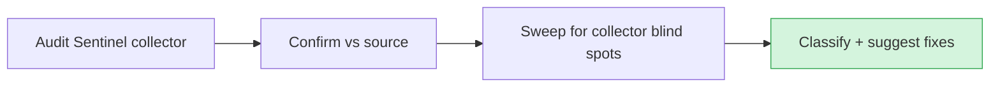

# Audit — 2026-06-14 15:35 UTC

## Collector summary
Audit Sentinel reported **PASS** — 0 critical / 0 high / 0 medium / 0 low, no findings (composer audit, pnpm audit, route-throttle scan, secret scan all clean).

## Confirmed findings

### Critical
- None.

### High
- None.

### Medium
- None.

## False positives
- **`whereRaw('1 = 0')`** in `app/Models/Lead.php:91`, `app/Models/Message.php:89`, `app/Models/Conversation.php:80` — a static "match nothing" guard inside the `forAgent` scope when `agentId` is null. No interpolation, no user input → not a SQL-injection vector.
- **`Http::` calls without timeout/throw** flagged by a naive grep in `OpenAiClient.php:44`, `AnthropicClient.php:51`, `GeminiClient.php:51`, `EmbeddingService.php:42` — the chains continue with `->timeout(60)` + `->retry(2, 300, …)` on the following lines. Properly bounded; no hang risk.

## Additional findings (collector missed)
Swept the interpreter blind spots — all clean:
- **API tenant-data exposure:** `routes/api.php` is fully covered. `/user` → `auth:sanctum`; `/public/stats` (aggregate marketing counts, server-cached) and `/health` (db+cache probe) are intentionally public, throttled `60,1` per IP, and expose **no tenant data**.
- **`Http::*` in services:** every outbound call (LLM + embeddings) carries `->timeout(60)` and a bounded `->retry`.
- **`whereRaw` / `DB::raw` interpolation:** only the static `'1 = 0'` guards above — no variable interpolation anywhere.
- **Mass assignment:** no model uses `$guarded = []`; no controller does `Model::create($request->all())` / `->fill($request->all())`.
- **Stored credentials in seeders/tests:** none in `database/seeders/` (uses factories). The historical test fixtures (`sek-1234567890`, `test-key-bytes-…`) and the rotated Voiceflow key live only in deleted/old commits and are allowlisted in `.gitleaks.toml`.

## Suggested next actions
1. Nothing to fix — audit is clean. Continue with the production-readiness todos (engine keys, Stripe live, mail, Reverb-in-prod, Forge scheduler/queue).
2. Keep the daily Audit Sentinel running — verify the Forge per-minute scheduler cron is enabled in prod so `audit_sentinel.sh` actually fires (todo #11).

## Audit visualization

