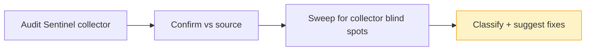

# Audit — 2026-06-17 07:54 UTC

Run with the **SES production-acceptance lens**: the goal is validating, code-wise,
that transactional email is correctly wired before requesting SES production access
for the `txn.flowstack.run` identity (currently sandbox).

## Collector summary
Audit Sentinel: **PASS** — 0 critical / 0 high / 0 medium / 0 low. Update Inspector:
WARN — 10 PHP outdated (4 major), 11 JS outdated (5 major). No security findings from
the heuristic collector; all findings below are from the interpreter source sweep.

## Confirmed findings

### Critical
- **Region mismatch risk — every SES send fails if region ≠ identity region.**
  `config/services.php` defaults `ses.region` to `us-east-1`; local `.env` =
  `us-east-1`; but `.env.example:77,80` document the SES identity in **`eu-central-1`**.
  An SES identity is regional — if `txn.flowstack.run` is verified in `eu-central-1`
  but prod sends with `AWS_DEFAULT_REGION=us-east-1`, every send is rejected
  (identity not found / `MessageRejected`), and the config set just edited won't apply.
  **Fix (verify on Forge, do not edit `.env` here):** confirm prod
  `AWS_DEFAULT_REGION` == the region where `txn.flowstack.run` + its DKIM/config set
  live. Then align the `.env.example` AWS section (says us-east-1 at :97) with the
  mail section (eu-central-1 at :77) so the docs stop contradicting each other.

### High
- **`mail` queue worker is a hard delivery dependency — no worker = no email.**
  `app/Models/User.php:79,93` route verification + password-reset onto the dedicated
  `mail` queue (`QueuedVerifyEmail`, `QueuedResetPassword`); `WelcomeEmail` too.
  `docs/operations/launch-checklist.md:167` requires a dedicated Email Worker daemon
  `php artisan queue:work database --queue=mail`. The general worker consumes only
  `default`. **If the Email Worker daemon is not running on Forge, verification mail
  silently never sends** — users register but can never verify, and SES sees zero
  traffic during the acceptance test. **Fix (verify on Forge):** confirm the
  dedicated `--queue=mail` daemon exists and is running; `php artisan queue:monitor mail`.

### Medium
- **No programmatic bounce/complaint handling.** No SNS endpoint, no suppression
  logic anywhere (`grep` for bounce/complaint/sns/suppress → nothing in app/routes).
  For transactional-only mail this is *acceptable* because SES's account-level
  automatic suppression list is on by default and the config set's event destination
  can route bounce/complaint to CloudWatch/SNS for monitoring. But AWS's production-
  access review explicitly asks how bounces/complaints are handled. **Fix:** ensure
  the config set has a bounce+complaint event destination + a CloudWatch alarm; state
  "SES auto-suppression + config-set event monitoring" in the access request. This
  becomes a hard requirement before any marketing/bulk lane is added.
- **Over-broad IAM guidance.** `.env.example:96` says the IAM user needs
  `AmazonSESFullAccess`; `:75` says `ses:SendEmail` only. The app only needs
  `ses:SendEmail` + `ses:SendRawEmail`. **Fix:** scope the prod IAM user to those two
  actions (least privilege) and correct the contradictory comment.

## False positives
- Audit Sentinel reported nothing, so there are no collector findings to refute. The
  `bounce` grep hits in `CreateAgent.php` / `RequireAgent.php` / `OnboardingController.php`
  / `LeadController.php` are control-flow comments ("bounce to the wizard"), unrelated
  to email bounces — correctly excluded.

## Additional findings (collector missed)
- **Config set not pinned app-side (low / informational).** Nothing references a
  `ConfigurationSetName`. Since the set was made the *identity default* on AWS this is
  fine, but pinning it via `config/services.php` `ses.options.ConfigurationSetName`
  would make the behavior explicit and survive an identity-default change.
- **Wiring confirmed correct (positive):** `User implements MustVerifyEmail`;
  `sendEmailVerificationNotification` / `sendPasswordResetNotification` overridden to
  the queued notifications; branded copy via `VerifyEmail::toMailUsing` in
  `AppServiceProvider:56`; `php artisan mail:test <addr>` exists and prints the
  resolved driver + from-address before sending — use it for the prod probe.
- **SES-relevant dependency:** only `aws/aws-sdk-php` 3.384.6 → 3.385.0 (minor, safe)
  matters for the SES path. The major bumps (Laravel 13, Inertia 3, PHPUnit 13,
  Tinker 3, Vite 8, Tailwind 4) are unrelated to SES and out of scope for this
  validation — do them on their own branch, not as part of acceptance.

## Suggested next actions
1. **On Forge — confirm region:** `AWS_DEFAULT_REGION` matches where `txn.flowstack.run`
   is verified. This is the #1 thing that breaks sends.
2. **On Forge — confirm the Email Worker daemon** is running `--queue=mail`
   (`php artisan queue:monitor mail`); without it nothing is delivered.
3. **On Forge — probe:** `php artisan mail:test <a-verified-inbox>` (sandbox: recipient
   must be verified). Expect "Sent" + arrival.
4. Add/confirm a **bounce+complaint event destination** on the config set + a CloudWatch
   alarm before requesting production access.
5. Scope the prod IAM user to `ses:SendEmail` + `ses:SendRawEmail`; fix the
   contradictory `.env.example` IAM + region comments.
6. Bump `aws/aws-sdk-php` to 3.385.0; defer all major upgrades to a separate branch.

## Audit visualization

