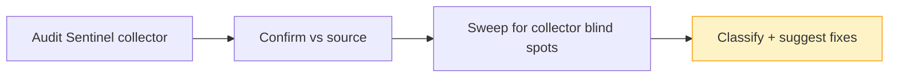

# Audit — 2026-06-18 21:11 UTC

## Collector summary
Collector reported **WARN** — 0 critical / 0 high / 1 medium / 0 low; single finding is `.env` drift for the new Slack integration keys.

## Confirmed findings

### Critical
- None.

### High
- None.

### Medium
- **`env-missing-keys` (collector)** — `.env.example:115,129-133` declare 6 `SLACK_*` keys (`SLACK_ADMIN_USERS`, `SLACK_AGENT_ID`, `SLACK_ALERT_WEBHOOK_URL`, `SLACK_APP_TOKEN`, `SLACK_BOT_TOKEN`, `SLACK_TEAM_ID`) that are absent from local `.env`. **Confirmed**: these were added by the new Slack bot/digest feature on this branch and have never been populated locally. Not a security risk, but the Slack listener/digest/alert commands will silently no-op (or `not_configured`) in any environment missing them. **Proposed action** (config-only, not auto-applied — `.env` is do-not-touch): populate the 6 keys in every target `.env` (local + Forge prod) before relying on Slack features; confirm `config/services.php` reads them with safe defaults so a missing key degrades gracefully rather than throwing.
- **SSRF in `KnowledgeBaseController::storeUrl`** — `app/Http/Controllers/KnowledgeBaseController.php:105` does `Http::timeout(20)->...->get($data['url'])` on a user-supplied URL that is only validated for `url` format + length (`:99-102`), with no destination filtering. The endpoint is auth + capability gated (`canAddKnowledge`), so this is authenticated SSRF, not anonymous — but a tenant user could point it at `http://169.254.169.254/…` (cloud metadata), `http://localhost`, or other internal-network hosts and exfiltrate the response body into a knowledge document. **Proposed fix**: before the fetch, resolve the host and reject private / loopback / link-local / reserved IP ranges (RFC1918, `127.0.0.0/8`, `169.254.0.0/16`, `::1`, `fc00::/7`), block non-`http(s)` schemes, and disable redirects (or re-validate each redirect hop) so a public 30x can't bounce into the internal network.

## False positives
- **`whereRaw('1 = 0')`** at `app/Models/Conversation.php:80`, `app/Models/Lead.php:91`, `app/Models/Message.php:91` — constant literal, no interpolation. Standard "force empty result" guard. Not an injection vector.
- **`DB::raw('SUM(amount) as total')`** (`app/Console/Commands/ReconcileCredits.php:30`) and **`DB::raw('-amount')`** (`app/Http/Controllers/AgentAnalyticsController.php:149`) — constant SQL fragments, no user input. Safe.

## Additional findings (collector missed)
- **API routes** (`routes/api.php`) — clean. `/user` is `auth:sanctum`; `/public/stats` and `/health` are public-by-design, throttled `60,1`, and don't expose tenant data.
- **Public embed routes** (`routes/web.php:228-239`) — clean. All four unauthenticated endpoints are throttled (`120,1` / `60,1` for launch) with per-agent-slug authorization inside `EmbedController` (refuses non-active agents).
- **Outbound `Http::*` calls** — all have explicit `->timeout()`: `SlackApi.php:129` (10s), `SlackWebhook.php:50` (5s), `OpenAiClient.php:46` (60s), `KnowledgeBaseController.php:105` (20s), plus Gemini/Anthropic/Embedding clients follow the same baseUrl+timeout+retry pattern. LLM clients throw `UpstreamUnavailable` on failure; Slack helpers degrade to logged `ok:false`. No unbounded outbound calls.
- **Mass assignment** — no model uses `$guarded = []`; no `Model::create($request->all())` sweep matches. No exposure found.
- **Stored credentials** — no password/secret/token/api-key literals in `database/seeders/`. Clean.

## Suggested next actions
1. Add destination filtering (private/loopback/link-local IP block + scheme allowlist + redirect re-validation) to `KnowledgeBaseController::storeUrl` before the next push — only confirmed exploitable-class finding this run.
2. Populate the 6 `SLACK_*` keys in target `.env` files (local + Forge prod) and verify `config/services.php` degrades gracefully when they're blank.
3. No critical/high blockers; branch is otherwise safe to push.

## Audit visualization

