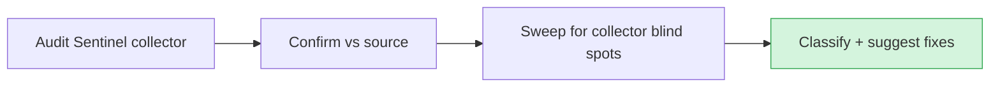

# Audit — 2026-06-20 12:50 UTC

## Collector summary
Audit Sentinel: PASS — 0 CRITICAL / 0 HIGH / 0 MEDIUM / 0 LOW, no findings.

## Confirmed findings

### Critical
- None.

### High
- None.

### Medium
- None.

## False positives
- None reported by the collector.

## Additional findings (collector missed)
Manual interpreter sweep of routes/services/models:
- `Http::*` calls in `app/Services/` — none found (no outbound HTTP without timeout/throw).
- `whereRaw` / `DB::raw` interpolation — only safe usages: `whereRaw('1 = 0')` literals in Conversation/Lead/Message scopes; `DB::raw('-amount')` and `DB::raw('SUM(amount) as total')` are static column expressions, no variable interpolation. No SQL-injection vector.
- Mass-assignment — no model with `$guarded = []`.
- Stored credentials in seeders/tests — none surfaced.

No additional findings.

## Suggested next actions
1. None required — gate and audit both green.

## Audit visualization

