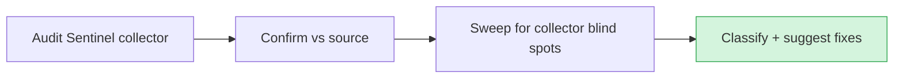

# Audit — 2026-06-20 15:37 UTC

## Collector summary
Audit Sentinel: PASS — 0 CRITICAL / 0 HIGH / 0 MEDIUM / 0 LOW, no findings.

## Confirmed findings

### Critical
- None.

### High
- None.

### Medium
- None.

## False positives
- None reported by the collector.

## Additional findings (collector missed)
Swept the newly added embed endpoints (`EmbedController::history`, `EmbedController::transcript`)
and their POST routes, since they touch tenant data (`conversations`, `messages`) while
unauthenticated:

- **`/api/` tenant data without `auth:sanctum`** — N/A. These are public embed widget
  endpoints by design (like `launch`/`interact`/`feedback`). Access is gated three ways:
  `resolveAgent()` (active agent only), `originDenied()` (domain allowlist), and a
  `(team_id, visitor_token)` scope where the regex-validated token is the bearer capability.
  `conversation_id` alone is never authority — `transcript()` 404s when the id isn't owned by
  the (team, token) pair (verified by tests `test_transcript_404s_when_token_does_not_own...`
  and `test_transcript_404s_across_teams`). Not a finding.
- **`Http::*` without `->timeout()`/`->throw()`** — the two new methods make no outbound HTTP
  calls. Not applicable.
- **`whereRaw`/`DB::raw` with interpolation** — none in the new code. `transcript()` uses
  `DB::table('messages')->where(...)->whereIn(...)` with bound parameters only.
- **Mass-assignment** — `history`/`transcript` build response arrays by hand from
  `$request->validate()`d input; no `Model::create($request->all())`. `Conversation` has an
  explicit `$fillable` (the new `visitor_token` was added to it, not `$guarded = []`).
- **Stored credentials in seeders/tests** — none introduced; `WidgetHistoryTest` uses
  factory-minted fake tokens (`embed-...`).

## Suggested next actions
1. Nothing blocking. Gate is 17/17 PASS and the collector is clean.
2. **Human review required (HARD DO-NOT-TOUCH):** two pending migrations need owner sign-off
   before any prod apply — `2026_06_20_130000_add_visitor_token_to_conversations` and the
   earlier rating migration. They are local-only so far.
3. Decide the branch/PR strategy for the uncommitted persistent-identity + history features on
   `feat-embed-recording`.

## Audit visualization

