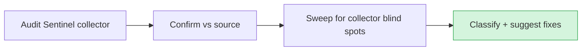

# Audit — 2026-06-20 16:22 UTC

## Collector summary
PASS — 0 critical / 0 high / 0 medium / 0 low; no findings.

## Confirmed findings

### Critical
None.

### High
None.

### Medium
None.

## False positives
None reported by the collector.

## Additional findings (collector missed)
Swept the areas touched this session (lead scoring) plus the standard blind spots:
- **SQL injection** — `whereRaw('1 = 0')` in `Lead/Conversation/Message::scope*` are static literals; `DB::raw('-amount')` (AgentAnalyticsController:149) and `DB::raw('SUM(amount) as total')` (ReconcileCredits:30) interpolate nothing. No vector.
- **Mass assignment** — no `$guarded = []` models; no controller passes `$request->all()` into `create()`. `CaptureLeadTool` builds an explicit attribute array (no request passthrough).
- **New column** — `leads.score_breakdown` (nullable JSON) holds only model-derived fit/intent/urgency integers; no PII or credentials.
- **HTTP calls / API auth** — no new `Http::*` calls or `/api/` routes added this session.

## Suggested next actions
1. None blocking. The two uncommitted HARD-DO-NOT-TOUCH migrations on this branch
   (`add_visitor_token_to_conversations`, `add_score_breakdown_to_leads`) still need
   prod review before they run against the live DB.

## Audit visualization

