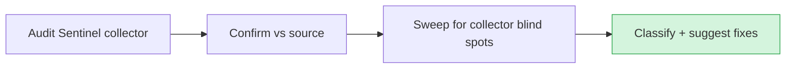

# Audit — 2026-06-21 11:52 UTC

## Collector summary
PASS — 0 critical / 0 high / 0 medium / 0 low; collector reported no findings.

## Confirmed findings

### Critical
None.

### High
None.

### Medium
None.

## False positives
- `whereRaw('1 = 0')` in `app/Models/Message.php:91`, `app/Models/Lead.php:93`, `app/Models/Conversation.php:88` — flagged by a raw-SQL grep, but these are constant tenant-scope guards (deny-all when no team context). No variable interpolation, no injection vector.

## Additional findings (collector missed)
Manual sweep beyond the collector:
- **API auth** — `routes/api.php`: `/user` is behind `auth:sanctum`; `/public/stats` and `/health` are deliberately public, IP-throttled (`throttle:60,1`), and return only aggregate/probe data (no tenant rows). Clean.
- **Http:: timeouts** — no `Http::` calls in `app/Services/` lacking `->timeout()`/`->throw()`.
- **SQL injection** — no `whereRaw`/`DB::raw`/`->raw()` with interpolated variables.
- **Mass assignment** — no models with `$guarded = []`; no `Model::create($request->all())`.
- **Stored credentials** — none in `database/seeders/` or `tests/`.

## Suggested next actions
1. None required — gate green (17/17) and audit clean.
2. (Carried, non-security) Architecture graph edge coverage: two controllers (`HealthController`, `HermesMetricsController`) and two middleware (`ComingSoon`, `SecurityHeaders`) render unconnected; consider auto-wiring controllers to `client::browser` instead of the curated list. Tracked outside the audit.

## Audit visualization

