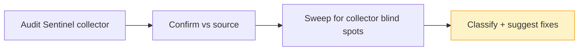

# Audit — 2026-07-02 11:23 UTC

## Collector summary
0 CRITICAL / 0 HIGH / 0 MEDIUM / 0 LOW — collector overall PASS (composer + pnpm audits clean, no env drift, no unthrottled public mutating routes, no debug routes, no secret-shaped strings, APP_DEBUG sane).

## Confirmed findings

### Critical
_None._

### High
- **automation-webhook-follows-redirects** — `app/Runtime/Automation/AutomationCaller.php:48-55`. The outbound automation POST uses Laravel's Http client without disabling redirects; Guzzle follows up to 5 by default. `OutboundGuard::assertSafe()` vets only the *initial* URL, so a vetted public endpoint that answers `302 Location: http://169.254.169.254/...` (or any RFC1918 host) gets silently followed — a full SSRF-guard bypass. Custom headers (including the HMAC signature headers from `$this->signer->headers()`) are re-sent to the redirect target, so the shared secret's signature also leaks. Mitigating factor: action URLs are authored only by Hermes operators (admin-gated in `AgentActionsController`), so exploitation requires a compromised/malicious *endpoint*, not a client. Still HIGH — the guard's own header comment calls SSRF "the #1 thing to get right", and this hole makes it bypassable by anyone controlling a whitelisted-looking public URL.
  **Fix APPLIED same session** (operator-approved): `AutomationCaller::send()` now sets `->withOptions(['allow_redirects' => false])` and throws `AutomationFailed` on any 3xx (`$response->redirect()` — `failed()` alone doesn't cover 3xx). Covered by `test_redirect_response_fails_and_is_never_followed` in `tests/Feature/Runtime/AutomationToolTest.php`, which asserts a 302 to the metadata endpoint yields a failed run (http_status 302) and exactly one outbound request. Gate green: Pint, PHPStan, 583 tests.

### Medium
- **dns-rebinding-toctou — CLOSED same session** — `app/Runtime/Automation/OutboundGuard.php`. The guard resolved DNS at check time but Guzzle re-resolved at request time (acknowledged TOCTOU window). Fixed: `assertSafe()` now returns `pin` entries in `CURLOPT_RESOLVE` format ("host:port:ip1,ip2"; empty for literal-IP hosts) and `AutomationCaller::send()` passes them via `withOptions(['curl' => [CURLOPT_RESOLVE => …]])`, so curl connects to exactly the vetted addresses and never re-resolves. Unit-tested (pin format, explicit ports, multi-address join, literal-IP skip) and live-verified: an unresolvable hostname pinned to a local server returned 200, proving the option takes effect through Laravel's client.

## False positives
- Collector produced zero findings, so no collector entries to dismiss. Manually cleared during the sweep:
  - `AgentAnalyticsController.php:82,240` — interpolated `selectRaw()` variables (`$dateColumn`, `$hourExpr`) come from internal string literals / the DB driver name, never user input. Safe.
  - `Lead/Message/Conversation` `whereRaw('1 = 0')` — constant guard clauses, no injection surface.
  - Test files with `'password' => 'password'`, `sk-anthropic-test` etc. — obvious fixtures, not credentials.

## Additional findings (collector missed)
The collector doesn't scan untracked files or app internals; the sweep covered them:
- `app/Runtime/Collab/` (new) — `RoomLedger` slugs room names before building the ledger path (`Str::slug`), so no path traversal; billing mirrors ChatController's formula. Clean.
- `app/Console/Commands/AgentsTerminal.php`, `AgentsCollab.php`, `AgentsIngestProject.php` (new) — console-only operator tools; `--no-bill` exists but is not reachable from any web surface. `AgentsIngestProject` bounds ingestion (60 files / 200 KB, `realpath`-vetted dirs). Clean.
- `routes/api.php` — only `/user` (auth:sanctum), `/public/stats` and `/health` (both throttled, intentionally public). No tenant data leaks.
- `app/Http/Controllers/AgentActionsController.php` — authoring correctly gated to Hermes operators (`requireHermesOperator` + `canUpdateAgent`), matching the managed-service model; https-only URL validation when `allow_private_hosts` is false. Clean.
- LLM/embedding clients (`app/Runtime/LLM/*`, `EmbeddingService`) — all outbound calls carry `->timeout(60)`. Clean.
- No `$guarded = []` models, no `Model::create($request->all())`, no credentials in seeders.

## Suggested next actions
1. ~~Disable redirect-following in `AutomationCaller::send()` and add the 3xx-rejection test~~ — DONE same session (see the HIGH above).
2. ~~When touching `OutboundGuard` next, consider IP-pinning via curl options to close the DNS-rebinding window for good.~~ — DONE same session (see the MEDIUM above).
3. Extend `scripts/agents/audit_sentinel.sh` with a check for `Http::` call sites lacking both `->timeout(` and redirect hardening, so this class of finding is caught mechanically next time.

## Audit visualization

