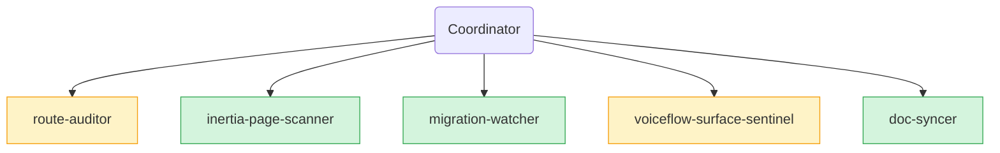

# Fleet Run — 2026-06-08 16:55 UTC

## Baseline
PASS — 8 PASS / 0 FAIL / 0 WARN. First fully clean baseline of this build cycle (Pint debt cleared earlier in turn).

## Agent reports

### Route Auditor
- 9 MISSING_THROTTLE on mutating endpoints (auth gate present, no rate cap → authenticated-user DoS surface):
  POST /agents, PUT /agents/{agent}, DELETE /agents/{agent}, PUT /current-agent,
  POST /leads, PATCH /leads/{lead}/status, POST /leads/{lead}/assign, DELETE /leads/{lead},
  POST /notifications/read
- 2 UNDOCUMENTED_PUBLIC: `/api/voiceflow/webhooks/session/{agent:slug}` + `/api/voiceflow/webhooks/org` — **absorbed by doc-syncer's `public-surface.md` update this same run**
- 0 ORPHAN_CONTROLLER, 0 DEBUG_ROUTE, 0 MISSING_AUTH
- All custom middleware (`HandleInertiaRequests`, `RequireAgent`) wired up

### Inertia Page Scanner
- CLEAN apart from the pre-existing low-severity `v-html` on Laravel paginator link labels in `Conversations/Index.vue:99` (server-controlled — `&laquo;`/`&raquo;` HTML entities, not user input)
- 0 PROP_DRIFT across 7 recently-changed Vue pages
- 0 LEAKED_SECRET, 0 XSS_RISK on user-controlled paths, 0 DEAD_IMPORT
- `Chat/Index.vue:96` direct DOM (`document.head.querySelector('meta[name=csrf-token]')`) flagged but acceptable — standard Laravel CSRF read pattern for manual `fetch`, not a reactivity bypass

### Migration Watcher
- CLEAN — `2026_06_08_000001_create_voiceflow_webhook_events_table` is internally consistent
- `VoiceflowWebhookEvent` `$fillable` covers all 11 schema columns; `$casts` correct for `payload`/`signature_valid`/datetimes
- All FKs indexed; `team_id` intentionally a nullable unconstrained `unsignedBigInteger` (org events insert `null`)
- 0 destructive ops; pre-existing duplicate timestamps `2026_05_31_052119` + `2026_06_01_062037` are inherited from Phase 6 / Jetstream scaffold, deterministically ordered by filename — outside change window

### Voiceflow Surface Sentinel
- SWALLOWED_EXCEPTION: `VoiceflowController.php:203` — `catch (OutOfCredits) {}` in `interactStream` had no `report()` while the non-streaming variant did. Inconsistent.
- INCONSISTENT_EXCEPTION: `RealtimeClient::createFileDocument` + `uploadTableDocument` throw bare `\RuntimeException` for upload validation (size/empty/unreadable). A `catch (VoiceflowException)` won't catch these.
- UNTESTED_CLIENT_METHOD: 9 wrapper methods without direct test reference: `queryUsage`, `updateEvaluation`, `deleteEvaluation`, `estimateEvaluation`, `patchDocument`, `patchChunk`, `replaceDocument`, `uploadTableDocument`, `deleteEnvironment`. (Five of these covered indirectly via controller/UI tests; four are write-paths with no coverage at any level.)
- DOC_DRIFT: `docs/voiceflow/README.md` "What the codebase uses today" table still claims `❌ not used` for: Inbound webhooks, Project/Environments, Evaluations, Usage API, Conversations streaming — all wired this cycle.
- 0 HARDCODED, 0 UNSAFE_HTTP, 0 UNVERIFIED_WEBHOOK, 0 WEAK_DTO, 0 WEBHOOK_MIDDLEWARE_GAP
- Documented endpoints still un-wrapped: WS interact (`/v4/interact/socket`), mid-session event emit (`POST /v2/.../session/{sk}/event`), state mutations (`PUT/DELETE /state/user/{id}`, `PATCH /state/user/{id}/variables`), traffic-split start (`POST /v4/session`), 8 transcript-property + property-value endpoints

### Doc Syncer
- FIXED: `docs/architecture/integration-map.md` — Voiceflow API coverage table refreshed (Tier 2/3/4 flipped from "future" to shipped where applicable)
- FIXED: `docs/public-surface.md` — added the two new inbound public webhook routes (`/voiceflow/webhooks/session/{agent:slug}` + `/voiceflow/webhooks/org`). **Absorbs route-auditor's UNDOCUMENTED_PUBLIC findings.**
- FIXED: `docs/phase-13-multitenancy.md` — three sync notes for the `/agent/*` → `/chat/*` route rename done in Phase 14
- FIXED: `docs/README.md` — added `phase-15-voiceflow-wrapper.md` to the Voiceflow integration index

## Actions taken (coordinator)

1. **Added throttle to 9 mutating endpoints** in `routes/web.php` (auth-only is partial defence — throttle prevents authenticated DoS surfaces):
   - `agents.store` (`throttle:10,1`), `agents.update` (`30,1`), `agents.destroy` (`10,1`)
   - `current-agent.update` (`60,1`)
   - `leads.store` (`30,1`), `leads.status` (`120,1` — kanban drag is hot path), `leads.assign` (`30,1`), `leads.destroy` (`30,1`)
   - `notifications.read` (`60,1`)
2. **Fixed swallowed exception** in `VoiceflowController::interactStream` (`app/Http/Controllers/VoiceflowController.php:203`) — added `report()` mirroring the non-streaming path so ops sees the credit-race when it happens.

## Verification

`composer hermes-fast` re-run after fixes: **PASS — 8 PASS / 0 FAIL / 0 WARN**. PHPStan, Pint, tests, config, routes, migrations, composer-audit all green. 288 tests pass.

## Carry forward

### MEDIUM
- **INCONSISTENT_EXCEPTION in RealtimeClient** — bare `\RuntimeException` for upload validation (size/empty/unreadable) should extend `VoiceflowException` so `catch (VoiceflowException)` covers them. Add `KbUploadException extends VoiceflowException` (Phase B+ cleanup).
- **9 untested wrapper methods** — write feature tests for `queryUsage`, `updateEvaluation`, `deleteEvaluation`, `estimateEvaluation`, `patchDocument`, `patchChunk`, `replaceDocument`, `uploadTableDocument`, `deleteEnvironment`. Some covered indirectly via UI/controller paths; four (KB metadata-patch endpoints) need direct coverage.
- **DOC_DRIFT in `docs/voiceflow/README.md`** — "What the codebase uses today" table still claims `❌ not used` on five categories now actually used. Doc-syncer didn't catch this (the file isn't in its read list). Add to doc-syncer's path next round, or update by hand.

### LOW
- Pre-existing `v-html` on Laravel paginator labels in `Conversations/Index.vue:99` — server-controlled, low practical risk; standing hazard.
- 7 documented Voiceflow endpoints not yet wrapped: WS interact, mid-session event emit, 3 state-mutation endpoints, traffic-split start, 8 transcript-property/value endpoints. Mostly low-value for this product; carry-forward as available capability.

## Phase flow visualization

