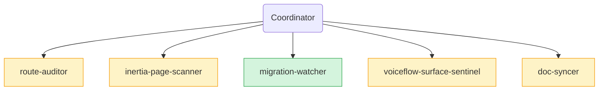

# Fleet Run — 2026-07-02 13:30 UTC

## Baseline
FAIL — 15 PASS / 1 FAIL. Sole failure: `doc-coverage` — three subsystems shipped today (`app/Jobs`, `app/Runtime/Automation`, `app/Runtime/Collab`) unregistered in `docs/hermes/manifest.json`. All other checks green.

## Agent reports

### Route Auditor
- 0 MISSING_AUTH, 0 actionable MISSING_THROTTLE (Stripe webhook exemption is documented-deliberate), 0 ORPHAN_CONTROLLER, 0 DEBUG_ROUTE. All 4 custom middleware wired.
- 5 UNDOCUMENTED_PUBLIC: `POST /waitlist`, `POST /embed/{slug}/feedback`, `POST /embed/{slug}/history`, `POST /embed/{slug}/conversation`, `GET /up` — **absorbed by doc-syncer's `public-surface.md` update this same run**
- Minor doc drift: `GET /` described as static Welcome page but now redirects — also absorbed by doc-syncer.

### Inertia Page Scanner
- 0 PROP_DRIFT (Actions.vue and Activity.vue defineProps match their controllers exactly), 0 LEAKED_SECRET, 0 DEAD_IMPORT, no reactivity-bypassing DOM access.
- 8 A11Y label gaps (all icon-only buttons / placeholder-only inputs): Actions.vue param-row inputs + remove button, Activity.vue filter selects, AppLayout hamburger / notifications bell / mobile close. **Fixed this run.**
- XSS_RISK on Activity.vue pagination `v-html` — server-controlled paginator labels, `@hermes-keep` annotated; noted, not actionable.
- LOW: `agent` and `hasDraft` props passed by AgentActionsController but never used by Actions.vue.

### Migration Watcher
- CLEAN. No migrations in the HEAD~10 range; adjacent audit of the phase-16 pair (`automation_secret`, `automation_runs`) confirms fillable/casts/index consistency. No future-dated or problematic duplicate timestamps.
- LOW: `2026_06_27_000001_add_automation_secret_to_agents.php:3` dead `use App\Models\Agent` import (DO-NOT-TOUCH: migrations — not fixed).

### Voiceflow Surface Sentinel
- The entire Voiceflow surface this sentinel audits was deliberately deleted (commit `76ee819` — native runtime is the only engine); zero code residue, absence is test-guarded (`NoLeaksTest`, `Http::assertNotSent`).
- DOC_DRIFT: dangling `docs/voiceflow/` links in five phase docs — **absorbed by doc-syncer this same run.**
- **Sentinel mandate is stale** — its prompt targets deleted files. Retarget at the native runtime boundary (`app/Runtime/`) or retire (operator decision, `scripts/fleet_agents.json`).

### Doc Syncer
- FIXED `docs/public-surface.md`: corrected `GET /` description; added `POST /waitlist`, the three embed conversation endpoints, `GET /up`, and the `next_cohort_open_at` response field.
- FIXED `docs/README.md` (dead voiceflow archive link) and `docs/architecture/integration-map.md` (removed stale `/conversations/search`, added the five shipped-but-missing surfaces: analytics, versions, actions, activity, install).
- FIXED `docs/phase-16-automations.md`: status + "Remaining work" caught up with shipped code (Actions UI, operator gating, Activity view, redirect rejection, IP pinning) — only the n8n signature-verify sub-workflow remains open.
- FIXED dangling `docs/voiceflow/` references in phase-5/6/11/12/13/15 docs (annotated as historical, pointing at git history).
- STALE-annotated: `phase-2-realtime.md` (removed tick demo files) and `phase-13-multitenancy.md` (deleted PoolAllocator files).
- OK: architecture SSE/public-stats docs, phase-3/4/7/14.
- UNDOCUMENTED: the agent collab surface (`app/Runtime/Collab` + `agents:collab|terminal|ingest-project`, commit `2857e5a`) has no doc home; the Audit Sentinel outbound-HTTP hardening check (`8b90005`) is missing from `docs/hermes/README.md`.

## Actions taken
- `docs/hermes/manifest.json` — registered the three missing subsystem nodes: `app/Runtime/Automation` (docs: phase-16, criticality high), `app/Jobs` (docs: phase-16), `app/Runtime/Collab` (waived: operator-only CLI surface, doc home pending). Clears the baseline FAIL.
- `resources/js/Pages/Agents/Actions.vue:229,240,249,266` — aria-labels on param name/type/description inputs + remove-parameter button.
- `resources/js/Pages/Agents/Activity.vue:82,90` — aria-labels on status/action filter selects.
- `resources/js/Layouts/AppLayout.vue:308,358,438` — aria-labels on hamburger, notifications bell, mobile close button.
- Doc-syncer applied its own edits to `docs/public-surface.md` + five phase docs (see its report).

## Verification
Final `composer hermes-fast`: **PASS** — 16/16 checks green (baseline FAIL → final PASS; `doc-coverage` cleared, no regressions).

## Carry forward
- **Stale sentinel mandate**: `voiceflow-surface-sentinel` audits a deleted surface — retarget its `scripts/fleet_agents.json` prompt at `app/Runtime/` (LLM clients, automation callers, embed boundary) or retire the slot. Operator decision.
- **stale_suppression (line drift)**: `.hermes/suppressions.yaml` XSS_RISK entry points at `Conversations/Index.vue:111`; the `v-html` now sits at line 230. Update the line (or switch to a glob) so the suppression keeps matching.
- **Collab doc home**: `app/Runtime/Collab` waived in the manifest — write a phase-17 doc or extend `docs/operations/commands.md`, then swap the waiver for real docs.
- LOW: unused `agent`/`hasDraft` props in the AgentActionsController → Actions.vue contract.
- LOW: add the Audit Sentinel outbound-HTTP hardening check to `docs/hermes/README.md`'s check inventory.
- LOW: dead `use App\Models\Agent` import in `2026_06_27_000001_add_automation_secret_to_agents.php` (migrations are DO-NOT-TOUCH; harmless).
- Recent-touch guard held `app/Runtime/Automation/AutomationCaller.php` out of scope this run (edited <30 min before the run); no findings targeted it anyway.

## Fleet visualization

