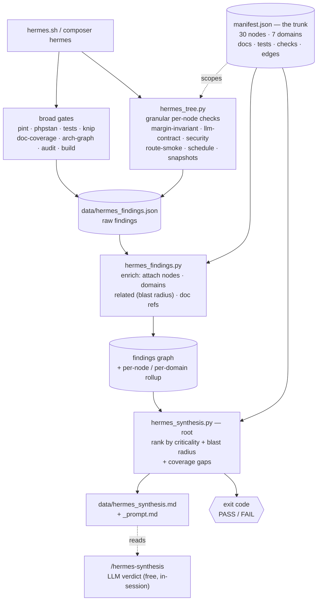
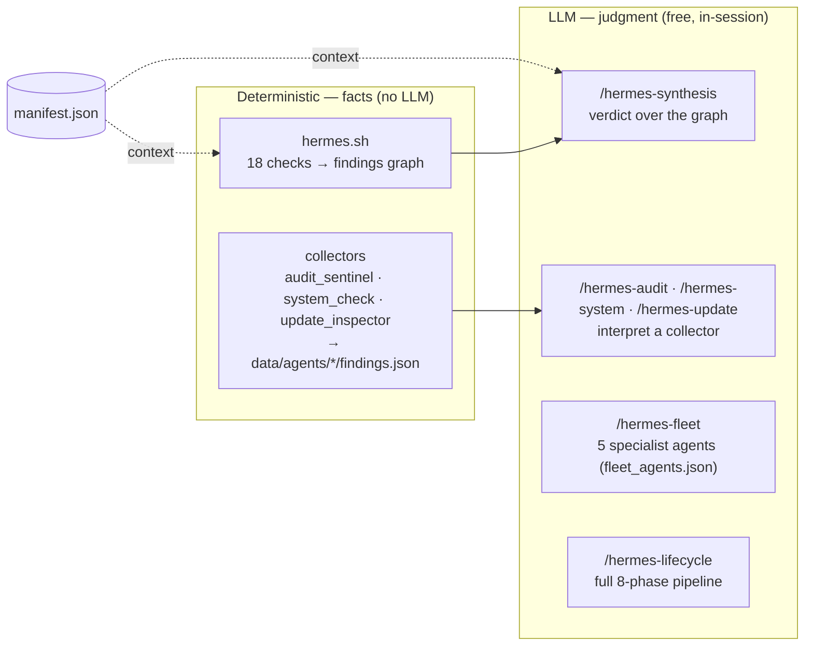

# Hermes — automation_dashboard

Local CI + audit tooling for automation_dashboard. The LLM/fleet layer is invoked manually (composer scripts or interactive Claude Code slash commands); the no-LLM collectors (`audit_sentinel`, `update_inspector`, `system_check`) also run on a prod schedule via `routes/console.php` and write their findings to `data/agents/*/`. Delivering CRITICAL/FAIL findings to an operator now lives in the separate `hermes-slack` project (see [Alerting](#alerting-criticalfail--delivery)).

## Architecture

Hermes has two halves joined by one **trunk** (`docs/hermes/manifest.json`): a
deterministic watchdog (facts, no LLM) and an LLM layer (judgment, free in a
Claude session). Nothing connects directly — everything reads the trunk, so a
finding always carries its context.

### How a run flows (the tree)



1. **Branches** — the checks run (`composer hermes`); granular ones are scoped to nodes via the trunk.
2. **Enrich** — each finding is tagged with the manifest nodes its check covers + their blast radius.
3. **Synthesize** — the root ranks everything and writes the brief + an LLM prompt.
4. **Verdict** — exit code is the gate; `/hermes-synthesis` turns the brief into a prioritised story.

### The two layers + the agents



## Quick reference

| Command | Where | Cost | When to run |
|---|---|---|---|
| `composer hermes` | any shell | free | full CI gate before pushing |
| `composer hermes-fast` | any shell | free | quick local heartbeat (skips vite + pnpm audit) |
| `composer hermes-tree` | any shell | free | granular per-node checks scoped by node/domain (`scripts/hermes_tree.py --domain billing`) |
| `composer hermes-domain` | any shell | free | run one domain as its own Hermes (`scripts/hermes_domain.py --domain billing`) |
| `composer hermes-metrics` | any shell | free | effectiveness report — quality KPI trend + regression check → `docs/hermes/effectiveness.md` |
| `composer hermes-learn` | any shell | free | the learning loop (deterministic half) — mines history+git → reviewable manifest proposals. **Periodic** |
| `composer hermes-audit` | any shell | free | security/risk surface scan (CVEs, .env drift, debug routes, throttle gaps) |
| `composer hermes-update` | any shell | free | outdated PHP + JS deps (counts + per-package current/latest) |
| `composer hermes-system` | any shell | free | runtime health (disk, logs, queue, DB, Typesense, scheduler) |
| `composer hermes-all` | any shell | free | chains all 4 free collectors (watchdog + audit + update + system); aggregate verdict at end |
| `composer hermes-status` | any shell | free | read-only snapshot — last collector verdicts, last lifecycle, git position, baseline state. No re-scan |
| `composer hermes-dashboard` | any shell | free | regenerates `docs/hermes/dashboard.md` with Mermaid timelines + verdict tallies across all sessions |
| `/hermes-fleet` | interactive Claude Code session | **free** (subscription) | deep audit + auto-fixes via 5 Claude agents |
| `/hermes-docs` | interactive Claude Code session | **free** (subscription) | sync docs/phase-*.md + docs/architecture/* against current code |
| `/hermes-audit` | interactive Claude Code session | **free** (subscription) | runs the audit collector then interprets/classifies findings + proposes fixes |
| `/hermes-update` | interactive Claude Code session | **free** (subscription) | runs the update collector then builds a risk-bucketed upgrade plan |
| `/hermes-system` | interactive Claude Code session | **free** (subscription) | runs the system collector then digs into anomalies + recommended actions |
| `/hermes-lifecycle` | interactive Claude Code session | **free** (subscription) | **full 8-phase pipeline**: scan → agent analysis → docs → obsidian → flowcharts → tests → validate → commit (no push). Heavy session, ~30-60 min wall-clock |
| `/loop <interval> /hermes-lifecycle` | interactive Claude Code session | **free** (subscription) | Repeat the lifecycle on a recurring interval (e.g. `/loop 4h /hermes-lifecycle`). Stays inside the same session, never pushes. Stop with `/loop stop`. |
| `/hermes-status` | interactive Claude Code session | **free** (subscription) | runs `composer hermes-status` + adds short interpretation + recent-sessions Mermaid timeline |
| `/hermes-synthesis` | interactive Claude Code session | **free** (subscription) | the root synthesis node — reads the findings graph + manifest, gives a prioritised, context-aware verdict (what's broken, blast radius, fix-first, gaps) |
| `/hermes-learn` | interactive Claude Code session | **free** (subscription) | the learning loop — validates the deterministic proposals + applies them as a human-reviewed manifest diff. **Periodic, proposes-only** |

## Files

| Path | Purpose |
|---|---|
| `scripts/hermes.sh` | Vendor + pint + PHPStan + tests + config + routes + migrations + arch-graph (architecture-graph integrity) + composer audit + knip (frontend dead code) + doc-coverage [+ vite + pnpm audit] |
| `scripts/doc_coverage.py` | Doc-coverage gate — every `app/` subsystem + every canonical doc must be registered in the manifest |
| `scripts/hermes_graph.py` | Manifest visualizer — prints the domain tree + each node's context (`--node app/X` for the connection view) |
| `scripts/hermes_findings.py` | Findings enricher — joins raw findings × manifest into a node-aware graph (status rollup per node/domain + blast radius) |
| `scripts/hermes_tree.py` | Tree runner — runs the manifest's granular per-node checks scoped to a node/domain/all (`composer hermes-tree`; `--domain billing` / `--node app/X`) |
| `scripts/hermes_synthesis.py` | Root synthesis — ranks the findings graph by criticality + blast radius, surfaces coverage gaps, writes the brief + LLM prompt (consumed by `/hermes-synthesis`) |
| `scripts/hermes_domain.py` | The split — runs one domain as its own Hermes (`composer hermes-domain` lists; `--domain billing` runs that slice + shows its cross-domain blast radius) |
| `scripts/hermes_metrics.py` | Effectiveness report — mines git history for direction-aware quality KPIs + flags regressions; writes `docs/hermes/effectiveness.md` (`composer hermes-metrics`) |
| `scripts/hermes_learn.py` | Learning loop (deterministic) — snapshots history + mines git for escaped-bug/coverage/flake signals → reviewable manifest proposals (`composer hermes-learn`, periodic) |
| `docs/hermes/effectiveness.md` | Generated "is Hermes working?" report — KPI charts + regression check |
| `docs/hermes/manifest.json` | **The trunk** — the project graph every Hermes check reads from (subsystems → docs/tests/checks/edges, + canonical docs) |
| `scripts/fleet_agents.json` | 5 specialist agent definitions (route-auditor, inertia-page-scanner, migration-watcher, runtime-surface-sentinel, doc-syncer) — consumed by `.claude/commands/hermes-fleet.md` |
| `scripts/agents/audit_sentinel.sh` | No-LLM collector — writes `data/agents/audit-sentinel/findings.json` (security/risk scan) |
| `scripts/agents/update_inspector.sh` | No-LLM collector — writes `data/agents/update-inspector/findings.json` (composer + pnpm outdated) |
| `scripts/agents/system_check.sh` | No-LLM collector — writes `data/agents/system-check/findings.json` (runtime health) |
| `scripts/agents/agent_status.py` | Shared helper — writes `data/agents/<name>/last_run.json` for any collector |
| `.claude/commands/hermes-fleet.md` | Slash command `/hermes-fleet` — runs the 5-agent fleet inside an interactive session |
| `.claude/commands/hermes-docs.md` | Slash command `/hermes-docs` — single-agent doc sync |
| `.claude/commands/hermes-audit.md` | Slash command `/hermes-audit` — runs audit collector + interprets findings |
| `.claude/commands/hermes-update.md` | Slash command `/hermes-update` — runs update collector + builds upgrade plan |
| `.claude/commands/hermes-system.md` | Slash command `/hermes-system` — runs system collector + investigates anomalies |
| `.claude/commands/hermes-lifecycle.md` | Slash command `/hermes-lifecycle` — full 8-phase project lifecycle orchestrator |
| `data/agents/lifecycle/<TS>/` | Per-session working dir for lifecycle runs (gitignored) — MANIFEST.md + 8 phase outputs |
| `phpstan.neon` | PHPStan + larastan + shipmonk dead-code config (level 6, paths app/routes/database) |
| `phpstan-baseline.neon` | **Committed** baseline of pre-existing PHPStan issues — chip away over time; smaller file = better |
| `data/hermes_findings.json` | Latest run's machine-readable status (gitignored) |
| `data/logs/` | Per-step logs (gitignored) |
| `docs/hermes/FLEET-*.md` | Fleet run notes — agent reports, actions taken, carry-forward items |

## Alerting (CRITICAL/FAIL → delivery)

The collectors are scheduled in prod but only *write report files* — nothing reads
them unless someone runs `composer hermes-status`. Turning an actionable finding
into a notification an operator actually sees is the job of the **separate
`hermes-slack` project**, which was split out of this repo.

```
collector (no LLM)                       hermes-slack (separate project)
audit_sentinel  ─CRITICAL─┐
system_check    ─FAIL─────┴─→ data/agents/*/findings.json ──► consumed + delivered to Slack
```

- **This repo's responsibility** — run the collectors on schedule
  (`routes/console.php`: `audit_sentinel.sh` daily 06:00, `system_check.sh` every 6h,
  `update_inspector.sh` Mondays) and write `data/agents/*/findings.json`. It no longer
  posts anywhere itself.
- **Delivery lives elsewhere** — the `hermes-slack` project reads those findings and
  posts CRITICAL/FAIL (deduped) to Slack, plus a daily digest. Its `INTEGRATION.md`
  documents the env/config/schedule it needs and the findings contract it consumes.
- **What still alerts** — audit-sentinel `severity: CRITICAL` (leaked secret,
  `APP_DEBUG` in prod, dependency CVE) and system-check `status: FAIL` (disk full,
  DB unreachable, queue backlog) — the classification is unchanged; only the delivery
  hop moved out.
- **Still no LLM** — the collectors are pure bash/PHP reading JSON. (The deeper
  "read & interpret the finding" step is the manual `/hermes-audit` LLM layer, off-server.)

## Dead-code policy (both stacks gated)

Dead code is gated on **both** sides of the app, so it can't accumulate:

| Stack | Tool | Catches | Gate |
|---|---|---|---|
| PHP | `shipmonk/dead-code-detector` (via PHPStan) | unused methods/constants/properties/enum cases, Laravel-aware | phpstan check (baseline-tracked) |
| Vue/JS | `knip` (`knip.json`, `pnpm run knip`) | unused files + exports (Inertia pages + the `@/` alias are configured as entries) | `knip` check — **FAIL on any finding** |

knip has no baseline: the frontend is kept at **zero** unused files/exports, so any new dead module breaks the build. PHP uses the `phpstan-baseline.neon` ratchet (shrink it as you delete). After removing dead code, regenerate: `vendor/bin/phpstan analyse --generate-baseline --memory-limit=2G` and confirm the diff is removal-only.

## The manifest (the trunk) + doc-coverage policy

`docs/hermes/manifest.json` is the **project graph** — the single source every
Hermes check reads from. Each `app/` subsystem is a node carrying its
`domain`, `docs`, `tests`, `checks`, `edges` (the links to other nodes that
give findings context), and `criticality`; a `documents` list tracks the
canonical project docs. Visualize it with `python3 scripts/hermes_graph.py`
(add `--node app/Billing` for one node's connection view).

`scripts/doc_coverage.py` (the `doc-coverage` check) enforces the manifest:
**every `app/` dir with PHP must be a node** (`docs: [...]` or `waived`), and
**every canonical doc must exist and be linked from `docs/README.md`**. Add a
subsystem or delete a source-of-truth doc and CI fails until you make a
documentation decision.

This is the tree-structured Hermes design taking shape. **Increment 1** built
the trunk (the manifest + `hermes_graph.py`). **Increment 2** wired findings
into it: after each run, `hermes_findings.py` joins the raw
`{check, status, detail}` findings against the manifest and rewrites
`data/hermes_findings.json` as a graph — every finding tagged with the nodes
its check covers, their `domains`, `related` nodes (the blast radius) and doc
`refs`, plus a per-node and per-domain status rollup. So a failure shows *what
it threatens* (which domains, which neighbouring nodes), not just "tests
failed". **Increment 3** added the **tree runner** (`scripts/hermes_tree.py`,
`composer hermes-tree`): the manifest's granular per-node checks
(`margin-invariant`, `llm-contract`, `security`, `route-smoke`, `schedule`,
`snapshots`) now run as first-class findings, each attached to the exact node
that declares it — so a failure localizes (`margin-invariant` → `app/Billing`)
instead of only tripping the broad `tests` gate. The same runner does scoped
dev runs: `python3 scripts/hermes_tree.py --domain billing` or
`--node app/Runtime/LLM` runs just that slice's deep checks (~seconds). That
scoping is the primitive the split is built on — a future `hermes:billing` is
just `hermes_tree.py --domain billing`.

**Increment 4** added the **root synthesis node**. After enrichment,
`scripts/hermes_synthesis.py` ranks the findings graph by node criticality +
blast radius, surfaces coverage gaps (pending granular checks, untested nodes),
and writes the context brief (`data/hermes_synthesis.md`) plus an assembled LLM
prompt (`data/hermes_synthesis_prompt.md`). The branches are facts; the root
turns them into a prioritised story: *what's broken, what it threatens (which
neighbouring nodes/domains), where to look first (the docs/tests the node
owns).* The LLM half runs free in a Claude session via `/hermes-synthesis` —
it reads the prompt and writes the verdict, no API call.

**Increment 5** is the **split**. `scripts/hermes_domain.py --domain <d>`
(`composer hermes-domain` to list) runs one domain as its own Hermes — the
tests + granular checks its manifest nodes declare, plus a doc check — and
gives a domain verdict that still shows the **outbound blast radius** (the
edges from this domain's nodes into other domains). Because every domain
runner reads the same trunk, the seven split-out Hermeses (`runtime`,
`billing`, `pipeline`, `tenancy`, `http`, `ops`, `platform`) are connected by
construction, not siloed: `hermes:billing` runs in ~2s and tells you it
connects out to `http, ops, runtime, tenancy`. Use it for fast focused work
(touch billing → `--domain billing`); the full `composer hermes` still runs
every domain as the push gate. (Note: `security` and `doc-coverage` are
cross-cutting *checks* that span domains, not domains themselves.)

**Increment 6** closes the loop — the **learning loop**
(`scripts/hermes_learn.py`, `composer hermes-learn`; the LLM half is
`/hermes-learn`). Run periodically (a milestone, ~monthly — **never automated**,
per the 2026-06-14 decision), it snapshots the findings graph into a history
ledger and mines history + git for three signals: **escaped bugs whose node
has no granular check** (learn from misses — the strongest signal), **untested
subsystems**, and **flaky / repeat-failing checks** (needs ≥3 snapshots). It
writes *reviewable proposals* to refine the manifest trunk and **never mutates
it** — `/hermes-learn` validates each against the code and applies them as a
human-reviewed diff. The cycle: checks → graph → synthesis → metrics (is it
working?) → learn (make it better) → back into the trunk every other Hermes
reads. On its first run it already flagged that `app/Lifecycle` and
`app/Actions/Agents` took escaped bugs but declare no granular check.

## Static-analysis policy

PHPStan runs at **level 6** with:
- `larastan/larastan` — Laravel-aware type analysis (resolves container, facades, magic methods)
- `shipmonk/dead-code-detector` — unused methods/constants/properties/enum cases, Laravel-aware (policies, jobs, middleware, mailables, notifications, form requests)

`phpstan-baseline.neon` captures **all existing errors at install time** so the watchdog only fails on NEW issues. The baseline is committed and tracked: any merge that reduces it = quality improving. Regenerate when you've cleaned up a batch:

```bash
vendor/bin/phpstan analyse --generate-baseline --memory-limit=2G
```

Auto-removing dead code is intentionally NOT wired into the watchdog (destructive). To audit-then-remove manually:

```bash
vendor/bin/phpstan analyse --memory-limit=2G                              # report
# review output, then if confident:
# vendor/bin/phpstan analyse --memory-limit=2G --remove-dead-code         # auto-delete
```

## June 15, 2026 billing change

Effective **2026-06-15**, Anthropic split Claude subscription billing into two pools:

- **Interactive usage** — `claude` TUI in terminal, Claude.ai web/desktop, Cowork. Unchanged; draws from normal subscription allowance.
- **Programmatic usage** — Claude Agent SDK, `claude -p` (aka `claude --print`), Claude Code GitHub Actions, third-party SDK harnesses. Moves to a separate monthly credit pool: Pro = $20, Max 5x = $100, Max 20x = $200. Credits do not roll over; billed at full API rates if extra-usage is enabled, else requests stop until the next cycle.

**The fleet runs free.** `/hermes-fleet` is a slash command (`.claude/commands/hermes-fleet.md`) executed inside an interactive Claude Code session — that's interactive Claude Code in a terminal, **explicitly carved out as unchanged subscription billing**. The session's Agent tool spawns the 5 specialists in parallel; no `claude --print` ever fires. Same fleet outcome, no credit-pool burn.

`composer hermes` / `composer hermes-fast` involve no LLM → unaffected by either pool.

### Caveat

The "interactive Claude Code is free" carve-out depends on Anthropic continuing to classify Agent-tool subagents within an interactive session as part of that session. If they later reclassify subagent spawns as programmatic, `/hermes-fleet` becomes paid too. The June 15 review TODO covers monitoring this.

### Why no cron

- Scheduling the fleet means paying for null runs (mostly "CLEAN" on a stable repo) — credit pool burn with low signal.
- Manual invocation before merges / weekly reviews captures ~80% of the value at 0% of the scheduled cost.
- The watchdog is `composer hermes-fast` — invoked manually before pushing; no cost regardless.

Shape: scripts in `scripts/`, composer-script targets for the free local CI, slash commands for the agent jobs. No cron, no systemd timers, no scheduled LLM invocations.

## Roadmap — additional agent-based jobs (planned)

These will be added as separate composer targets (each invocation hits the Claude credit pool after June 15):

- **`composer hermes-docs`** — sync `docs/phase-*.md` and `docs/architecture/*.md` against current code; flag undocumented features in recent commits
- **`composer hermes-obsidian`** — write/refresh fleet notes, decision notes, weekly digests in-vault
- **`composer hermes-flowcharts`** — regenerate architecture diagrams (mermaid, integration-map.md flow blocks) from current routes/services
- Each is invoked manually when wanted; none are scheduled

## TODO — review on or after 2026-06-15

- [ ] Watch actual Anthropic credit pool consumption rates once the new system goes live.
- [ ] Reassess whether scheduled fleet runs are worth it given real prices.
- [ ] If sticking with manual fleet: consider adding a `hermes-lifecycle.sh` (time-aware daemon) that can be invoked as a long-running session via `composer hermes-lifecycle`, paid only while it's running.
- [ ] Decide whether to authenticate `claude --print` via API key (predictable per-call pricing) instead of subscription credit pool (capped, potentially cut off).

## Running the fleet

```
# In any Claude Code interactive session in this repo:
/hermes-fleet
```

The slash command (`.claude/commands/hermes-fleet.md`) orchestrates the full workflow: baseline → 5 parallel specialists → synthesize → CRITICAL/HIGH fixes → verify → write `docs/hermes/FLEET-<ts>.md` → update `docs/hermes/index.md`.

DO-NOT-TOUCH list (baked into the slash command):
`.env*`, `config/database.php`, `config/services.php`, `database/migrations/**`, `app/Models/User.php`, `bin/deploy.sh`.

Review the diff before keeping:
```bash
git diff
ls -t docs/hermes/FLEET-*.md | head -1 | xargs cat
```
