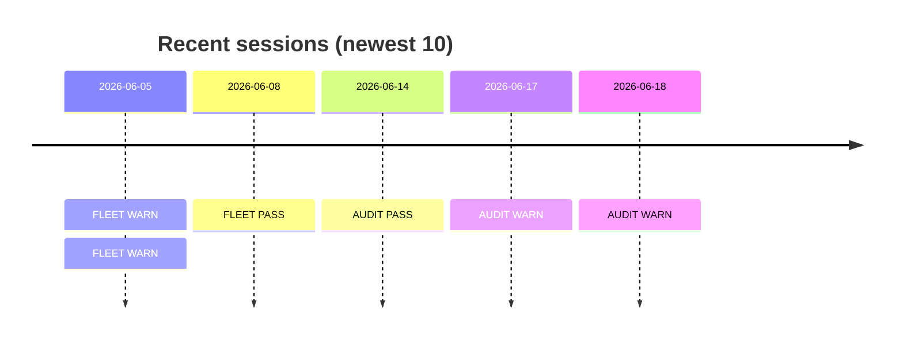

# Hermes Dashboard

Auto-generated by `composer hermes-dashboard`. Regenerate after each session, or whenever you want a fresh overview.

**Last generated:** `2026-06-18T21:12:47Z` · **Sessions on file:** 6

## Recent sessions

## Verdict tally

| Type | PASS | WARN | FAIL | Total |
|---|---|---|---|---|
| FLEET | 1 | 2 | 0 | 3 |
| AUDIT | 1 | 2 | 0 | 3 |

## Session links

| When | Type | Verdict | Note |
|---|---|---|---|
| 2026-06-18 | AUDIT | WARN | [[AUDIT-2026-06-18_21-11]] |
| 2026-06-17 | AUDIT | WARN | [[AUDIT-2026-06-17_07-54]] |
| 2026-06-14 | AUDIT | PASS | [[AUDIT-2026-06-14_15-35]] |
| 2026-06-05 | FLEET | WARN | [[FLEET-2026-06-05_15-41]] |
| 2026-06-08 | FLEET | PASS | [[FLEET-2026-06-08_16-55]] |
| 2026-06-05 | FLEET | WARN | [[FLEET-2026-06-05_14-15]] |

## Current snapshot

(From the latest `composer hermes-status` aggregation of on-disk findings JSON. Re-run for fresh data.)

| Collector | Overall | Headline |
|---|---|---|
| Watchdog | FAIL | 16 PASS / 1 FAIL / 0 WARN |
| Audit | WARN | 0 CRITICAL / 0 HIGH / 1 MEDIUM |
| Update | WARN | PHP 10 / JS 11 outdated |
| System | WARN | 7 PASS / 1 WARN / 0 FAIL |

---

_Regenerate this dashboard anytime: `composer hermes-dashboard`. Auto-regenerated by the end of every `/hermes-lifecycle` run._
