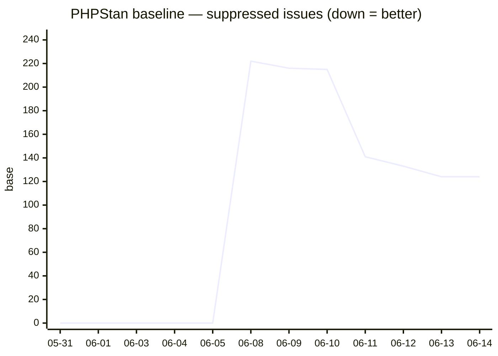
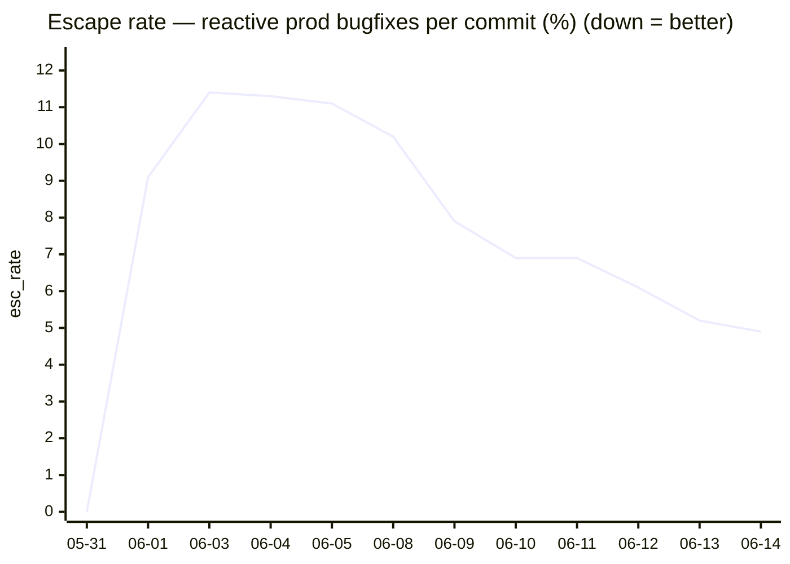
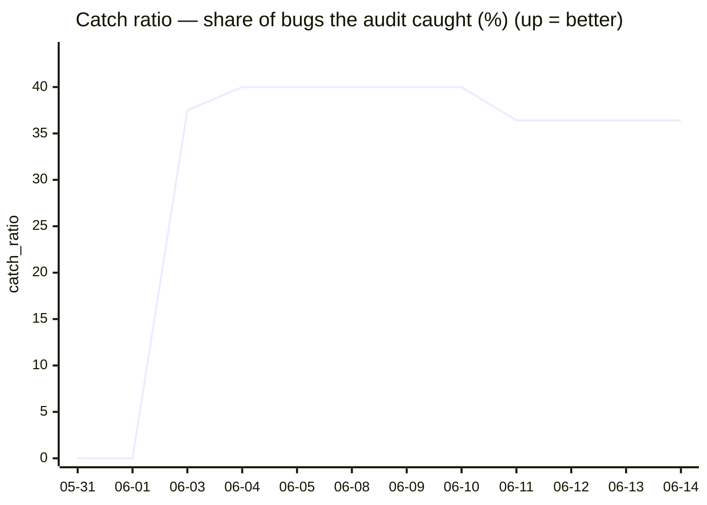
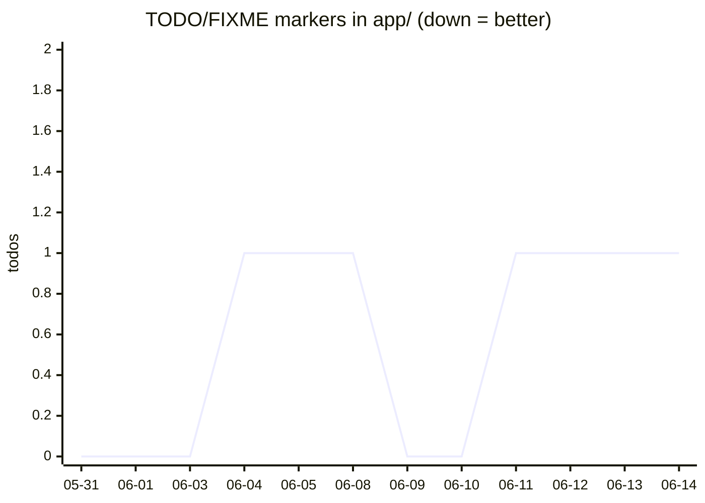
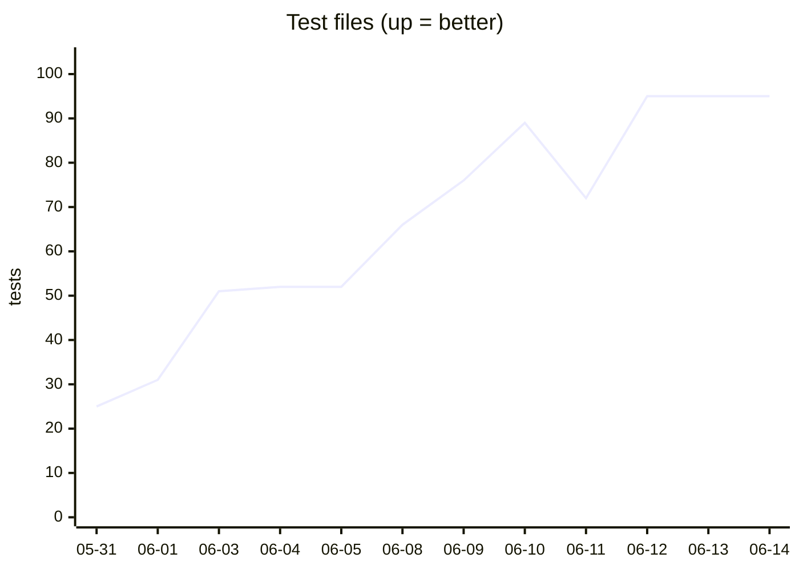
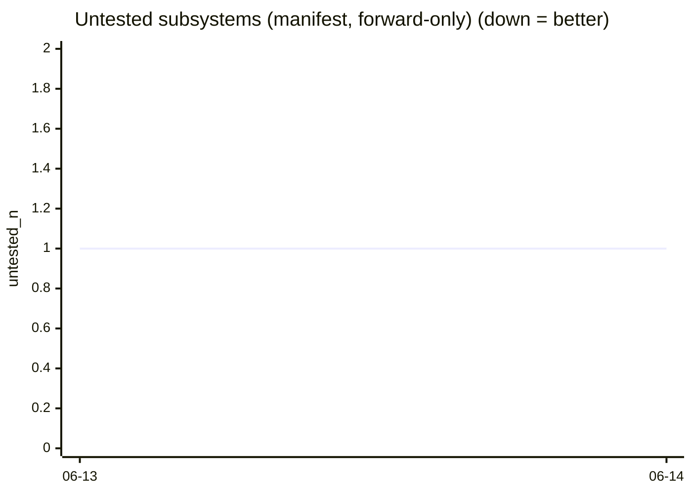

# Hermes — effectiveness

> Auto-generated by `scripts/hermes_metrics.py` (`composer hermes-metrics`). Does the audit
> system actually improve the codebase? Mines git history for direction-aware quality KPIs
> and flags regressions. Periodic, not per-run (see the 2026-06-14 decision).

## Strategy — what 'improvement' means

| KPI | Source | Good direction | A win looks like |
|---|---|---|---|
| PHPStan baseline | `phpstan-baseline.neon` | **↓** | suppressed-debt shrinks as you fix it |
| Debt density | baseline ÷ `app/*.php` | **↓** | **debt falls even while the code grows** — the real signal |
| Escape rate | reactive prod bugfixes ÷ commits | **↓** | less firefighting per unit of work |
| Catch ratio | catches ÷ (catches + escapes) | **↑** | the audit catches a bigger share of bugs pre-merge |
| TODO/FIXME | markers in `app/` | **↓** | inline tech-debt paid down |
| Test files | `tests/**/*Test.php` | **↑** | coverage grows with features |
| Docs | `docs/**/*.md` | **↑** | the doc-coverage gate keeps it climbing |
| Untested nodes | manifest subsystems w/o tests | **↓** | subsystems gain test coverage (forward-only) |

Headline test = **debt density**: suppressed issues per file falling while the code grows
means the gates are net-positive. **Catch ratio** answers the other half — *is the audit
catching bugs before they ship?*

> **Escape vs catch:** a `fix`-type commit touching `app/`/`resources/` is an *escape* unless
> it's attributed to the audit (`fix: audit-driven…`, 'surfaced by the audit') — those are
> *catches* (a positive). Until releases are tagged, escape rate is a *firefighting* proxy,
> not a true production-escape rate.

## Headline (2026-06-08 → 2026-06-14)

| KPI | Start | Now | Δ |
|---|---|---|---|
| PHPStan baseline | 222 | 124 | **-44%** |
| Debt density | 2.02 | 0.89 | **-56%** |
| Escape rate (peak → now) | 11.4% | 4.9% | **-57%** |
| Catch ratio | 0.0% | 36.4% | +36.4pp |
| TODO/FIXME | 0 | 1 | +1 |
| Test files | 25 | 95 | +280% |
| Docs | 5 | 128 | +2460% |
| Untested nodes | 1 | 1 | +0% |
| App PHP files _(context)_ | 33 | 139 | +321% |

Untested subsystems: **1** (app/Runtime/Exceptions) · escapes: **7** · catches (audit-found pre-merge): **4**

## Charts

## Regression check (latest vs previous snapshot)

✅ No regressions — no KPI moved against its good direction in the latest snapshot.

## Data

| date | baseline | density | tests | docs | todos | untested | escapes | esc% | catches | catch% | app php |
|---|---|---|---|---|---|---|---|---|---|---|---|
| 2026-05-31 | 0 | 0.0 | 25 | 5 | 0 | — | 0 | 0.0% | 0 | 0.0% | 33 |
| 2026-06-01 | 0 | 0.0 | 31 | 10 | 0 | — | 2 | 9.1% | 0 | 0.0% | 46 |
| 2026-06-03 | 0 | 0.0 | 51 | 78 | 0 | — | 5 | 11.4% | 3 | 37.5% | 88 |
| 2026-06-04 | 0 | 0.0 | 52 | 83 | 1 | — | 6 | 11.3% | 4 | 40.0% | 90 |
| 2026-06-05 | 0 | 0.0 | 52 | 84 | 1 | — | 6 | 11.1% | 4 | 40.0% | 90 |
| 2026-06-08 | 222 | 2.02 | 66 | 103 | 1 | — | 6 | 10.2% | 4 | 40.0% | 110 |
| 2026-06-09 | 216 | 1.74 | 76 | 105 | 0 | — | 6 | 7.9% | 4 | 40.0% | 124 |
| 2026-06-10 | 215 | 1.34 | 89 | 106 | 0 | — | 6 | 6.9% | 4 | 40.0% | 161 |
| 2026-06-11 | 141 | 1.05 | 72 | 109 | 1 | — | 7 | 6.9% | 4 | 36.4% | 134 |
| 2026-06-12 | 133 | 0.96 | 95 | 116 | 1 | — | 7 | 6.1% | 4 | 36.4% | 138 |
| 2026-06-13 | 124 | 0.9 | 95 | 126 | 1 | 1 | 7 | 5.2% | 4 | 36.4% | 138 |
| 2026-06-14 | 124 | 0.89 | 95 | 128 | 1 | 1 | 7 | 4.9% | 4 | 36.4% | 139 |

