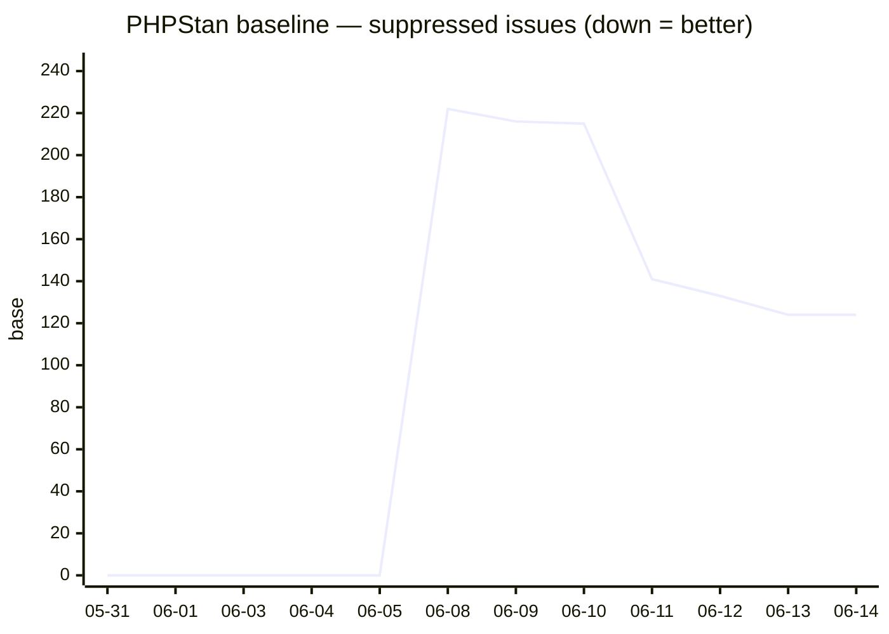
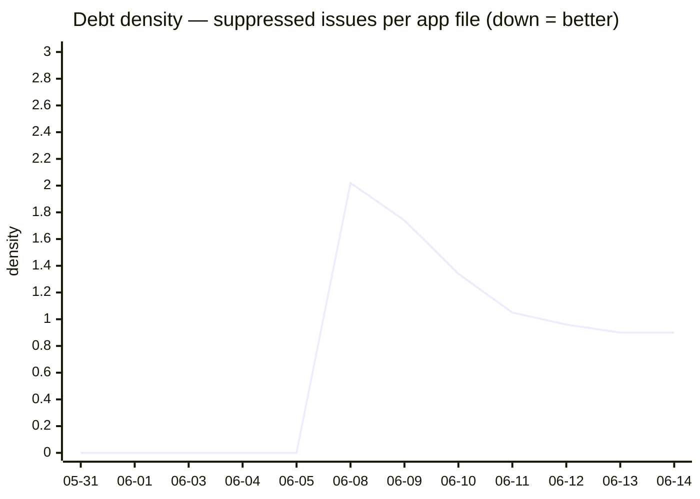
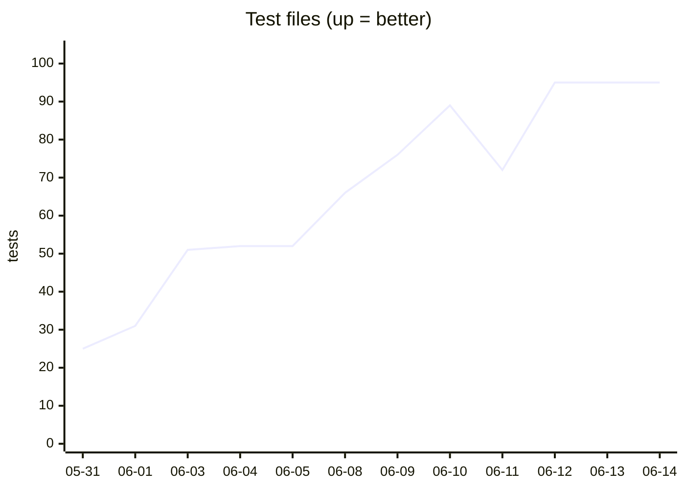
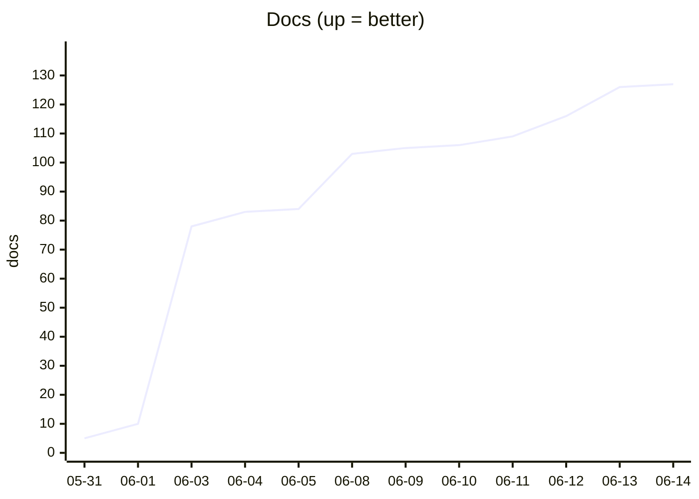

# Hermes — effectiveness

> Auto-generated by `scripts/hermes_metrics.py` (`composer hermes-metrics`). Does the audit
> system actually improve the codebase? This mines the git history for direction-aware
> quality KPIs and flags regressions. Periodic, not per-run (see the 2026-06-14 decision).

## Strategy — what 'improvement' means

| KPI | Source | Good direction | A win looks like |
|---|---|---|---|
| PHPStan baseline | `phpstan-baseline.neon` | **↓** | suppressed-debt shrinks as you fix it |
| Debt density | baseline ÷ `app/*.php` | **↓** | **debt falls even while the code grows** — the real signal |
| Test files | `tests/**/*Test.php` | **↑** | coverage grows with features |
| Docs | `docs/**/*.md` | **↑** | the doc-coverage gate keeps it climbing |

The headline test is **debt density**: if suppressed issues per file fall while the
codebase grows, the gates are net-positive — you're adding code *and* paying down debt.

## Headline (2026-06-08 → 2026-06-14)

| KPI | Start | Now | Δ |
|---|---|---|---|
| PHPStan baseline | 222 | 124 | **-44%** |
| Debt density | 2.02 | 0.9 | **-55%** |
| Test files | 25 | 95 | +280% |
| Docs | 5 | 127 | +2440% |
| App PHP files | 33 | 138 | +318% |

## Charts

## Regression check (latest vs previous snapshot)

✅ No regressions — no KPI moved against its good direction in the latest snapshot.

## Data

| date | baseline | density | tests | docs | app php |
|---|---|---|---|---|---|
| 2026-05-31 | 0 | 0.0 | 25 | 5 | 33 |
| 2026-06-01 | 0 | 0.0 | 31 | 10 | 46 |
| 2026-06-03 | 0 | 0.0 | 51 | 78 | 88 |
| 2026-06-04 | 0 | 0.0 | 52 | 83 | 90 |
| 2026-06-05 | 0 | 0.0 | 52 | 84 | 90 |
| 2026-06-08 | 222 | 2.02 | 66 | 103 | 110 |
| 2026-06-09 | 216 | 1.74 | 76 | 105 | 124 |
| 2026-06-10 | 215 | 1.34 | 89 | 106 | 161 |
| 2026-06-11 | 141 | 1.05 | 72 | 109 | 134 |
| 2026-06-12 | 133 | 0.96 | 95 | 116 | 138 |
| 2026-06-13 | 124 | 0.9 | 95 | 126 | 138 |
| 2026-06-14 | 124 | 0.9 | 95 | 127 | 138 |

