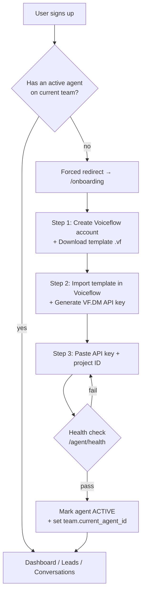
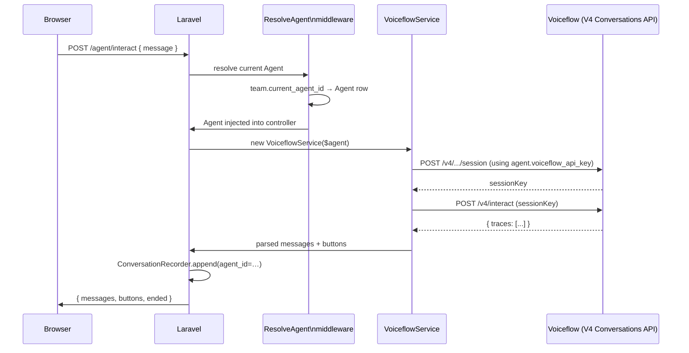
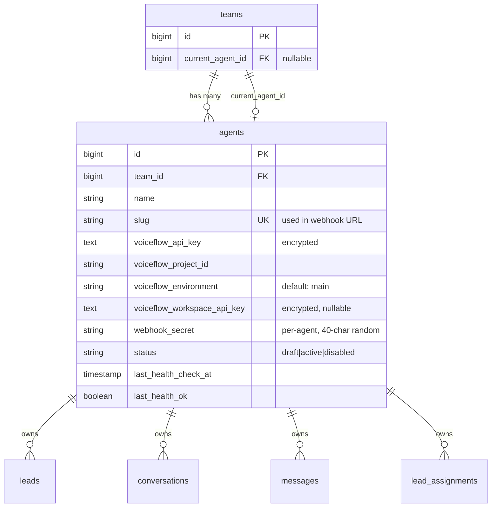
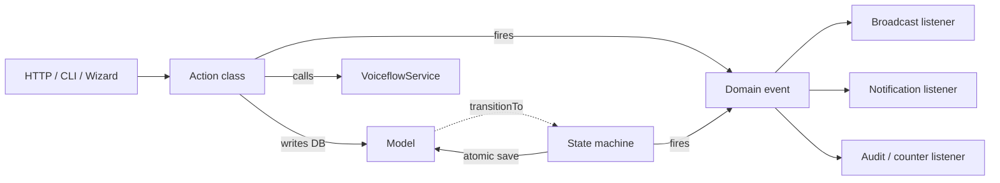
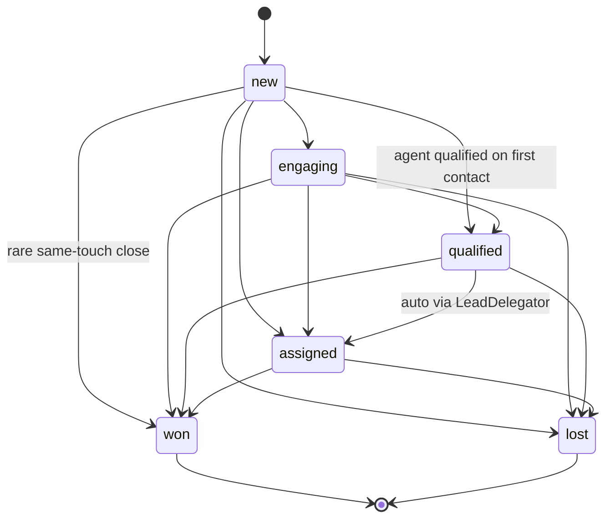
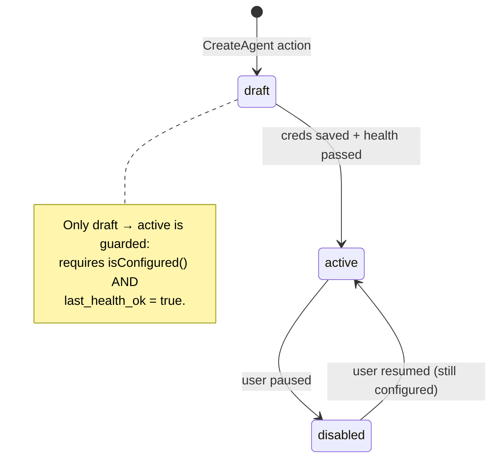
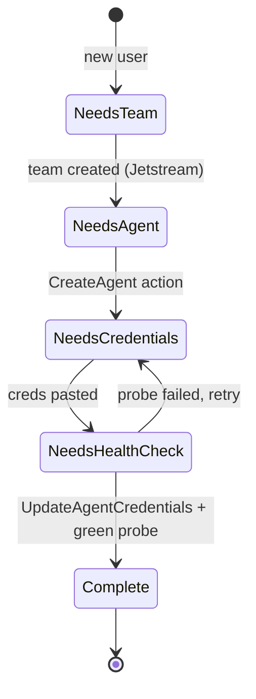

# Phase 13 — Multi-tenant SaaS: per-team agents + seamless onboarding

Turns the app from "one Voiceflow project per Laravel deployment" into a
SaaS where **every team configures their own Voiceflow agent(s)** through a
wizard. Each agent's credentials live encrypted in the DB; the existing
team-scoping already covers data isolation.

> Status of this doc: **Phase A shipped** (data model + backfill). Phases
> B–G in progress — see the roadmap at the end.

## End-to-end onboarding flow



The "forced redirect" gate lives in a `RequireAgent` middleware applied to
every authenticated app route except `/onboarding`, `/profile`, and the
agent-CRUD routes themselves. Skippable by users who already have an
active agent on a different team they belong to.

## Request flow once configured

How a single agent-chat round trip flows through the system after onboarding:



The same pattern applies to KB queries, transcript backfill, and
the per-agent webhook — `Agent` becomes the explicit context object that
replaces the implicit global `config('services.voiceflow.*')`.

## Data model

The new pieces and their relationships:



`leads`, `conversations`, `messages`, `lead_assignments` each gain a
nullable `agent_id` FK + index. Nullable on purpose: existing rows must
have somewhere to land during backfill, and the per-row FK gives downstream
queries an efficient filter without joining through `team_id`.

## Phase A — Foundation (shipped)

**Migrations** (`database/migrations/2026_06_03_000000`…`000003`):
1. `create_agents_table` — encrypted credential columns, slug, webhook secret, status.
2. `add_current_agent_id_to_teams` — mirrors Jetstream's `current_team_id`.
3. `add_agent_id_to_leads_and_conversations` — adds the FK to four tables in one pass.
4. `backfill_default_agent_per_team` — for each existing team, creates one
   Agent row using the legacy `.env` credentials, sets it as `current_agent_id`,
   then updates every existing row of that team with the new `agent_id`.
   Idempotent (re-runs are no-ops).

**Model** (`app/Models/Agent.php`):
- `encrypted` cast on credential columns (round-trips through the model, never
  in cleartext on disk).
- `$hidden` blocks `voiceflow_api_key`, `voiceflow_workspace_api_key`,
  `webhook_secret` from `toArray()` / Inertia props — they must be exposed
  explicitly when needed.
- `booted()` auto-generates `slug` and `webhook_secret` on create.
- `getRouteKeyName() = 'slug'` so `{agent}` route binding uses the URL-safe slug.

**Team** (`app/Models/Team.php`): adds `agents()`, `currentAgent()`,
and `switchAgent(Agent)` that rejects cross-team switches.

**Tests** (`tests/Feature/AgentModelTest.php`, 7 cases):
- slug + webhook secret auto-generated on create
- credentials encrypted on disk, decrypted through the model
- credentials never leak via `toArray()` (Inertia safety net)
- `isConfigured()` requires both API key and project ID
- team can switch to its own agents, not a foreign team's
- route binding uses slug
- backfill behaviour vs. newly-created teams

## Phase B — Service refactor (next)

`VoiceflowService::__construct` already accepts per-instance overrides
(it was built this way for testing). The refactor:

1. Add a static factory: `VoiceflowService::forAgent(Agent $agent): self`.
2. Replace the container binding:

```php
// app/Providers/AppServiceProvider.php
$this->app->scoped(VoiceflowService::class, function ($app) {
    $agent = $app['request']->user()?->currentTeam?->currentAgent;
    return $agent
        ? VoiceflowService::forAgent($agent)
        : new VoiceflowService(); // unconfigured — methods throw via isConfigured() gate
});
```

3. Controllers that need a specific agent (e.g. the webhook hits a route
   with `{agent}`) construct via `VoiceflowService::forAgent($route->agent)`.

The downstream files (`VoiceflowController`, `ConversationController`,
`KnowledgeBaseController`, `ConversationRecorder`, `LeadDelegator`,
`voiceflow:backfill` command) **don't change** — they keep injecting
`VoiceflowService` from the container; the container hands them the
agent-scoped instance.

## Phase C — Per-agent webhook

Old:
```
POST /api/voiceflow/lead-captured
X-Webhook-Secret: <global VOICEFLOW_WEBHOOK_SECRET>
```

New:
```
POST /api/voiceflow/lead-captured/{agent:slug}
X-Webhook-Secret: <agent.webhook_secret>
```

`VoiceflowWebhookController` looks up the agent via route binding, then
checks `hash_equals($agent->webhook_secret, $providedHeader)`. The agent
edit page shows the unique URL with a copy button and a "regenerate
secret" action that rolls the random value.

## Phase D — Agent CRUD UI

| Route | Page | Purpose |
|---|---|---|
| `GET /agents` | `Agents/Index.vue` | List team's agents + "Create" CTA |
| `GET /agents/create` | redirects to wizard | Same flow as onboarding for additional agents |
| `GET /agents/{agent}` | `Agents/Show.vue` | Edit name + keys, copy webhook URL, run health check, disable, delete |
| `PUT /current-agent` | (action) | Switch which agent is current (parallel to Jetstream's `current-team.update`) |

Plus an agent picker in `AppLayout.vue` next to the team switcher.

## Phase E — Onboarding wizard

Three Inertia pages (`/onboarding/{step}`):

1. **Intro** — value prop + "Sign up for Voiceflow" + "Download template" buttons.
2. **Connect** — paste DM key + project ID; the "Test connection" button hits
   `/agent/health` against the entered values without persisting; only "Save"
   commits the row.
3. **Done** — confetti page → "Start chatting" → `/agent`.

`RequireAgent` middleware (registered on the protected route group) checks
`auth()->user()->currentTeam?->currentAgent?->status === 'active'`. If not,
it redirects to step 1.

## Phase F — Template asset

`resources/voiceflow/lead-qualification.vf` — a pre-built Voiceflow project
the user imports. The template must:
- Capture variables exactly `name`, `email`, `phone`, `company` (matches the
  existing `services.voiceflow.lead_variables`).
- POST to `{{webhook_url}}` (a placeholder Voiceflow's importer substitutes
  with the user's actual `/api/voiceflow/lead-captured/{slug}` URL during the
  wizard) with `X-Webhook-Secret: {{webhook_secret}}`.

This file has to be built and exported in the Voiceflow IDE — I can't generate
a valid `.vf` artifact. See `resources/voiceflow/README.md` for the schema spec
the template must conform to.

## Phase G — Page scoping

Every list endpoint gains a `where('agent_id', $team->current_agent_id)`
clause. The agent picker in the nav (Phase D) sets `current_agent_id` and
reloads the page; all data swaps in one click.

## Migration safety

- **`agent_id` is nullable** on all four tables. Rows without an agent are
  invisible to scoped pages but not destroyed.
- **Backfill is idempotent.** Reruns skip teams that already have an agent.
- **Credentials never logged.** The `$hidden` list + `encrypted` cast cover
  both serialization and at-rest exposure. Logging an `Agent` model dumps
  no secrets.
- **Webhook rollover.** `webhook_secret` defaults to the existing
  `VOICEFLOW_WEBHOOK_SECRET` value during backfill so existing Voiceflow
  agents keep working without reconfiguration.
- **Rollback preserves credentials.** `down()` nulls out `current_agent_id`
  and `agent_id` columns but does not drop agent rows — losing user-entered
  keys on a rollback would be unrecoverable.

## What's intentionally out of scope

- **Billing.** Stripe/Cashier comes in a separate PR. Plan limits will hang
  off `agents` (e.g. messages/month counter).
- **OAuth with Voiceflow.** They don't offer it for this use case.
- **Managed Voiceflow workspace.** We don't host Voiceflow on the user's
  behalf — pure BYOK keeps usage costs off our books.
- **Per-agent KB.** Phase 12's KB controller already targets a single project;
  in Phase G it'll switch on `current_agent_id` automatically.

## Lifecycle architecture

To keep the SaaS work consistent as it spreads across controllers, services
and commands, the codebase adopts four cooperating patterns. Together they
give every domain entity exactly one canonical place for transitions, one
canonical place for side effects, and one canonical place for the
"where am I in setup" question.

### Pieces

| Piece | Lives in | What it owns |
|---|---|---|
| **State machine** | `app/Lifecycle/{StateMachine, Transition, HasLifecycle}` | What transitions are legal, with optional guards. Fires events atomically. |
| **Concrete machines** | `app/Lifecycle/{Lead, Agent, Conversation}StateMachine` | The actual transition table per entity. |
| **Domain events** | `app/Events/Domain/*` | Typed events like `LeadQualified`, `AgentActivated`, `ConversationEnded`. Fired from machines + actions; listened to for broadcasts, notifications, recording. |
| **Action classes** | `app/Actions/{Domain}/*` | Single entry point per business operation. `CreateAgent`, `UpdateAgentCredentials`, `RotateWebhookSecret`, `SwitchAgent`, `DeleteAgent`. |
| **OnboardingState** | `app/Lifecycle/OnboardingState` | One source of truth for "what's blocking this user." Enum + resolver + `nextRoute()`. |

### How they cooperate



The HTTP/wizard/artisan layer **only ever calls actions** — it never
mutates the model directly. The action handles persistence, talks to
services, and fires the appropriate event. Mutating state goes through the
state machine, which enforces the transition rules + fires a typed event
inside the same DB transaction. Listeners do everything else.

### Lead state diagram



Won and lost are terminal — there is no "reopen." A returning prospect
becomes a fresh Lead row. The state machine refuses any backwards or
sideways transition that isn't in the table above.

### Agent state diagram



The guard on `draft → active` is enforced in two places:
- `AgentStateMachine` (the source of truth — refuses bare `transitionTo`)
- `UpdateAgentCredentials::execute` (where it actually happens after a green health check)

### Onboarding state diagram



`OnboardingState::for($user)` reads the user's current team + agent rows
and returns the matching enum case. The `RequireAgent` middleware (Phase E)
calls it on every request and redirects to `$state->nextRoute()` until
`Complete`. Pages can render checklists by iterating the cases and asking
each what's done.

### Why hand-rolled, not spatie/laravel-model-states

We considered the library; it's good but over-shaped for a four-state
machine. Hand-rolling kept the framework to ~150 lines, removed a
dependency, and let the transition table live as a plain `array<Transition>`
that's trivially diffable in PR reviews. If the state machines grow past
~10 transitions per entity, revisit.

### What the lifecycle pattern unlocks downstream

- **Phase D (Agent CRUD UI):** form submit → `UpdateAgentCredentials` →
  whatever the response is, the UI re-reads `OnboardingState` to know what
  to render. No duplicated activation logic.
- **Phase E (Onboarding wizard):** every step is a route that calls one
  action and reads `OnboardingState`. Wizard is ~200 lines of UI on top of
  pure business logic that's already tested.
- **Phase G (Page scoping):** unaffected — agent-scoping is a query
  concern, not a lifecycle concern. But the agent picker's "switch agent"
  button calls `SwitchAgent` (one place), not a controller-local block.
- **Phase H (Billing, later):** plan limits become a guard added to the
  `CreateAgent` action and a guard added to the `draft → active`
  transition. Nothing else changes.

### Test coverage

| Test file | What's covered |
|---|---|
| `tests/Feature/StateMachineTest` | Forward-only Lead transitions; terminal states; guards on Agent draft→active; typed event firing |
| `tests/Feature/AgentActionsTest` | CreateAgent persists + fires event + becomes current; UpdateAgentCredentials health-checks and activates only on green; RotateWebhookSecret; SwitchAgent rejects foreign; DeleteAgent fallback |
| `tests/Feature/OnboardingStateTest` | Each state resolves correctly; `nextRoute()` per case; fallback to team's existing agent when current_agent_id is null |
| `tests/Feature/AgentModelTest` | Slug + secret auto-gen; encryption at rest; hidden from `toArray()`; cross-team switch rejection |

Total new lifecycle + foundation tests: **30 cases**, 0 regressions on the
existing 85.

## Roadmap

| Phase | Status | What |
|---|---|---|
| A. Foundation | ✅ shipped | `agents` table, FKs, model, backfill, Team mods |
| L. Lifecycle layer | ✅ shipped | State machines, domain events, actions, OnboardingState |
| B. Service refactor | ⏳ next | `VoiceflowService::forAgent` + container binding |
| C. Per-agent webhook | ⏳ | `/api/voiceflow/lead-captured/{agent:slug}` |
| D. Agent CRUD UI | ⏳ | `/agents`, picker, settings page |
| E. Onboarding wizard | ⏳ | `/onboarding` 3-step flow + middleware |
| F. Template `.vf` | ⏳ (manual) | Build + export in Voiceflow IDE |
| G. Page scoping | ⏳ | All lists filter by `current_agent_id` |
| H. Billing | later | Cashier + Stripe, plan limits |
