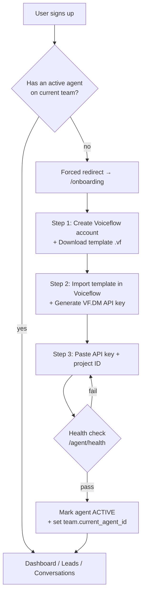
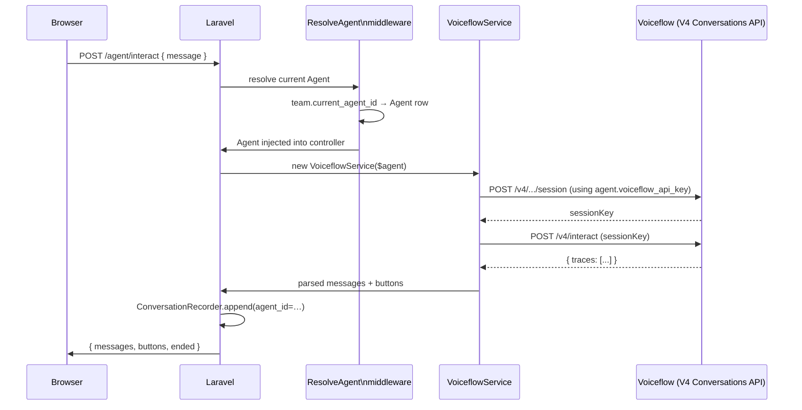
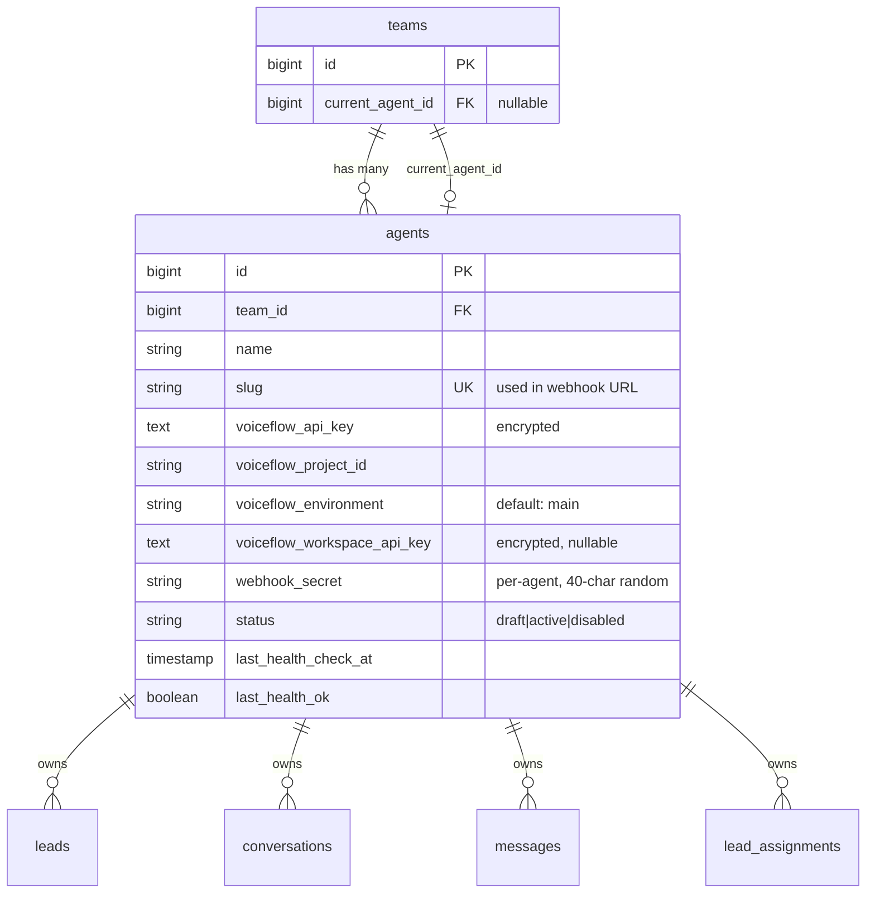
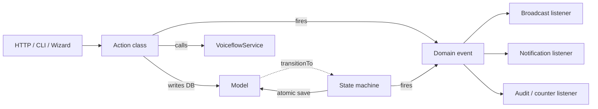
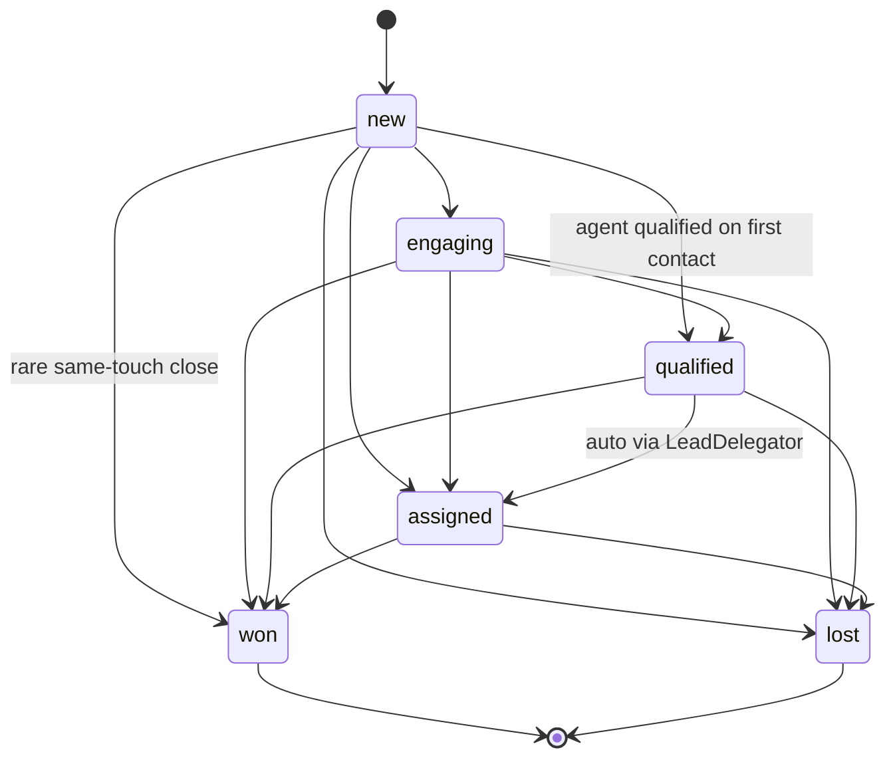
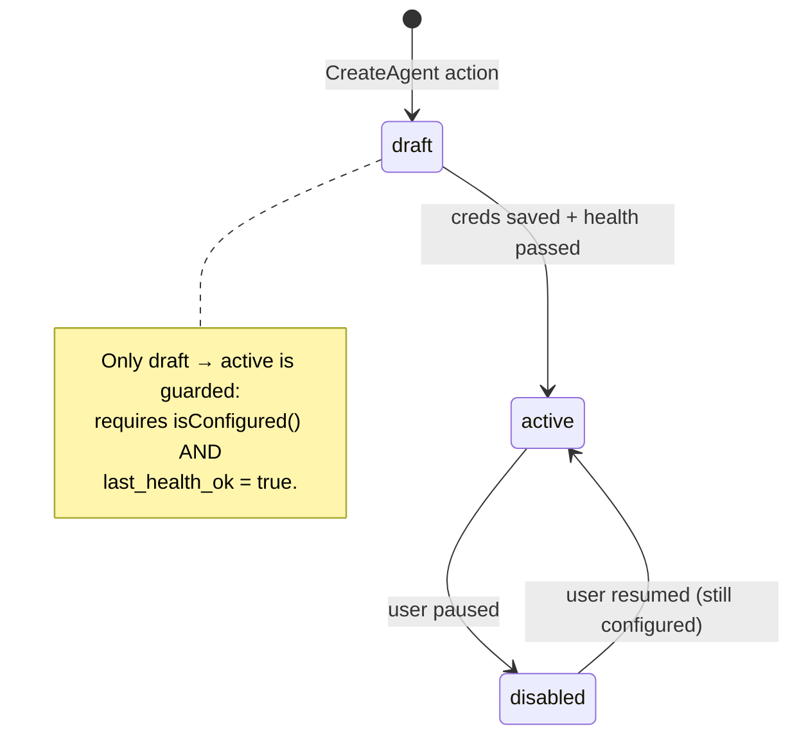
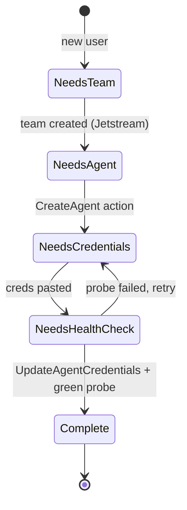

# Phase 13 — Multi-tenant SaaS: per-team agents + seamless onboarding

Turns the app from "one Voiceflow project per Laravel deployment" into a
SaaS where **every team configures their own Voiceflow agent(s)** through a
wizard. Each agent's credentials live encrypted in the DB; the existing
team-scoping already covers data isolation.

> Status of this doc: **Phase A shipped** (data model + backfill). Phases
> B–G in progress — see the roadmap at the end.

## End-to-end onboarding flow



The "forced redirect" gate lives in a `RequireAgent` middleware applied to
every authenticated app route except `/onboarding`, `/profile`, and the
agent-CRUD routes themselves. Skippable by users who already have an
active agent on a different team they belong to.

## Request flow once configured

How a single agent-chat round trip flows through the system after onboarding:



The same pattern applies to KB queries, transcript backfill, and
the per-agent webhook — `Agent` becomes the explicit context object that
replaces the implicit global `config('services.voiceflow.*')`.

## Data model

The new pieces and their relationships:



`leads`, `conversations`, `messages`, `lead_assignments` each gain a
nullable `agent_id` FK + index. Nullable on purpose: existing rows must
have somewhere to land during backfill, and the per-row FK gives downstream
queries an efficient filter without joining through `team_id`.

## Phase A — Foundation (shipped)

**Migrations** (`database/migrations/2026_06_03_000000`…`000003`):
1. `create_agents_table` — encrypted credential columns, slug, webhook secret, status.
2. `add_current_agent_id_to_teams` — mirrors Jetstream's `current_team_id`.
3. `add_agent_id_to_leads_and_conversations` — adds the FK to four tables in one pass.
4. `backfill_default_agent_per_team` — for each existing team, creates one
   Agent row using the legacy `.env` credentials, sets it as `current_agent_id`,
   then updates every existing row of that team with the new `agent_id`.
   Idempotent (re-runs are no-ops).

**Model** (`app/Models/Agent.php`):
- `encrypted` cast on credential columns (round-trips through the model, never
  in cleartext on disk).
- `$hidden` blocks `voiceflow_api_key`, `voiceflow_workspace_api_key`,
  `webhook_secret` from `toArray()` / Inertia props — they must be exposed
  explicitly when needed.
- `booted()` auto-generates `slug` and `webhook_secret` on create.
- `getRouteKeyName() = 'slug'` so `{agent}` route binding uses the URL-safe slug.

**Team** (`app/Models/Team.php`): adds `agents()`, `currentAgent()`,
and `switchAgent(Agent)` that rejects cross-team switches.

**Tests** (`tests/Feature/AgentModelTest.php`, 7 cases):
- slug + webhook secret auto-generated on create
- credentials encrypted on disk, decrypted through the model
- credentials never leak via `toArray()` (Inertia safety net)
- `isConfigured()` requires both API key and project ID
- team can switch to its own agents, not a foreign team's
- route binding uses slug
- backfill behaviour vs. newly-created teams

## Phase B — Service refactor (shipped)

`VoiceflowService::__construct` already accepted per-instance overrides
(it was built this way for testing), which made the refactor surgical:

1. **`VoiceflowService::forAgent(Agent $agent): self`** — the canonical
   SaaS entrypoint, builds an instance from the agent's encrypted
   credential columns.
2. Container binding in `AppServiceProvider::register()` is now
   `$this->app->scoped(VoiceflowService::class, ...)`. The closure
   resolves the request's current Agent via
   `auth()->user()?->currentTeam?->currentAgent` and constructs through
   `forAgent`. **Fallback path:** when there's no authenticated user OR no
   current agent (cron / artisan / pre-onboarding), it constructs from
   `.env` config so transcript backfill, KB sync, and other background work
   stay usable.
3. **Downstream files unchanged.** `VoiceflowController`,
   `ConversationController`, `KnowledgeBaseController`,
   `ConversationRecorder`, `LeadDelegator`, and the `voiceflow:backfill`
   command keep injecting `VoiceflowService` through DI; the container
   hands them the agent-scoped instance automatically.
4. **`ConversationRecorder::resolve()`** now accepts an optional `agentId`.
   New conversations and their messages get stamped with the agent id so
   Phase G's page-scoping (`where('agent_id', current_agent_id)`) can
   filter them. Existing rows that were backfilled to the team's default
   agent by the Phase A migration remain visible.
5. **`VoiceflowController::upsertLead`** stamps `agent_id =
   $team->current_agent_id` on lead create and backfills it on pre-existing
   lead rows the agent re-touches.

Tests added in `VoiceflowServiceResolutionTest` (5 cases):
- Service resolved through the container uses the current agent's credentials
- Falls back to `.env` config when no agent is current
- End-to-end through `/agent/health`: tenant sees their `project_id`
- End-to-end through `/agent/health`: no-agent user sees the env fallback
- `forAgent()` factory tested directly

## Phase C — Per-agent webhook (shipped)

Old (single-tenant):
```
POST /api/voiceflow/lead-captured
X-Webhook-Secret: <global VOICEFLOW_WEBHOOK_SECRET>
body: { team_id, name, email, ... }
```

New (per-agent):
```
POST /api/voiceflow/lead-captured/{agent:slug}
X-Webhook-Secret: <agent.webhook_secret>
body: { name, email, ... }   # team_id derived from agent
```

Implementation:
- **Route** binds `{agent:slug}` to the `Agent` model (via
  `Agent::getRouteKeyName()` returning `'slug'`).
- **`VoiceflowWebhookController::leadCaptured(Request, Agent)`** verifies
  the secret with `hash_equals($agent->webhook_secret, $providedHeader)`
  and rejects requests against a `disabled` agent with 503 (draft agents
  still accept — the first capture is sometimes how a user discovers the
  agent is wired up).
- **`team_id` removed from the request body** — the agent owns it.
- **`agent_id` stamped on new leads** and backfilled on pre-existing
  leads the agent re-touches.
- **Voiceflow user-id matching scoped to `agent_id`** so two agents in the
  same team can't collide on identical session ids.

The Phase A backfill migration reused the existing global webhook secret
as the default agent's `webhook_secret`, so the only change a current
single-tenant deployment needs is updating its Voiceflow Custom Action URL
to include `/<agent_slug>` — the secret already matches.

Tests added in `VoiceflowTest`:
- `webhook rejects disabled agent` (503)
- `webhook rejects another agent's secret` (cross-agent 401)

All 3 pre-existing webhook tests updated to use the per-agent URL +
per-agent secret pattern.

## Phase D — Agent CRUD UI (shipped)

| Route | Page | Purpose |
|---|---|---|
| `GET /agents` | `Agents/Index.vue` | List team's agents + status + "Make current" + "Create" CTA |
| `POST /agents` | (action) | Creates a draft agent via `CreateAgent`; redirects to settings |
| `GET /agents/{agent}` | `Agents/Show.vue` | Edit name + paste keys, copy webhook URL + secret, "Test connection" button, rotate-secret, delete |
| `PUT /agents/{agent}` | (action) | Calls `UpdateAgentCredentials` — health-checks and activates on green |
| `DELETE /agents/{agent}` | (action) | Calls `DeleteAgent` — falls back `current_agent_id` to next available |
| `POST /agents/{agent}/rotate-secret` | (action) | Calls `RotateWebhookSecret` — flashes the new value once |
| `POST /agents/{agent}/health` | (JSON) | On-demand probe re-running the activation pipeline |
| `PUT /current-agent` | (action) | Switches `current_agent_id` (parallels Jetstream's `current-team.update`) |

`HandleInertiaRequests` shares `currentAgent` and `teamAgents` on every
request so the nav picker in `AppLayout.vue` stays in sync without each
page re-querying. Picker exposes "All agents", "Add new agent" (re-enters
the wizard for additional agents) and a per-agent switch list when more
than one exists.

Tests in `AgentCrudTest` (9 cases): index team-scoping, store →
settings redirect, update activates on green health, destroy with
current-agent fallback, rotate-secret flash, switch-current rejects
foreign agents, settings page surfaces webhook URL + secret correctly.

## Phase E — Onboarding wizard (shipped)

Three Inertia pages, all under `/onboarding`:

1. **`Intro`** (`GET /onboarding`): value prop, "Sign up for Voiceflow"
   external link, "Download template" link to `/templates/lead-qualification.vf`.
   The "Continue" button POSTs to `/onboarding/start` which calls
   `CreateAgent` to create a draft row (idempotent — re-clicking reuses the
   existing draft) and redirects to step 2.
2. **`Connect`** (`GET/POST /onboarding/connect`): the form for the DM
   key + project ID + optional workspace key. POST runs
   `UpdateAgentCredentials` which probes Voiceflow; on green, the agent
   transitions to `active` and becomes the team's `current_agent_id`. On
   failure, stays on the page with the failure reason via
   `withErrors([...])`. Shows the per-agent webhook URL + secret so the
   user can paste them into Voiceflow's Custom Action while they're here.
3. **`Done`** (`GET /onboarding/done`): success page → "Start chatting"
   button to `/agent`, or skip to `/dashboard`.

**`RequireAgent` middleware** (`app/Http/Middleware/RequireAgent.php`) sits
in the protected route group. It calls `OnboardingState::for($user)` and
redirects to `$state->nextRoute()` until `Complete`. Bypass list (routes
that must stay reachable mid-onboarding): `onboarding.*`, `agents.*`,
`current-agent.*`, `profile.*`, `two-factor.*`, `api-tokens.*`,
`teams.*`, `current-team.*`, `logout`.

**Wizard tests** (`OnboardingWizardTest`, 8 cases) explicitly re-enable
the middleware via `$this->withMiddleware(RequireAgent::class)` — the
global test base class disables it for the broader suite so the existing
113 tests don't all bounce to onboarding on every authenticated request.

## Phase F — Template asset (placeholder shipped)

`resources/voiceflow/README.md` documents the exact shape the template
must take: the four captured variables (`name`, `email`, `phone`,
`company`), the Custom Action POST contract, the recommended flow
shape, and Voiceflow IDE build instructions.

`public/templates/lead-qualification.vf` is a **text-stub placeholder** —
a real `.vf` export from the Voiceflow IDE must replace it before the
wizard's "Download template" link gives users a working starting point.
Voiceflow's `.vf` is an opaque binary tied to canvas coordinates and
internal IDs; we can't generate a valid one in-repo, so this is a
one-time manual export.

## Phase G — Page scoping (shipped)

Every list/detail endpoint now filters by the team's `current_agent_id`,
so switching agents in the picker swaps every visible row in one click.

**Implementation**

1. New local scope `forAgent(?int $agentId)` on `Lead`, `Conversation`,
   `Message` (`app/Models/{Lead,Conversation,Message}.php`). Null
   `agentId` returns no rows (`whereRaw('1 = 0')`) — explicit "no current
   agent ⇒ nothing to show" rather than fall-through-to-team-wide. A team
   without a current agent is mid-onboarding and should be bounced to the
   wizard before reaching list pages anyway.
2. `app/Models/Agent.php` gains `messages()` HasMany for symmetry with
   `leads()` and `conversations()`.
3. Four controllers updated to scope:
   - `LeadController::index` — the kanban
   - `ConversationController::index` — list
   - `ConversationController::show` — 404 if the convo belongs to a
     different agent (prevents URL-guessing across agents)
   - `ConversationController::runSearch` — both Scout and DB-LIKE branches
   - `DashboardController::stats` — every counter + the per-rep load

**KnowledgeBase page** is already agent-scoped because `VoiceflowService`
is per-request bound to the current agent via the container.

**Tests** — `AgentScopingTest` (6 cases) covers the picker-swap behavior
end-to-end: same team / two agents / different leads + conversations per
agent / switching `current_agent_id` swaps every visible row. Plus a
cross-agent URL-guessing 404 on the conversation detail page and the
empty-state when no current agent is set.

Pre-existing tests (`LeadTest`, `LeadDelegationTest`, `DashboardTest`,
`ConversationTest`) updated to set up a current agent + stamp test
fixtures with `agent_id`, reflecting the new SaaS model.

## Migration safety

- **`agent_id` is nullable** on all four tables. Rows without an agent are
  invisible to scoped pages but not destroyed.
- **Backfill is idempotent.** Reruns skip teams that already have an agent.
- **Credentials never logged.** The `$hidden` list + `encrypted` cast cover
  both serialization and at-rest exposure. Logging an `Agent` model dumps
  no secrets.
- **Webhook rollover.** `webhook_secret` defaults to the existing
  `VOICEFLOW_WEBHOOK_SECRET` value during backfill so existing Voiceflow
  agents keep working without reconfiguration.
- **Rollback preserves credentials.** `down()` nulls out `current_agent_id`
  and `agent_id` columns but does not drop agent rows — losing user-entered
  keys on a rollback would be unrecoverable.

## What's intentionally out of scope

- **Billing.** Stripe/Cashier comes in a separate PR. Plan limits will hang
  off `agents` (e.g. messages/month counter).
- **OAuth with Voiceflow.** They don't offer it for this use case.
- **Managed Voiceflow workspace.** We don't host Voiceflow on the user's
  behalf — pure BYOK keeps usage costs off our books.
- **Per-agent KB.** Phase 12's KB controller already targets a single project;
  in Phase G it'll switch on `current_agent_id` automatically.

## Lifecycle architecture

To keep the SaaS work consistent as it spreads across controllers, services
and commands, the codebase adopts four cooperating patterns. Together they
give every domain entity exactly one canonical place for transitions, one
canonical place for side effects, and one canonical place for the
"where am I in setup" question.

### Pieces

| Piece | Lives in | What it owns |
|---|---|---|
| **State machine** | `app/Lifecycle/{StateMachine, Transition, HasLifecycle}` | What transitions are legal, with optional guards. Fires events atomically. |
| **Concrete machines** | `app/Lifecycle/{Lead, Agent, Conversation}StateMachine` | The actual transition table per entity. |
| **Domain events** | `app/Events/Domain/*` | Typed events like `LeadQualified`, `AgentActivated`, `ConversationEnded`. Fired from machines + actions; listened to for broadcasts, notifications, recording. |
| **Action classes** | `app/Actions/{Domain}/*` | Single entry point per business operation. `CreateAgent`, `UpdateAgentCredentials`, `RotateWebhookSecret`, `SwitchAgent`, `DeleteAgent`. |
| **OnboardingState** | `app/Lifecycle/OnboardingState` | One source of truth for "what's blocking this user." Enum + resolver + `nextRoute()`. |

### How they cooperate



The HTTP/wizard/artisan layer **only ever calls actions** — it never
mutates the model directly. The action handles persistence, talks to
services, and fires the appropriate event. Mutating state goes through the
state machine, which enforces the transition rules + fires a typed event
inside the same DB transaction. Listeners do everything else.

### Lead state diagram



Won and lost are terminal — there is no "reopen." A returning prospect
becomes a fresh Lead row. The state machine refuses any backwards or
sideways transition that isn't in the table above.

### Agent state diagram



The guard on `draft → active` is enforced in two places:
- `AgentStateMachine` (the source of truth — refuses bare `transitionTo`)
- `UpdateAgentCredentials::execute` (where it actually happens after a green health check)

### Onboarding state diagram



`OnboardingState::for($user)` reads the user's current team + agent rows
and returns the matching enum case. The `RequireAgent` middleware (Phase E)
calls it on every request and redirects to `$state->nextRoute()` until
`Complete`. Pages can render checklists by iterating the cases and asking
each what's done.

### Why hand-rolled, not spatie/laravel-model-states

We considered the library; it's good but over-shaped for a four-state
machine. Hand-rolling kept the framework to ~150 lines, removed a
dependency, and let the transition table live as a plain `array<Transition>`
that's trivially diffable in PR reviews. If the state machines grow past
~10 transitions per entity, revisit.

### What the lifecycle pattern unlocks downstream

- **Phase D (Agent CRUD UI):** form submit → `UpdateAgentCredentials` →
  whatever the response is, the UI re-reads `OnboardingState` to know what
  to render. No duplicated activation logic.
- **Phase E (Onboarding wizard):** every step is a route that calls one
  action and reads `OnboardingState`. Wizard is ~200 lines of UI on top of
  pure business logic that's already tested.
- **Phase G (Page scoping):** unaffected — agent-scoping is a query
  concern, not a lifecycle concern. But the agent picker's "switch agent"
  button calls `SwitchAgent` (one place), not a controller-local block.
- **Phase H (Billing, later):** plan limits become a guard added to the
  `CreateAgent` action and a guard added to the `draft → active`
  transition. Nothing else changes.

### Test coverage

| Test file | What's covered |
|---|---|
| `tests/Feature/StateMachineTest` | Forward-only Lead transitions; terminal states; guards on Agent draft→active; typed event firing |
| `tests/Feature/AgentActionsTest` | CreateAgent persists + fires event + becomes current; UpdateAgentCredentials health-checks and activates only on green; RotateWebhookSecret; SwitchAgent rejects foreign; DeleteAgent fallback |
| `tests/Feature/OnboardingStateTest` | Each state resolves correctly; `nextRoute()` per case; fallback to team's existing agent when current_agent_id is null |
| `tests/Feature/AgentModelTest` | Slug + secret auto-gen; encryption at rest; hidden from `toArray()`; cross-team switch rejection |

Total new lifecycle + foundation tests: **30 cases**, 0 regressions on the
existing 85.

## Phase J — Managed mode (shipped)

The BYOK flow we shipped first asked the user to set up Voiceflow,
build a project, generate a key, and paste it. Managed mode skips
all of that — **we** own the Voiceflow workspace + a master project,
and on signup we clone the template environment into a fresh
per-tenant environment via the Project API. The user clicks one
button and lands on a working chat 10 seconds later.

### The constraint that shapes the design

Voiceflow's public API has **no `POST /project` endpoint** — verified
against the mirrored docs (see `docs/voiceflow/projects/README.md`).
What it DOES support is `POST /v1alpha1/project/{ourProjectId}/environment`
with a `cloneFromEnvironmentID` parameter. Each tenant gets their own
environment inside our shared project. KB, conversation state, and
variables are environment-scoped, so isolation holds.

### Architecture

```
Voiceflow (we own)             Our app                 User
──────────────────             ───────                 ────
ONE master project ─┐
  ├─ env "template" ┼──── on signup ────── click "Set up my agent"
  │ (the agent      │       ↓
  │  flow we built) │       CreateAgent::createManaged:
  ├─ env "alice"    │         1. POST /v1alpha1/project/{ours}/environment
  ├─ env "bob"      │            with cloneFromEnvironmentID: tmpl-env-id
  └─ env "carol"    │         2. Store returned env_id on agent row
                              3. Mark status=active immediately (clone
                                 success already proved the env works)
                              All Voiceflow calls use:
                                projectID = ours (env config)
                                environment = tenant's clone (agent row)
                                key = ours workspace (env config)
```

### What changed in the code

| File | Change |
|---|---|
| `database/migrations/2026_06_03_200000_add_mode_to_agents.php` | New `mode` column on agents (`byok` default, `managed` opt-in) |
| `app/Models/Agent.php` | `MODE_BYOK`, `MODE_MANAGED` constants. `isConfigured()` branches per mode (managed requires only `voiceflow_environment` + env config). `isManaged()` helper. |
| `config/services.php` | New `voiceflow.managed.{enabled, master_project_id, template_environment_id}` keys |
| `.env.example` | `VOICEFLOW_MANAGED`, `VOICEFLOW_MASTER_PROJECT_ID`, `VOICEFLOW_TEMPLATE_ENVIRONMENT_ID` documented |
| `app/Services/VoiceflowService.php` | `cloneEnvironment()` method (POST to realtime-api with workspace key). `forAgent()` falls back to env config for managed agents — they only store the env id |
| `app/Actions/Agents/CreateAgent.php` | Branches on `config('services.voiceflow.managed.enabled')`. `createByok()` is the original behaviour; `createManaged()` calls `cloneEnvironment()` BEFORE the DB write so a Voiceflow failure doesn't leave an orphan local row |
| `app/Http/Controllers/OnboardingController.php` | `intro()` shares the `managed` flag; `startAgent()` redirects to Done (not Connect) when the agent is managed |
| `resources/js/Pages/Onboarding/Intro.vue` | Single-step "Set up my agent" CTA in managed mode; original 3-step instructions in BYOK |

### Feature flag

`VOICEFLOW_MANAGED=true` flips the wizard for **new signups**. Existing
agents stay on whatever mode they were created with — the `mode` column
is per-agent, not per-deployment. This lets you A/B managed vs BYOK
without disrupting current users.

### What you take on by going managed

- **Voiceflow's bill is yours.** Credits + Stripe (Phase H3 when it
  lands) recover it. The credit meter we built earlier is exactly
  this rail.
- **Shared rate limits** across all your tenants (one workspace).
- **Shared outage blast radius** — Voiceflow goes down, every tenant's
  chat goes down. BYOK isolates this per-tenant.
- **No per-tenant flow customization** in v1. The cloned environment
  is the template; users can change KB documents but not the agent
  flow itself. Adding customization needs either a flow editor we
  build or a way to expose Voiceflow's IDE to tenants.

### Tests

`ManagedModeTest` (5 cases):
- ✓ Create agent clones environment and marks active
- ✓ Managed create propagates Voiceflow failure (no orphan row)
- ✓ Managed `isConfigured()` requires env config
- ✓ BYOK agents unaffected by managed mode flag
- ✓ Managed wizard skips step 2 (lands on Done directly)

### Switching a deployment to managed

1. Sign up at https://creator.voiceflow.com (paid tier needed for
   Project API access).
2. Build the lead-qualification flow in their IDE — the captured
   variables MUST be `name`, `email`, `phone`, `company` (per
   `services.voiceflow.lead_variables`) and the Custom Action must
   POST to your dashboard's per-agent webhook URL.
3. Note the project id and the template environment id.
4. Set in your deployment's env:
   - `VOICEFLOW_API_KEY=<your DM key>`
   - `VOICEFLOW_WORKSPACE_API_KEY=<your workspace key>`  ← required for cloning
   - `VOICEFLOW_MASTER_PROJECT_ID=<the project>`
   - `VOICEFLOW_TEMPLATE_ENVIRONMENT_ID=<the template env>`
   - `VOICEFLOW_MANAGED=true`
5. Deploy. New signups now get managed agents; existing ones keep
   their BYOK setup.

## Roadmap

| Phase | Status | What |
|---|---|---|
| A. Foundation | ✅ shipped | `agents` table, FKs, model, backfill, Team mods |
| L. Lifecycle layer | ✅ shipped | State machines, domain events, actions, OnboardingState |
| B. Service refactor | ✅ shipped | `VoiceflowService::forAgent` + scoped container binding + recorder agent_id propagation |
| C. Per-agent webhook | ✅ shipped | `/api/voiceflow/lead-captured/{agent:slug}` with per-agent secret |
| D. Agent CRUD UI | ✅ shipped | `/agents` index + settings, nav picker, switcher, regenerate-secret, delete |
| E. Onboarding wizard | ✅ shipped | 3-step `/onboarding` flow + `RequireAgent` middleware |
| F. Template `.vf` | ⚠️ placeholder shipped | Schema documented; real `.vf` export pending (manual Voiceflow IDE step) |
| G. Page scoping | ✅ shipped | All lists + detail pages filter by `current_agent_id`; `forAgent()` scope on Lead/Conversation/Message |
| J. Managed mode | ✅ shipped | `mode` column on agents, `VoiceflowService::cloneEnvironment`, CreateAgent managed branch, wizard collapses to 1 step. Feature flag (`VOICEFLOW_MANAGED`) coexists with BYOK. |
| H. Billing | later | Cashier + Stripe, plan limits |
