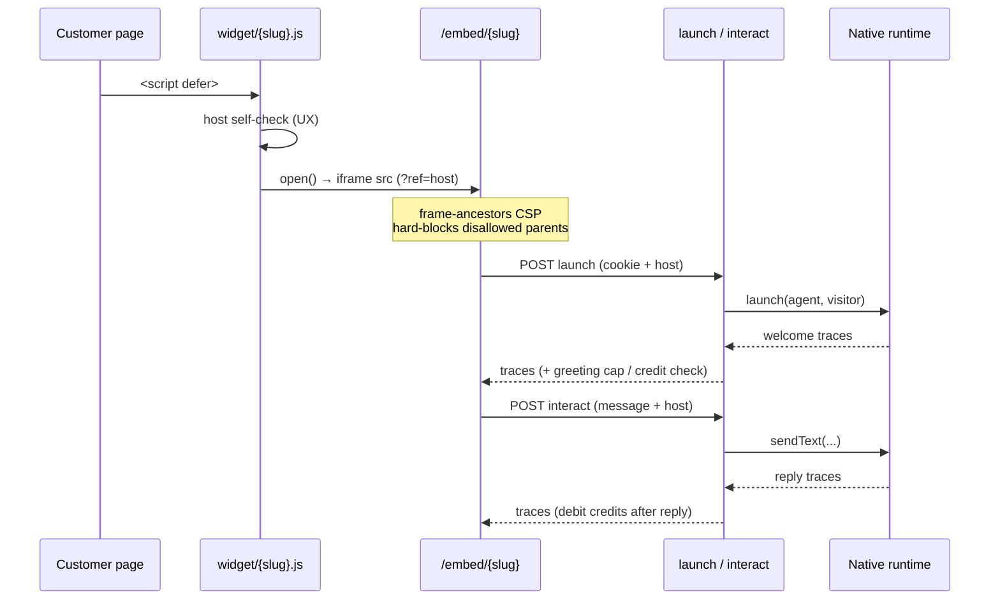

# Embeddable chat widget

> Status: **shipped.** One `<script>` tag on the customer's site →
> a floating launcher + an iframe chat, served and controlled entirely
> by this app (Voiceflow-style). The chat answers through the native
> runtime (`docs/runtime-native.md`); this doc covers the embed surface
> itself — how it's installed, customized, secured, and billed.

Code: `app/Http/Controllers/EmbedController.php` (public endpoints),
`app/Http/Controllers/InstallController.php` (the dashboard editor),
`app/Support/Embed/DomainAllowlist.php` (the matching + CSP rules),
`app/Models/Agent.php` (`WIDGET_DEFAULTS`, `widgetConfig()`,
`allowedDomains()`), `resources/views/embed/widget.blade.php` (the
loader), `resources/views/embed/chat.blade.php` (the iframe page).

## What it is

The operator pastes one line into their website:

```html
<script src="https://app.flowstack.run/widget/{slug}.js" defer></script>
```

That script (the **loader**) draws a floating launcher button in the
corner. Clicking it opens an **iframe** pointed at `/embed/{slug}`, which
is a plain Blade chat page served from our origin — no Inertia, no SPA
bundle, no external fonts, so the customer's site pays almost nothing for
it. The iframe talks back to `launch`/`interact` endpoints on our origin,
which route through the native runtime and bill the agent's team.

`{slug}` is the agent's public slug (`Agent::getRouteKeyName()` is
`slug`). The same slug is the only authorization token: anyone holding it
can embed the agent, but the agent must be `active` (`resolveAgent()`
404s otherwise).

## Install

The `/install` dashboard page (`InstallController@index`,
`resources/js/Pages/Install/Index.vue`) renders the snippet and the
appearance/behavior editor for the team's **current** agent. Switching
agents in the top-left dropdown changes which agent the page configures.

Three copy-paste variants are offered there for the same loader:

- **Floating** — the `<script ... defer>` tag above, dropped before
  `</body>`. Gives the default corner launcher.
- **WordPress** — the same tag, pasted into a theme footer / "custom
  HTML" block / header-footer plugin.
- **React / SPA** — append the script element on mount (e.g. in a
  `useEffect`), since the tag won't run if injected after hydration.

All three load the identical `widget/{slug}.js`; only where the snippet
goes differs.

## Customization (`widget_config`)

The Install page writes `agents.widget_config` (JSON). `widgetConfig()`
merges stored overrides over `Agent::WIDGET_DEFAULTS`, keeping only known
keys (stored junk can't reach the loader) and normalizing `position`,
`proactive_delay`, `auto_open`, `show_branding`.

| Key | What it does | Default |
|---|---|---|
| `accent_color` | Launcher + header background (hex `#rrggbb`) | `#000000` |
| `text_color` | Contrast color drawn on the accent | `#FFFFFF` |
| `position` | Corner: `right` or `left` | `right` |
| `launcher_text` | Label beside the icon; `''` = icon only (max 40) | `''` |
| `title` | Panel header; `''` falls back to the agent name (max 60) | `''` |
| `subtitle` | Panel header subline (max 80) | `AI assistant` |
| `avatar_url` | Header avatar image; `''` = monogram (URL, max 2048) | `''` |
| `proactive_message` | Teaser-bubble copy; `''` = no teaser (max 200) | `''` |
| `proactive_delay` | Seconds before teaser / auto-open (0–120) | `8` |
| `auto_open` | Open the panel automatically after the delay | `false` |
| `show_branding` | "Powered by Flowstack" footer in the chat | `true` |

**Propagation:** `widget/{slug}.js` is served with
`Cache-Control: public, max-age=300`, so appearance/domain edits go live
within **~5 minutes** (the edge cache window) — short enough to feel
quick, long enough to not hammer the origin.

## Host JS API (`window.flowstack`)

The loader exposes a small API on the customer's page so their own UI can
drive the widget. The loader relays `open`/`sendMessage` into the iframe
over an origin-checked `postMessage` bridge.

| Method | Effect |
|---|---|
| `window.flowstack.open()` | Open the chat panel |
| `window.flowstack.close()` | Close it |
| `window.flowstack.toggle()` | Toggle open/closed |
| `window.flowstack.sendMessage(text)` | Open the panel and send `text` as the visitor |
| `window.flowstack.on(event, cb)` | Subscribe to an event; returns `window.flowstack` (chainable) |

`event` is one of `open` · `close` · `message` (agent reply, `{text}`) ·
`lead` (a lead was captured) · `ready` (chat session launched).

Example — a custom "Chat with sales" button:

```html
<button id="sales">Chat with sales</button>
<script>
  document.getElementById('sales')
    .addEventListener('click', function () { window.flowstack.open(); });
  window.flowstack.on('lead', function (lead) {
    // e.g. fire your own analytics conversion event
  });
</script>
```

The loader also shows an **unread badge** (counts agent messages while
the panel is closed) and an optional **proactive teaser** bubble after
`proactive_delay` seconds.

## Domain allowlist & the trust boundary

Each agent has `allowed_domains` (`Agent::allowedDomains()`), editable on
the Install page. **Empty = embeddable anywhere** (permissive, backward
compatible). Setting one or more hosts restricts the agent to them.

Be honest about what enforces this. There are **three layers**, only the
first of which is a hard guarantee (mirrors the trust-boundary comment in
`app/Support/Embed/DomainAllowlist.php`):

1. **`frame-ancestors` CSP on the iframe — the hard, browser-enforced
   control.** `chat()` emits
   `Content-Security-Policy: frame-ancestors <allowlist>` (built by
   `DomainAllowlist::frameAncestors()`, https + http per host). The chat
   page simply **won't render** inside a parent page whose origin isn't
   allowed — the browser refuses, and it can't be spoofed from the
   customer's page. This is the real control over *where* the chat
   appears. (Empty allowlist → `frame-ancestors *` and a legacy
   `X-Frame-Options: ALLOWALL`.)
2. **The loader self-check — UX only.** Before drawing anything,
   `widget/{slug}.js` compares `window.location.hostname` against the
   allowlist and bails (with a console warning) if it doesn't match. This
   just avoids rendering a dead launcher on a domain the operator forgot
   to allow; it is trivially bypassable and is *not* a security control.
3. **The `launch`/`interact` host check — best-effort.**
   `originDenied()` checks the loader-forwarded `host` field (then
   `Referer`, then `Origin`) against the allowlist. All of these are
   spoofable by a hand-crafted, non-iframe API call, so this only stops
   honest/accidental cross-site use. The **per-IP throttle**, the
   **free-greeting cap**, and the **credit ceiling** are the real
   backstops against deliberate abuse (see Billing below).

**Matching rules** (`DomainAllowlist::matches()`):

- `acme.com` → the **apex only**.
- `*.acme.com` → **any subdomain *and* the apex**.
- `localhost` / `127.0.0.1` match literally (handy for local testing).

Stored domains are normalized on save (`InstallController::normalizeDomains`):
scheme, path, and port are stripped, lowercased, and deduped — bare hosts
only, wildcard prefix preserved.

## Endpoints

All four are **unauthenticated** (the loader runs on someone else's site)
with **per-agent-slug authorization** inside the controller — the agent
must be `active` or the request 404s. All are **throttled per IP**; the
two POSTs are **CSRF-exempt** (the iframe sends its own token via
`<meta name="csrf-token">`, accepted as `X-CSRF-TOKEN`, but Laravel CSRF
verification is skipped — see `bootstrap/app.php`).

| Method | Path | Purpose |
|---|---|---|
| GET | `/widget/{slug}.js` | The loader JS (edge-cached 5 min). Throttle 120/min. |
| GET | `/embed/{slug}` | The iframe chat HTML; emits the `frame-ancestors` CSP. Throttle 120/min. |
| POST | `/embed/{slug}/launch` | Start a visitor session; returns the welcome traces. Throttle 60/min. |
| POST | `/embed/{slug}/interact` | Send a visitor message; returns the agent's reply traces. Throttle 120/min. |

**Visitor identity:** a 30-day cookie `fs_embed_{slug}` (SameSite=None,
Secure, HttpOnly) holds a stable, account-less `visitor_id` so the
conversation threads across `interact` calls.

## Billing

Credits are charged by the controller, never by the engine (the
runtime-wide invariant). The basis matches the dashboard's documented
rate: **(1 per visitor message + 1 per agent reply) × the agent's
quality-tier multiplier**, debited *after* the engine replies so failures
aren't billed.

`launch()` greetings are normally free — but a free greeting is a
token-burn vector for bots spread across many IPs (the per-IP throttle
can't see that pattern). So past a per-team daily allowance
(`runtime.safety.free_greetings_per_day`) each further launch debits the
tier multiplier. Real traffic spikes keep working; they're just paid for.
Out of credits → the endpoints return `402` with a neutral
"not available right now" message.

## Endpoint flow


