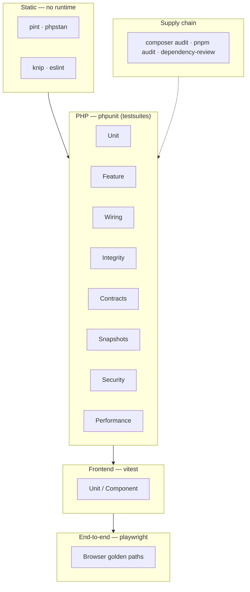

# Test architecture

Flowstack's tests are organized into **layers**, each with a single
responsibility and its own runner. A layer answers one question; when it fails
you know what kind of thing broke without reading the diff. New tests go in the
layer that matches the question they answer — this is what keeps the suite
scalable instead of collapsing into one undifferentiated `Feature` pile.



## PHP layers (`phpunit.xml` testsuites)

Run one layer: `php artisan test --testsuite=Security`. Run all: `php artisan test`.

| Suite | Question it answers | Examples in repo |
| ----- | ------------------- | ---------------- |
| **Unit** | Does this pure function/class behave in isolation? | `DomainAllowlistTest` |
| **Feature** | Does an HTTP/Inertia/console flow work end-to-end against the DB? | the 80-test workhorse — controllers, runtime, embed, Slack |
| **Wiring** | Is the app *assembled* correctly — does it boot, do bindings resolve, are routes/events registered, is config coherent? | `BootTest`, `ContainerTest`, `RouteWiringTest`, `EventWiringTest`, `ConfigContractTest` |
| **Integrity** | Is persisted state self-consistent — migrations round-trip, factories/seeders run, casts/scheduler agree? | `MigrationRoundTripTest`, `FactoryTest`, `SeederTest`, `CastsCoherenceTest`, `SchedulerTest` |
| **Contracts** | Does an external dependency still match the shape we depend on? | `LlmClientContractTest` |
| **Snapshots** | Does a complex generated output match a known-good baseline? | `DialogPathTest` |
| **Security** | Are the guardrails intact — tenant isolation, mass-assignment, throttling, header/redaction/leak policy? | `CrossTenantTest`, `MassAssignmentTest`, `ThrottleTest`, `HeadersTest`, `LogRedactionTest`, `ExceptionLeakTest` |
| **Performance** | Does a hot path stay within its budget? | `BudgetTest`, `HealthTest` |

**Where does my new test go?**

- Testing one class with no DB/HTTP → **Unit**.
- Testing a route/command/job touching the DB → **Feature**.
- Asserting the container/routes/events/config are wired → **Wiring**.
- Asserting DB schema/seed/migration/cast invariants → **Integrity**.
- Pinning the shape of a third-party API or our LLM clients → **Contracts**.
- Asserting a security guarantee a regression could silently remove → **Security**.

Each suite shares the dedicated test DB (`automation_dashboard_test`) pinned in
`phpunit.xml`. Never point tests at the dev DB — a stale `config:cache` doing
exactly that once wiped dev data, which is why `scripts/hermes.sh` runs
`config:clear` before the test step.

## Frontend layer (Vitest)

```bash
pnpm test:unit            # run once
pnpm test:unit:watch      # watch mode
pnpm test:unit:coverage   # with v8 coverage → coverage/js
```

- Config: `vitest.config.js` (jsdom env, `@` → `resources/js`).
- Convention: co-locate `Thing.spec.js` next to `Thing.vue`/`thing.js`.
- Global setup: `resources/js/test/setup.js` (stubs Ziggy's `route()`).
- Patterns: pure logic → import and assert (see `composables/useTheme.spec.js`);
  components → `mount()` with `@vue/test-utils`, mock `@inertiajs/vue3` for
  shared props (see `Components/CreditMeter.spec.js`).

## End-to-end layer (Playwright)

Browser-level golden paths against a running app — the cross-system flows no
single unit can cover (e.g. widget iframe → message → live dashboard tick over
Reverb). _Scaffolded in the E2E PR; see `tests/e2e/`._

## Coverage policy

Coverage is **measured, then ratcheted** — we do not drop a blind threshold that
breaks CI on day one. PHP coverage runs via `pcov`; JS via v8. Establish the
baseline, then raise the floor over time rather than all at once.

## How this maps to CI

`.github/workflows/ci.yml` runs each layer as its own job/check so a failure
names the layer (a red **Security** check reads differently from a red
**Frontend** check). See that file for the job graph.
